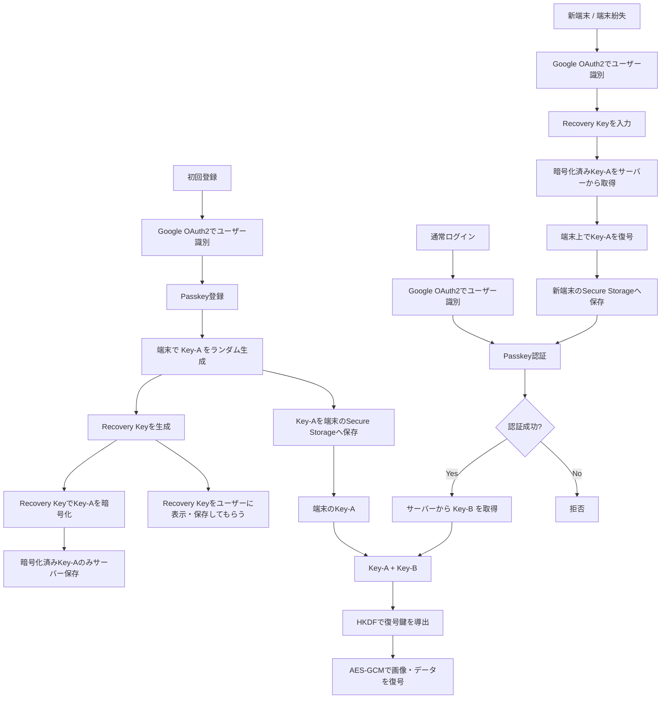

# Tornado 2026 ハッカソン 

## 📋 概要

- **イベント名**：Tornado 2026 ハッカソン
- **本ドキュメントの目的**：チーム内の役割分担と技術スタック候補を整理し、開発の初期認識合わせとする

---

## 👥 役割

| 領域 | 担当者 |
|---|---|
| バックエンド | くわむら |
| フロントエンド | ながまさ |
| AI | くぼした |
| UI/UX | ながれもとくり |
| 全体（進捗管理・統括） | ながまさ |
| アドバイス | くり |

---

## 🛠️ 技術スタック（候補）

### フロントエンド
- React
- React Native
- TypeScript
- JavaScript
- Expo

### バックエンド
- Go

### データベース
- Supabase
- SQLite
- PostgreSQL

### 認証
- Google OAuth

### チャット
- Go
- WebSocket

### 画像保存
- Go（自前サーバに保存）

### コード管理
- GitHub

---

## 📱 アプリ機能

コンセプト：**マッチング＋コミュニケーション系アプリ**（リアルタイムでユーザー同士がつながり、チャットで交流できるアプリ）

| # | 機能 | 概要 |
|---|---|---|
| 1 | ユーザー登録・認証 | Google OAuthによるログイン・新規登録 |
| 2 | プロフィール作成・編集 | ニックネーム、自己紹介、興味・関心タグ、プロフィール画像のアップロード |
| 3 | リアルタイムマッチング | 条件（興味・位置情報など）に基づきリアルタイムで相手候補を提示 |
| 4 | マッチング承認・成立 | お互いにいいねやいいね等でマッチした場合にチャットが開放される |
| 5 | リアルタイムチャット | WebSocketによる1対1（将来的にはグループも検討）のリアルタイムメッセージング |
| 6 | 画像共有 | チャット内・プロフィールでの画像送信（保存：自前Goサーバに保存） |
| 7 | 通知 | 新規いいね・新着メッセージのプッシュ通知（またはアプリ内通知） |
| 8 | マッチ履歴・チャット一覧 | 過去のマッチ相手・チャットスレッドの一覧表示 |

> ⚠️ 上記はハッカソン向けの機能候補です。開発時間に合わせてMVPスコープ（例：機能1〜5を優先）を絞り込む想定。

---

## 🗂️ ファイル構成（候補）

### フロントエンド（React Native / Expo / TypeScript）

```
frontend/
├── app/                        # Expo Router によるページ
│   ├── (auth)/
│   │   ├── login.tsx           # ログイン画面
│   │   └── register.tsx        # 新規登録画面
│   ├── (tabs)/
│   │   ├── index.tsx           # マッチング画面（メイン）
│   │   ├── chat.tsx            # チャット一覧
│   │   └── profile.tsx         # プロフィール画面
│   ├── chat/
│   │   └── [id].tsx            # 個別チャット画面
│   └── _layout.tsx             # 全体レイアウト・ナビゲーション
├── components/
│   ├── MatchCard.tsx           # マッチング候補カード
│   ├── ChatBubble.tsx          # チャット吹き出し
│   └── ProfileForm.tsx         # プロフィール編集フォーム
├── hooks/
│   ├── useAuth.ts              # 認証状態管理
│   ├── useMatching.ts          # マッチングロジック
│   └── useWebSocket.ts         # WebSocket接続管理
├── services/
│   ├── api.ts                  # REST API通信
│   ├── supabase.ts             # Supabaseクライアント
│   └── websocket.ts            # WebSocketクライアント
├── types/
│   └── index.ts                # 型定義
├── app.json                    # Expo設定
├── package.json
└── tsconfig.json
```

### バックエンド（Go）

```
backend/
├── cmd/
│   └── server/
│       └── main.go             # エントリーポイント
├── internal/
│   ├── auth/
│   │   ├── handler.go          # 認証エンドポイント
│   │   └── oauth.go            # Google OAuth連携
│   ├── user/
│   │   ├── handler.go          # ユーザーAPI
│   │   ├── model.go            # ユーザーモデル
│   │   └── repository.go       # DBアクセス
│   ├── matching/
│   │   ├── handler.go          # マッチングAPI
│   │   └── service.go          # マッチングロジック
│   ├── chat/
│   │   ├── handler.go          # チャットAPI
│   │   ├── websocket.go        # WebSocketハンドリング
│   │   └── model.go            # メッセージモデル
│   ├── image/
│   │   ├── handler.go          # 画像アップロードAPI
│   │   └── storage.go          # 自前サーバへの画像保存処理
│   └── db/
│       └── postgres.go         # DB接続（Supabase/PostgreSQL）
├── pkg/
│   └── middleware/
│       └── auth.go             # 認証ミドルウェア
├── migrations/
│   └── 0001_init.sql           # 初期テーブル定義（users, profiles, matches, messages）
├── go.mod
└── go.sum
```

### 補足（想定DBテーブル）

→ 詳細は下記「🗄️ DB設計」セクション参照

---

## 🗄️ DB設計

想定DB：**PostgreSQL（Supabase）**。SQLiteを採用する場合はUUID／JSONB型を`TEXT`等に読み替え。

### ER図

```mermaid
erDiagram
    USERS ||--|| PROFILES : has
    USERS ||--o{ LIKES : sends
    USERS ||--o{ LIKES : receives
    USERS ||--o{ MATCHES : "user_a"
    USERS ||--o{ MATCHES : "user_b"
    MATCHES ||--o{ MESSAGES : contains
    USERS ||--o{ MESSAGES : sends
    USERS ||--o{ NOTIFICATIONS : receives

    USERS {
        uuid id PK
        text google_id UK
        text email UK
        timestamp created_at
        timestamp updated_at
    }
    PROFILES {
        uuid user_id PK_FK
        text nickname
        text bio
        text avatar_url
        text_array interests
        float latitude
        float longitude
        timestamp updated_at
    }
    LIKES {
        uuid id PK
        uuid from_user_id FK
        uuid to_user_id FK
        timestamp created_at
    }
    MATCHES {
        uuid id PK
        uuid user_a_id FK
        uuid user_b_id FK
        text status
        timestamp matched_at
    }
    MESSAGES {
        uuid id PK
        uuid match_id FK
        uuid sender_id FK
        text content
        text image_url
        timestamp created_at
        timestamp read_at
    }
    NOTIFICATIONS {
        uuid id PK
        uuid user_id FK
        text type
        jsonb payload
        boolean is_read
        timestamp created_at
    }
```

### テーブル定義

#### `users`（認証情報）
| カラム | 型 | 制約 | 説明 |
|---|---|---|---|
| id | UUID | PK, default gen_random_uuid() | ユーザーID |
| google_id | TEXT | UNIQUE, NOT NULL | Google OAuthのsub |
| email | TEXT | UNIQUE, NOT NULL | メールアドレス |
| created_at | TIMESTAMPTZ | default now() | 作成日時 |
| updated_at | TIMESTAMPTZ | default now() | 更新日時 |

#### `profiles`（プロフィール）
| カラム | 型 | 制約 | 説明 |
|---|---|---|---|
| user_id | UUID | PK, FK → users.id | ユーザーID（1:1） |
| nickname | TEXT | NOT NULL | 表示名 |
| bio | TEXT | | 自己紹介文 |
| avatar_url | TEXT | | プロフィール画像URL（Go画像サーバ） |
| interests | TEXT[] | | 興味・関心タグ |
| latitude | DOUBLE PRECISION | NULL可 | 位置情報（リアルタイムマッチングに使用する場合） |
| longitude | DOUBLE PRECISION | NULL可 | 同上 |
| updated_at | TIMESTAMPTZ | default now() | 更新日時 |

#### `likes`（マッチング候補への意思表示）
| カラム | 型 | 制約 | 説明 |
|---|---|---|---|
| id | UUID | PK | |
| from_user_id | UUID | FK → users.id | いいねした側 |
| to_user_id | UUID | FK → users.id | いいねされた側 |
| created_at | TIMESTAMPTZ | default now() | |

- `UNIQUE(from_user_id, to_user_id)` で重複いいねを防止
- 相互に`likes`を持った時点でアプリ側（またはDBトリガー）が`matches`にレコードを作成する想定

#### `matches`（マッチング成立）
| カラム | 型 | 制約 | 説明 |
|---|---|---|---|
| id | UUID | PK | |
| user_a_id | UUID | FK → users.id | マッチ相手A（`user_a_id < user_b_id`で正規化） |
| user_b_id | UUID | FK → users.id | マッチ相手B |
| status | TEXT | 'active' \| 'ended' | マッチの状態 |
| matched_at | TIMESTAMPTZ | default now() | 成立日時 |

- `UNIQUE(user_a_id, user_b_id)` で同一ペアの重複マッチを防止

#### `messages`（チャットメッセージ）
| カラム | 型 | 制約 | 説明 |
|---|---|---|---|
| id | UUID | PK | |
| match_id | UUID | FK → matches.id | 所属チャットスレッド |
| sender_id | UUID | FK → users.id | 送信者 |
| content | TEXT | NULL可（画像のみの場合） | メッセージ本文 |
| image_url | TEXT | NULL可 | 画像添付時のURL |
| created_at | TIMESTAMPTZ | default now() | 送信日時 |
| read_at | TIMESTAMPTZ | NULL可 | 既読日時 |

#### `notifications`（通知）
| カラム | 型 | 制約 | 説明 |
|---|---|---|---|
| id | UUID | PK | |
| user_id | UUID | FK → users.id | 通知対象ユーザー |
| type | TEXT | 'new_match' \| 'new_message' 等 | 通知種別 |
| payload | JSONB | | 通知の詳細データ |
| is_read | BOOLEAN | default false | 既読フラグ |
| created_at | TIMESTAMPTZ | default now() | 作成日時 |

### 初期マイグレーションSQL（PostgreSQL / Supabase想定）

```sql
CREATE EXTENSION IF NOT EXISTS "pgcrypto";

CREATE TABLE users (
    id UUID PRIMARY KEY DEFAULT gen_random_uuid(),
    google_id TEXT UNIQUE NOT NULL,
    email TEXT UNIQUE NOT NULL,
    created_at TIMESTAMPTZ DEFAULT now(),
    updated_at TIMESTAMPTZ DEFAULT now()
);

CREATE TABLE profiles (
    user_id UUID PRIMARY KEY REFERENCES users(id) ON DELETE CASCADE,
    nickname TEXT NOT NULL,
    bio TEXT,
    avatar_url TEXT,
    interests TEXT[],
    latitude DOUBLE PRECISION,
    longitude DOUBLE PRECISION,
    updated_at TIMESTAMPTZ DEFAULT now()
);

CREATE TABLE likes (
    id UUID PRIMARY KEY DEFAULT gen_random_uuid(),
    from_user_id UUID REFERENCES users(id) ON DELETE CASCADE,
    to_user_id UUID REFERENCES users(id) ON DELETE CASCADE,
    created_at TIMESTAMPTZ DEFAULT now(),
    UNIQUE (from_user_id, to_user_id)
);

CREATE TABLE matches (
    id UUID PRIMARY KEY DEFAULT gen_random_uuid(),
    user_a_id UUID REFERENCES users(id) ON DELETE CASCADE,
    user_b_id UUID REFERENCES users(id) ON DELETE CASCADE,
    status TEXT DEFAULT 'active',
    matched_at TIMESTAMPTZ DEFAULT now(),
    UNIQUE (user_a_id, user_b_id)
);

CREATE TABLE messages (
    id UUID PRIMARY KEY DEFAULT gen_random_uuid(),
    match_id UUID REFERENCES matches(id) ON DELETE CASCADE,
    sender_id UUID REFERENCES users(id) ON DELETE CASCADE,
    content TEXT,
    image_url TEXT,
    created_at TIMESTAMPTZ DEFAULT now(),
    read_at TIMESTAMPTZ
);

CREATE TABLE notifications (
    id UUID PRIMARY KEY DEFAULT gen_random_uuid(),
    user_id UUID REFERENCES users(id) ON DELETE CASCADE,
    type TEXT NOT NULL,
    payload JSONB,
    is_read BOOLEAN DEFAULT false,
    created_at TIMESTAMPTZ DEFAULT now()
);

-- インデックス例
CREATE INDEX idx_messages_match_id ON messages(match_id);
CREATE INDEX idx_likes_to_user ON likes(to_user_id);
CREATE INDEX idx_notifications_user_unread ON notifications(user_id, is_read);
```

> ⚠️ `latitude`/`longitude`は位置情報ベースのマッチングを行う場合に使用。興味タグベースのマッチングのみであれば省略可。開発初期に方式を決めて調整してください。

---

## 🔐 認証フロー

Google OAuth2によるユーザー識別に加え、Passkeyと端末Secure Storageを組み合わせ、暗号化データ（画像等）の復号鍵をサーバーとクライアントで分散管理する方式。



- **初回登録**：Google OAuth2でユーザーを識別後、Passkeyを登録。端末上でKey-Aをランダム生成し、Secure Storageに保存。同時にRecovery Keyを生成してユーザーに表示・保存してもらい、Recovery KeyでKey-Aを暗号化した上で暗号化済みKey-Aのみをサーバーに保存する（サーバーは平文のKey-Aを保持しない）。
- **通常ログイン**：Google OAuth2 + Passkey認証に成功したらサーバーからKey-Bを取得し、端末のKey-Aと合わせてHKDFで復号鍵を導出、AES-GCMで画像・データを復号する。
- **新端末 / 端末紛失時**：Google OAuth2でユーザーを識別後、Recovery Keyを入力し、サーバーから暗号化済みKey-Aを取得。端末上で復号したKey-Aを新端末のSecure Storageへ保存し、通常ログインのPasskey認証フローへ合流する。

---

## 📝 補足

- 上記技術スタックは現時点での**候補**であり、開発初期に確定される想定
- 添付PDF（Tornado_2026_ハッカソン.pdf）にはイベント名のみが記載されているため、詳細な要件・スケジュール等が別途あれば追記が必要
