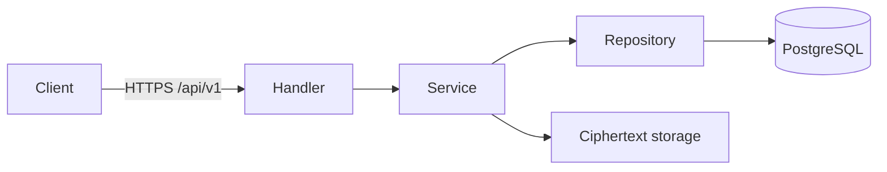

# バックエンドHTTP契約

詳細なリクエスト/レスポンスは [backend/API_SPEC.md](../../../backend/API_SPEC.md) を正とする。この文書は結合時に破ってはいけない境界を規定する。

- バックエンドは `/healthz`、`/readyz`、`/api/v1/*`、OAuth callback以外のUIを配信しない。
- 保護APIは `Authorization: Bearer <access_token>`。token形式をクライアントが推測しない。
- CORSは本番では`CLIENT_ORIGIN`、開発・testでは`DEV_CLIENT_ORIGIN`と固定したローカルWeb開発Origin（`http://localhost:8081`、`http://127.0.0.1:8081`）の完全一致だけを許可する。ワイルドカード・Origin反射は禁止。
- OAuthの戻り先は固定scheme、Expo開発scheme、設定済みOriginの`/auth/complete`だけを許可する。任意URLへのredirectは禁止。
- 高権限のKey-A envelope、Key-B、退会は有効sessionに加えて5分以内のPasskey再認証を要求する。
- HTTPエラーは status と `{ "error": "stable_code" }` を組み合わせる。画面文言にサーバー内部エラーを流用しない。
