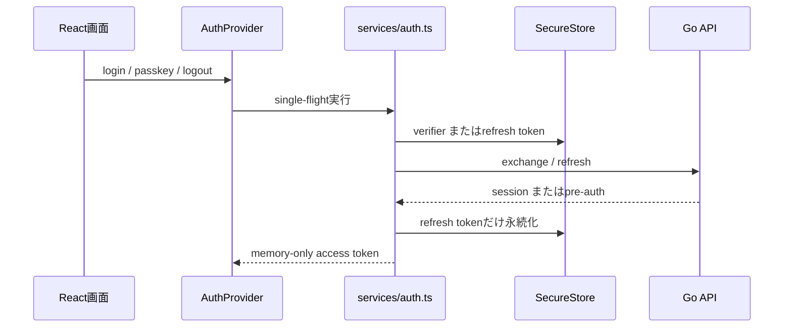

# 正式フロントエンド結合契約

対象は `frontend/` のみ。`backend/expo-test` と `backend/dev-client` は廃止済みであり、復活させない。

不変条件:

1. Access Token、pre-auth token、Recovery Key、Key-A/Key-B平文を永続ストレージ・ログ・analytics・URL queryに置かない。
2. Deep linkは `samuraimeet://auth`、開発用Expo schemeだけをallow-listで解析し、一回限りcode以外を受け取らない。
3. Refreshはrequest IDを保持して単一実行する。不確定な通信失敗では保存済みsessionを先に消さない。
4. session handoff/OAuth verifierは交換成功・明確な4xx・logout時に消去する。
5. Passkey web pageは正式frontendが所有する。URL fragmentに渡す値も短命・最小権限にし、Web側は履歴置換とreferrer抑制を実施する。

**未解決の設計負債:** 現行 `buildPasskeyURL` は再認証用Access Tokenをfragmentに含める。queryより漏えいしにくいがゼロトラスト基準を満たさない。session-handoff開始APIで短命・用途限定のweb ceremony tokenを発行する方式へ置換するまで、本番の再認証導線をリリース承認しない。
