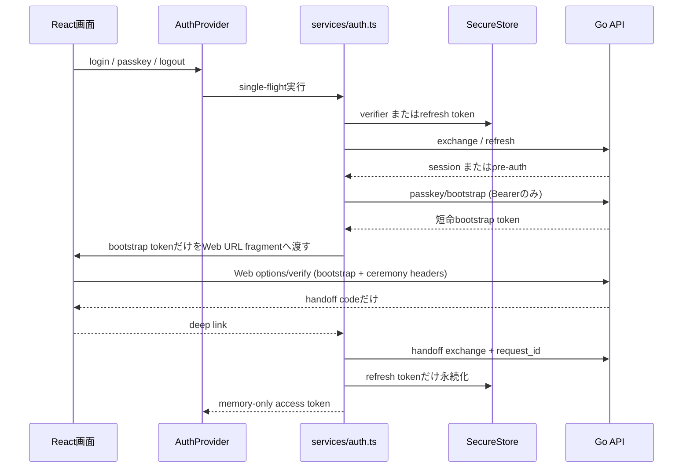

# 正式フロントエンド結合契約

対象は `frontend/` のみ。`backend/expo-test` と `backend/dev-client` は廃止済みであり、復活させない。

不変条件:

1. Access Token、pre-auth token、Recovery Key、Key-A/Key-B平文をログ・analytics・URLに置かない。pre-authはExpo GoのSecureStoreからbootstrap発行Bearerへだけ使う。
2. Deep linkは `samuraimeet://auth`、開発用Expo schemeだけをallow-listで解析し、一回限りcode以外を受け取らない。
3. Refreshはrequest IDを保持して単一実行する。不確定な通信失敗では保存済みsessionを先に消さない。
4. session handoff/OAuth verifierは交換成功・明確な4xx・logout時に消去する。
5. Passkey web pageは正式frontendが所有する。`buildPasskeyURL`のfragmentは`bootstrap_token`だけで、Access/pre-auth tokenは含めない。Web APIは`Cache-Control: no-store`と`Referrer-Policy: no-referrer`を返す。
6. Bootstrapはサーバー側でhash、scope、source session/pre-auth、ceremony binding、1分期限、used_atを管理する。verify成功時はhandoff codeだけを返す。
