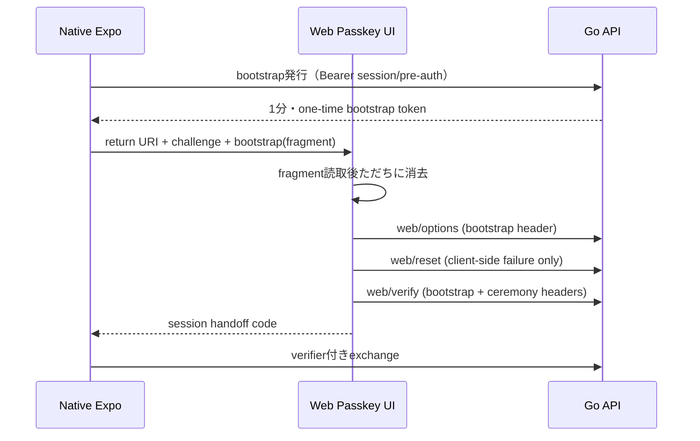

# Web Passkey配信物の契約

これは `frontend/` のネイティブExpoアプリとは別に、Goバックエンドの `/passkey` から配信する正式Web Passkey画面の必須契約である。APIと画面を同じOriginで提供し、ネイティブアプリのURLは既定でこのバックエンド画面を指す。

## 実装要件

- queryに許容するのは`app_return_uri`、`app_handoff_challenge`、表示言語の`lang=ja|en`だけ。URL tokenはfragmentから一度だけ取得し、`history.replaceState`で消去する。
- HTTPレスポンスに`Referrer-Policy: no-referrer`、CSP、`Cache-Control: no-store`を設定する。
- bootstrapは1分以内・一回限り、ceremony tokenは5分以内・一回限り。両方をユーザー/session/用途に束縛する。Access Token、Refresh Token、pre-auth tokenをWeb URLへ渡さない。
- `register/options|verify`、`login/options|verify`、`reauth/options|verify`のどれを呼べるかを用途で固定する。Recovery由来のpre-auth登録では既存credentialを除外せず、新しいPasskeyを追加できる。
- WebAuthnのブラウザ側失敗時は`web/reset`で現在のceremonyを無効化してからoptionsを再取得する。verify後やbootstrap消費後にresetして再試行してはいけない。
- `web/verify`成功時はサーバー側でsession handoffを作成し、固定allow-listのアプリURIへ一回限りcodeだけを返す。ブラウザへAccess/Refresh/pre-auth tokenを返さない。
- Web UIはGoバックエンドの `/passkey` で配信する。ページは同一Originの `/api/v1/auth/passkey/web/options`、`/reset`、`/verify`を呼び出す。実機E2Eが完了するまでproductionでPasskey再認証を有効化しない。
