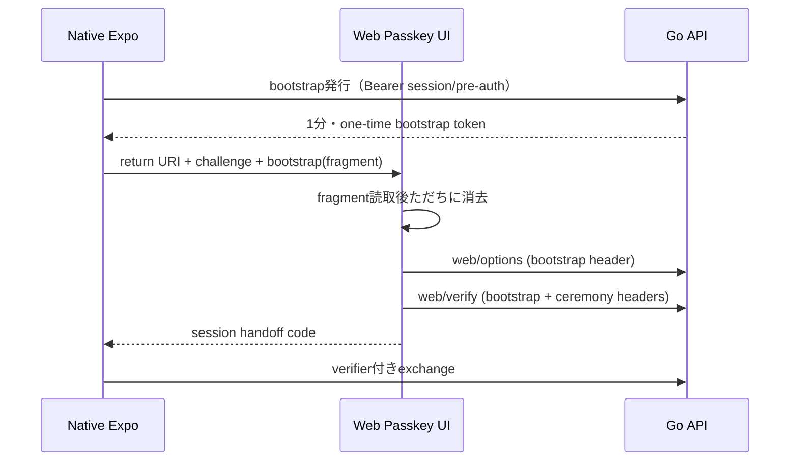

# Web Passkey配信物の契約（未実装）

これは `frontend/` のネイティブExpoアプリとは別に配信する、正式Web Passkey画面の必須契約である。バックエンドはこの画面を配信しない。

## 実装要件

- queryに許容するのは`app_return_uri`と`app_handoff_challenge`だけ。URL tokenはfragmentから一度だけ取得し、`history.replaceState`で消去する。
- HTTPレスポンスに`Referrer-Policy: no-referrer`、CSP、`Cache-Control: no-store`を設定する。
- bootstrapは1分以内・一回限り、ceremony tokenは5分以内・一回限り。両方をユーザー/session/用途に束縛する。Access Token、Refresh Token、pre-auth tokenをWeb URLへ渡さない。
- `register/options|verify`、`login/options|verify`、`reauth/options|verify`のどれを呼べるかを用途で固定する。
- `web/verify`成功時はサーバー側でsession handoffを作成し、固定allow-listのアプリURIへ一回限りcodeだけを返す。ブラウザへAccess/Refresh/pre-auth tokenを返さない。
- Web UI、Cloudflare等の配信設定、実機E2Eは未実装。実装完了前にproductionでPasskey再認証を有効化しない。
