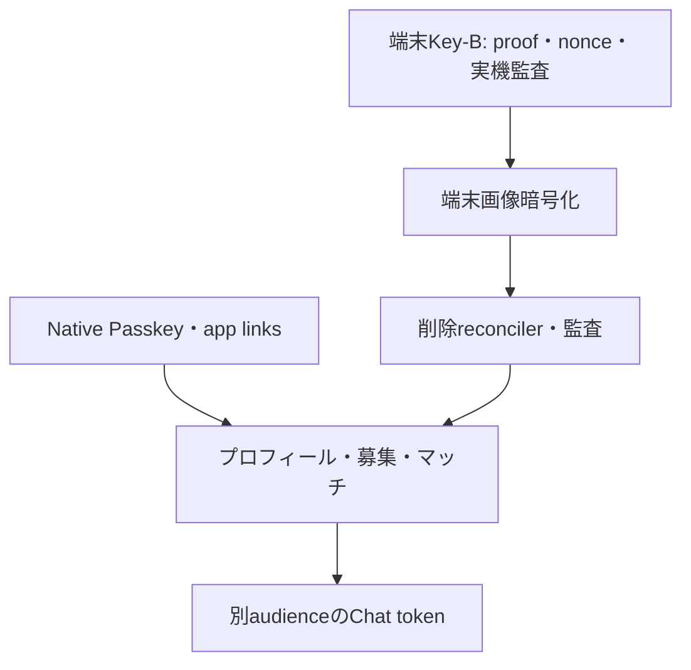

# 実装バックログ（コード基準）

| 優先 | 項目 | 依存 | 完了定義 |
| --- | --- | --- | --- |
| P0 | Web Passkeyの正式frontend化 | Web hosting | `WEB_PASSKEY_URL` に本番UI、短命ceremony token、実機E2E |
| P0 | 端末Key-Bの実機・監査 | Secure Storage / PostgreSQL | 端末移行、proof replay、Key-B表示保護、秘密値なし監査を検証 |
| P0 | 再認証tokenをURLから除去 | session handoff API | 完了: fragmentは`bootstrap_token`だけ。Web options/verify、短命hash、request_id再送制限を実装・テスト |
| P1 | 募集・応募・通知遷移のiOS実機E2E | 募集API／iOS日時UI | ISO内部値・利用日／壁時計の`Asia/Tokyo`固定、絶対時刻UTC、過去時刻・日跨ぎ、公開・応募・通知遷移を一連の実機E2Eで確認する |
| P1 | client画像UI統合 | Key-A/端末Key-B HKDF | 写真選択・表示・削除を端末暗号化APIへ接続し、サーバーは暗号文のみ |
| P1 | 削除reconciler | DB/ストレージ | 孤児検出、冪等ジョブ、監査、バックアップ期限の運用 |
| P1 | native Passkey実機 | app links | Associated Domains/assetlinks、登録・別端末・解除を確認 |
| P2 | 認証統合テスト拡張 | PostgreSQL | handoff/reuse/challenge/rotationの実DB並行ケース |
| P2 | Web Passkey transaction reconciler | PostgreSQL/worker | bootstrap消費・handoff作成失敗時の孤児sessionを検出し、再試行または安全に失効させる |
| P2 | 業務APIの残り | profile schema | プロフィール、募集、検索、関心、承認、完了、チャット（REST+WebSocket配送）、会合セッション／距離補助、通知一覧・未読管理、通報登録（`reports`）・ブロック作成/一覧/解除まで実装済み。残: 通報の運営キュー`/admin/reports`と`audit_logs`、評価、チャット配送の複数インスタンス対応（`LISTEN/NOTIFY`）。IPベースのHTTP rate limitとチャット送信のユーザー単位rate limitは実装済み |
| P2 | Stripe Identity本人確認 | Stripe Identity / Webhook / identity_verifications | Verification Session発行、Webhook署名検証・イベント冪等性・ユーザー紐付け・再確認期限を実装し、正規の検証結果だけ`verified`バッジへ反映。戻りURLやクライアント自己申告では更新しない |
| P2 | プロフィール編集・通知のフロント接続 | Go API契約 | 募集公開・検索・応募・承認／辞退、通知一覧・未読管理は接続済み。自己紹介編集の完全同期、通知の実機E2E、OSプッシュ通知の要否を確認 |
| P2 | ログアウト後の言語選択・履歴ガードのiOS実機確認 | Expo Router | コードと自動テストは実装済み。ログアウト後に旧保護画面へ戻らず、言語選択から再開することを実機で確認 |
| P0 | Proton式client-owned root key v2 | `docs/ai/security/proton-style-key-management` | v1互換のまま24語Recovery Phrase、旧端末承認、新端末X25519 envelope、server zero-knowledge境界を実機E2Eで確認 |
| P0 | 端末移行のbulk画像DEK再包み | client-owned root key v2 / image API | 進捗・再試行・中断再開・旧端末失効を持ち、全画像の新端末envelope確認後だけ完了扱い |
| P0 | Native hardware posture | iOS Secure Enclave / Android Keystore | Expo Goと本番nativeを区別し、hardware-backed/attestation可否を画面と監査へ反映 |
| P1 | Go admin panel | 認証・監査・運用権限設計 | 公開APIと別listenerまたは別serviceで、管理者認証、監査ログ、危険操作の再認証、運用分離を実機・障害時も検証 |
| P1 | Recovery Codes | client-owned root key v2 | 8個程度のone-time auth recovery codeをhashのみ保存し、phrase復号能力と分離 |
| P1 | Chat transport | 業務API | WebSocket配送を実装済み（別audience Chat Token、first-frame認証、20秒heartbeatでセッション/ブロック/マッチ失効、単一インスタンスのin-memoryハブ、fan-out除外はソケット単位でマルチデバイス整合）。残: 複数インスタンスの`LISTEN/NOTIFY` fan-out、接続中のChat Tokenローテーション（`token_seq`）、Expo実機での再接続負荷試験 |

各項目は実装前に脅威、API契約、migration、observability、rollback、E2E受入条件をPR本文へ記載する。
