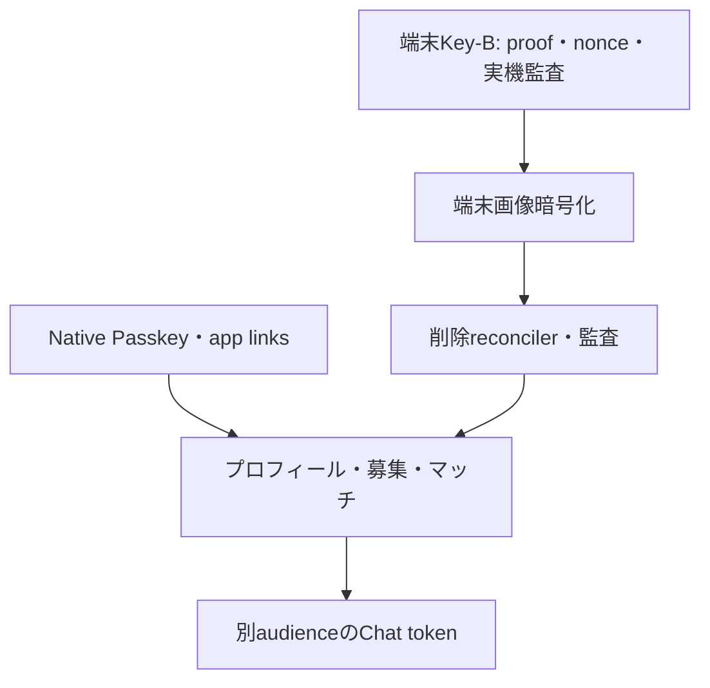

# 実装バックログ（コード基準）

| 優先 | 項目 | 依存 | 完了定義 |
| --- | --- | --- | --- |
| P0 | Web Passkeyの正式frontend化 | Web hosting | `WEB_PASSKEY_URL` に本番UI、短命ceremony token、実機E2E |
| P0 | 端末Key-Bの実機・監査 | Secure Storage / PostgreSQL | 端末移行、proof replay、Key-B表示保護、秘密値なし監査を検証 |
| P0 | 再認証tokenをURLから除去 | session handoff API | 完了: fragmentは`bootstrap_token`だけ。Web options/verify、短命hash、request_id再送制限を実装・テスト |
| P1 | client画像UI統合 | Key-A/端末Key-B HKDF | 写真選択・表示・削除を端末暗号化APIへ接続し、サーバーは暗号文のみ |
| P1 | 削除reconciler | DB/ストレージ | 孤児検出、冪等ジョブ、監査、バックアップ期限の運用 |
| P1 | native Passkey実機 | app links | Associated Domains/assetlinks、登録・別端末・解除を確認 |
| P2 | 認証統合テスト拡張 | PostgreSQL | handoff/reuse/challenge/rotationの実DB並行ケース |
| P2 | Web Passkey transaction reconciler | PostgreSQL/worker | bootstrap消費・handoff作成失敗時の孤児sessionを検出し、再試行または安全に失効させる |
| P2 | 業務API | profile schema | プロフィール→募集→マッチ→block/report の順で所有権・監査・rate limitを実装。募集カード（最小）・マッチ・blockは実装済み（`backend/internal/matching`）。チャットREST（一覧・履歴・送信、`backend/internal/chat`）も実装済み、本文は現状平文。プロフィール、検索、report、監査ログ、チャットのWebSocket/Chat Tokenは未着手 |
| P3 | Chat transport | 業務API | Access/Refreshと別audience、0-RTT変更禁止、heartbeat失効 |

各項目は実装前に脅威、API契約、migration、observability、rollback、E2E受入条件をPR本文へ記載する。
