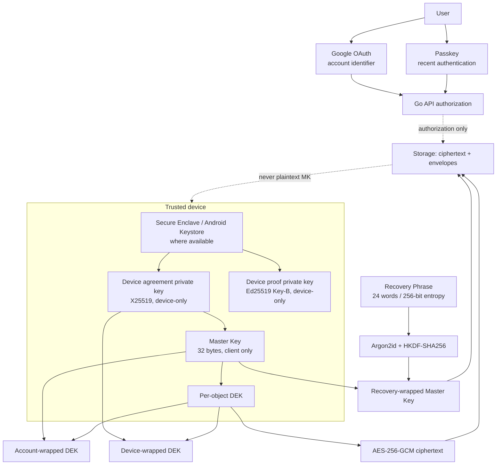

# Final design: user-held root key

Status: accepted for implementation as a v2-only client-owned root-key protocol
for the pre-release cutover. The HTTP path remains `/api/v1` for deployment
compatibility; that path does not mean the cryptographic protocol is v1.

## Security invariants

1. The account has one stable 32-byte Master Key. In the v2 transition, the
   existing client Key-A is the root key; the protocol name changes, not the
   bytes. It is never sent to the API.
2. Each private object has its own random data-encryption key (DEK). The object
   ciphertext is independent of the device. The DEK is wrapped once for the
   account root and once per trusted device.
3. The existing Ed25519 Key-B remains a device authentication/proof key. A
   separate X25519 device-agreement key is used only to receive a root-key
   envelope. Signing and key agreement are not combined.
4. A Recovery Phrase is a 24-word encoding of 256 bits of entropy. The phrase
   is normalized and processed locally with Argon2id followed by HKDF-SHA256.
   Only the resulting opaque envelope, salt, KDF parameters, and public
   verification key are stored by the server.
5. Google OAuth identifies the account; Passkey proves control of an
   authenticator; the Recovery Phrase or an approved old device supplies the
   decryption capability. Google alone never releases the Master Key.
6. Recovery Codes are for re-establishing authentication/Passkey registration,
   not for decrypting the Master Key. This keeps an authentication recovery
   compromise separate from data recovery.
7. If the user has no old device, Passkey, Recovery Phrase, or Recovery Code,
   private data is intentionally unrecoverable. Support cannot override this
   without changing the trust model.

## Key hierarchy



## Old device present: authenticated key migration

```mermaid
sequenceDiagram
    participant N as New device
    participant S as API/storage
    participant O as Old device

    N->>N: Generate new device ID, Key-B, and X25519 agreement pair
    N->>S: Register public keys after recent Passkey authentication
    N->>N: Generate short verification code and show code + fingerprint
    N->>S: Create migration request
    S-->>O: Pending request metadata only
    O->>O: User compares code/fingerprint or scans OOB QR
    O->>O: Key-B proof + recent Passkey authorize approval
    O->>O: Unwrap local Master Key
    O->>O: X25519 + AEAD wrap Master Key for N
    O->>S: Opaque wrapped Master Key
    N->>S: Poll with N's Key-B proof
    S-->>N: Opaque wrapped Master Key
    N->>N: Unwrap with X25519 private key; validate AAD
    N->>S: Acknowledge completion
    Note over S: Server never sees the Master Key
```

The server binds the request to the target device's registered public key and
will not accept a replacement key inside the approval request. The verification
code/fingerprint is an anti-mix-up control, not a substitute for the device
private key. For a malicious active server, direct QR/OOB comparison is required
to prevent public-key substitution.

The image bytes do not move through this flow. The new device unwraps each
account-wrapped DEK locally and stores a new device envelope. The existing lazy
per-photo rewrap remains compatible; a resumable bulk rewrap/status job is a
follow-up before calling migration complete for large accounts.

## Old device absent: Recovery Phrase recovery

```mermaid
sequenceDiagram
    participant U as User
    participant N as New device
    participant S as API/storage

    U->>N: Google account identification
    U->>N: Passkey authentication when available
    N->>S: Request short recovery challenge
    S-->>N: Recovery-wrapped envelope + one-time challenge
    U->>N: Enter 24-word Recovery Phrase
    N->>N: Argon2id + HKDF; unwrap Master Key locally
    N->>N: Generate new device keys and a new Passkey
    N->>S: Register new device public keys and new auth credential
    N->>N: Rewrap object DEKs for this device as needed
    Note over S: Phrase and plaintext Master Key never cross the API
```

The pre-release cutover accepts only the v2 24-word Recovery Phrase. Legacy v1
Base64URL Recovery Key envelopes are rejected with a version-disabled error and
are removed by `0022_disable_legacy_root_keys.sql`; an old development account
must complete v2 setup again. Successful phrase recovery or rotation creates a
new phrase and replaces the v2 envelope only after the user confirms that the
new material was saved. If saving fails, the local pending material remains and
the previous server envelope stays usable until a new envelope is stored.

## Threat model and limits

| Threat | Expected result |
| --- | --- |
| DB/storage read-only compromise | Private ciphertext, wrapped DEKs, and wrapped root are unreadable without a device or phrase. |
| Access Token theft | Cannot read private image ciphertext without device proof; cannot approve transfer without recent Passkey and device proof. |
| Google account compromise | Identifies the account but does not decrypt private data. |
| Old device compromise | It can approve a transfer because it is trusted; users must review pending devices and revoke old devices. |
| Active API compromise | Can delete, delay, replay, or withhold ciphertext/envelopes and can attack metadata. It must not learn the root key from this protocol. Fingerprint/QR protects target-key substitution. |
| Malicious client or release pipeline | Can exfiltrate keys while the user runs it. Signed builds, review, native attestation, and incident response remain required. |
| Public profile image | Current `/profile-photos` is a deliberate server-readable/public exception and is not zero-access. Private profile media needs a separate client-distribution design. |
| All recovery factors lost | Private data is unrecoverable by design. |

Confidentiality is not integrity or availability. The v2 object format must
bind owner, object ID, version, and algorithm in AEAD AAD, and encrypted backups
must be retained for deletion/availability recovery. These are separate rollout
items from the key transfer protocol.

## Hardware-backed storage posture

The protocol requires device-only storage, but the current Expo Go client cannot
claim hardware-backed protection. The release matrix is:

- Expo Go/development web: functional compatibility and test-only storage; no
  production security claim.
- Native production build: use Secure Enclave/Keystore through a reviewed native
  module and record whether hardware backing/attestation is available.
- If hardware backing is unavailable, show a degraded posture and retain the
  OS secure-storage fallback; never upload the fallback secret to the API.
