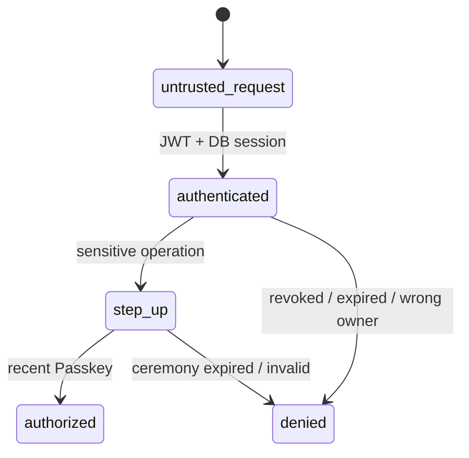

# ゼロトラスト実装規約

- 認可はhandlerで終わらせず、service/repository境界でも所有者・session・用途を確認する。
- tokenは短命、Refreshはrotation、reuse検知時はsession familyを失効する。
- 鍵は最小目的・最小寿命で渡し、DBとログには暗号文またはhashだけを保存する。
- Key-Bは端末Secure Storage／Keychain／Keystoreに限定し、サーバーには端末公開鍵だけを登録する。画像APIは端末proof、timestamp、body hash、ワンタイムnonceを検証し、Key-B平文をサーバーへ返さない。
- 監査イベントにはactor、対象、操作、結果、相関ID、時刻だけを記録する。token、平文、Recovery Phrase、Key-B、暗号文本文を記録しない。
- 所有権が不明な画像・metadataは公開せずquarantineし、reconcilerが再試行可能な削除ジョブを作る。

## v2鍵移行の追加規約

- 安定したMaster Keyは端末側だけに置き、サーバーへ送るのは暗号化envelopeだけにする。Googleは識別、Passkeyは認証、Recovery Phraseまたは旧端末承認は復号能力という役割分離を守る。
- Ed25519 Key-Bは端末proof専用とし、暗号鍵移行は別のX25519合意鍵で行う。同じ秘密鍵を署名と鍵合意に使わない。
- 移行APIはAccess Tokenだけで通さず、直近Passkey、対象端末proof、期限、nonce/状態遷移、ユーザー確認を検証する。サーバーが新端末公開鍵を勝手に差し替える経路を作らない。
- 24語Recovery Phraseは端末内でArgon2id + HKDF-SHA256へ通し、phrase自体は送信しない。Recovery CodeはPasskey再登録用で、Master Key復号用に兼用しない。
- root-key envelopeはv2だけを受け付ける。`/api/v1`はURLの世代であり、v1暗号方式の受入れを意味しない。旧v1 envelopeはAPIで拒否し、pre-release migrationで削除する。
- DBの読み取り侵害からは秘密を守れても、APIのアクティブ侵害による削除・改ざん・遅延までは防げない。fingerprint/QR/OOB、署名付きclient、暗号化バックアップを別の可用性・完全性対策として扱う。
