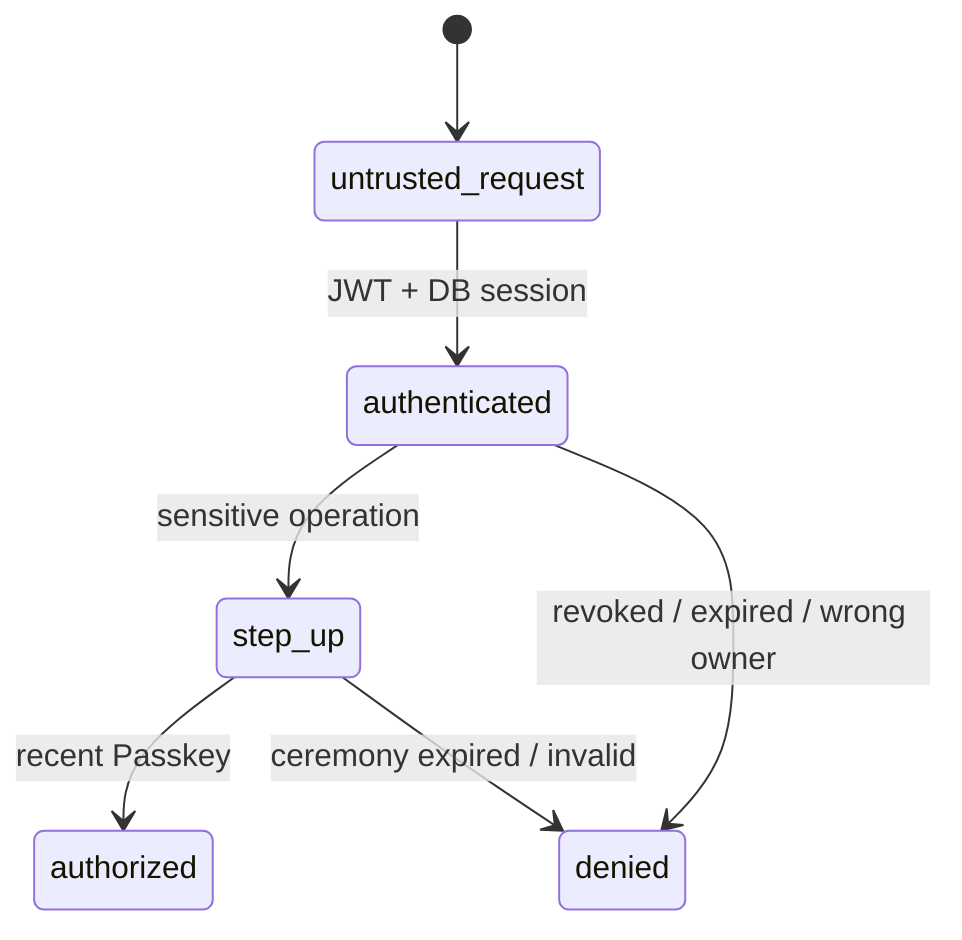

# ゼロトラスト実装規約

- 認可はhandlerで終わらせず、service/repository境界でも所有者・session・用途を確認する。
- tokenは短命、Refreshはrotation、reuse検知時はsession familyを失効する。
- 鍵は最小目的・最小寿命で渡し、DBとログには暗号文またはhashだけを保存する。
- KMS/Secret Managerを唯一のKey-B wrap鍵供給元にし、鍵ID不一致はfail closedとする。
- 監査イベントにはactor、対象、操作、結果、相関ID、時刻だけを記録する。token、平文、Recovery Key、暗号文本文を記録しない。
- 所有権が不明な画像・metadataは公開せずquarantineし、reconcilerが再試行可能な削除ジョブを作る。
