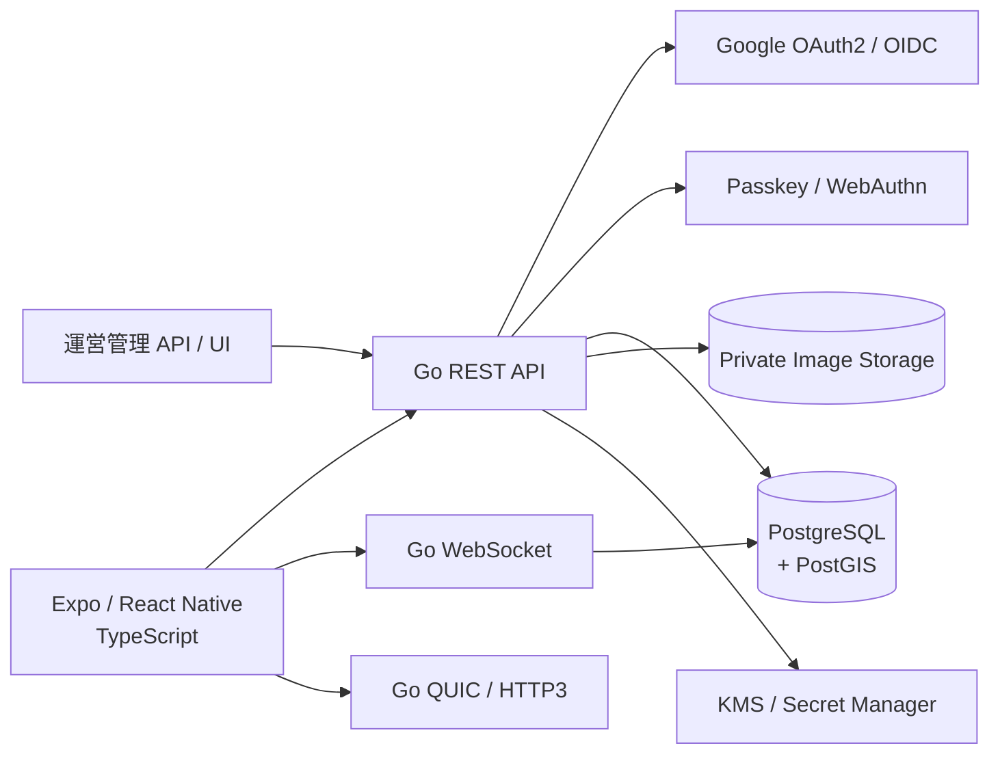
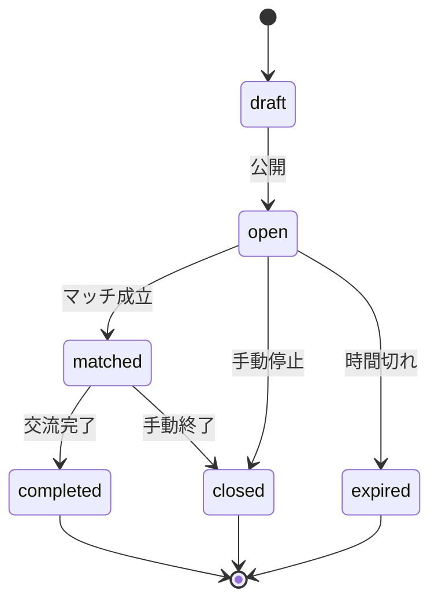
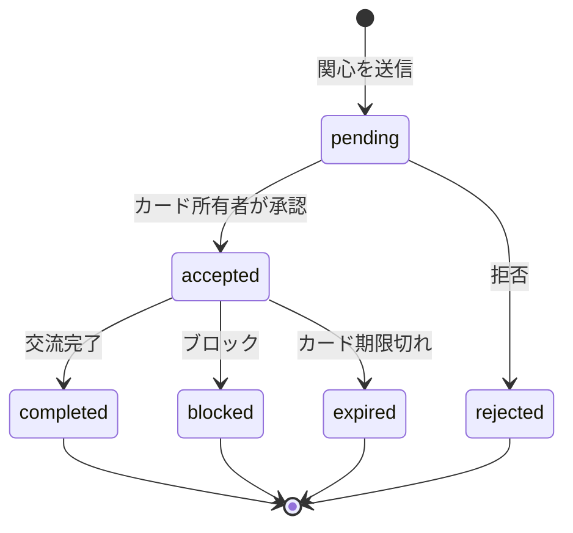

# アーキテクチャ概要

## 1. システム構成

## 2. レイヤー責務

| レイヤー | 主な責務 | 実装 |
| --- | --- | --- |
| Presentation | 画面、フォーム、ナビゲーション、表示状態 | React Native / TypeScript |
| Client Service | REST、WebSocket、位置情報、Secure Storage | TypeScript |
| API Handler | HTTP 入出力、認証コンテキスト、エラー変換 | Go |
| Domain Service | カード公開、距離、マッチ、評価、通報のルール | Go |
| Repository | SQL、トランザクション、PostGIS クエリ | Go + SQL |
| Persistence | ユーザー、カード、マッチ、メッセージ等 | PostgreSQL + PostGIS |
| File Storage | 写真本体、暗号化済みファイル | 非公開ストレージ |
| QUIC / HTTP/3 | チャット用の低遅延 transport、Chat Token 検証 | Go + native client module |

## 3. データの流れ

### 3.1 検索

1. アプリが位置情報利用の同意を取得する。
2. アプリが現在地を Go API へ送る。
3. API が認証ユーザー、精度、期限、入力値を検証する。
4. PostgreSQL / PostGIS が募集カードとの距離を計算する。
5. API が公開半径内か、カードが有効か、ブロック対象でないかを判定する。
6. アプリへは距離帯または丸めたエリアだけを返す。

### 3.2 チャット

1. マッチ成立後、アプリが認証済み WebSocket を開く。
2. Go WebSocket がユーザーと `match_id` の権限を確認する。
3. 受信したメッセージを検証し、重複を排除して保存する。
4. サーバー時刻・メッセージ ID を付与して相手へ配信する。
5. 切断時は REST で未同期メッセージを取得し、再接続後に状態を補正する。

QUIC / WebTransport を採用する場合は、通常の Access Token とは別に Chat Token を発行します。Chat Token の期限・切り替えは Access Token の Refresh 処理とは独立させ、対象 `chat_id` と `sid` に限定します。Refresh Token は QUIC 上へ送信しません。

### 3.3 写真

1. アプリで形式、サイズ、必要ならクライアント暗号化を行う。
2. API がマッチ参加者か、アップロード権限があるかを確認する。
3. API が MIME、サイズ、拡張子、画像内容、EXIF を検査する。
4. 非公開ストレージへ保存し、DB にはメタデータだけを登録する。
5. 取得時は、認証済み API または短期 URL を発行する。

## 4. 信頼境界

- Google は外部の認証基盤であり、サービスは ID Token を検証した結果だけを信頼する。
- アプリはユーザー端末上で動くため、クライアントから送信された距離・権限・評価値をそのまま信頼しない。
- Go API は認可の最終判断を行う。
- DB 接続情報、Key-B、署名鍵はアプリやリポジトリに埋め込まない。
- 他ユーザーの正確な位置、本人確認書類、非公開写真は API の認可境界を越えて返さない。

## 5. 状態遷移の中心

### 5.1 募集カード

### 5.2 マッチ

## 6. 失敗時の方針

| 失敗 | 方針 |
| --- | --- |
| Google 認証失敗 | セッションを作成せず、再試行可能なエラーを表示 |
| Passkey 認証失敗 | 認証情報の有無を推測できないメッセージを表示 |
| 位置情報拒否 | 位置情報なし検索へフォールバック。正確な距離検索は不可 |
| WebSocket 切断 | 再接続し、REST で未同期メッセージを補完 |
| 写真アップロード失敗 | 再試行可能な状態を表示し、未完了ファイルを公開しない |
| DB 一時障害 | リクエスト ID を返し、リトライ可能な処理だけ再試行 |
| Recovery Key 紛失 | 原則として復号不可。登録時に明示し、サポート復旧可否を別途決定 |

## 7. セッション失効の構成

- 運用環境は PostgreSQL の `sessions` テーブルをセッション失効の正本とする。
- ローカル開発・CI を含め、PostgreSQL の `sessions` テーブルをセッション失効の正本とする。
- アクセストークンは JWS 署名付き JWT とし、JWT の `sid` で DB のセッションを参照する。
- API は署名と有効期限の検証後、`sessions.revoked_at IS NULL`、ユーザー状態、セッション期限を確認する。
- Redis 等の別セッション DB は導入しない。
- WebSocket は接続時と heartbeat 時にセッションを再検証し、失効を検知したら接続を閉じる。
- PostgreSQL の複数 API インスタンスで即時通知が必要になった場合は、PostgreSQL の `LISTEN / NOTIFY` を利用する。
