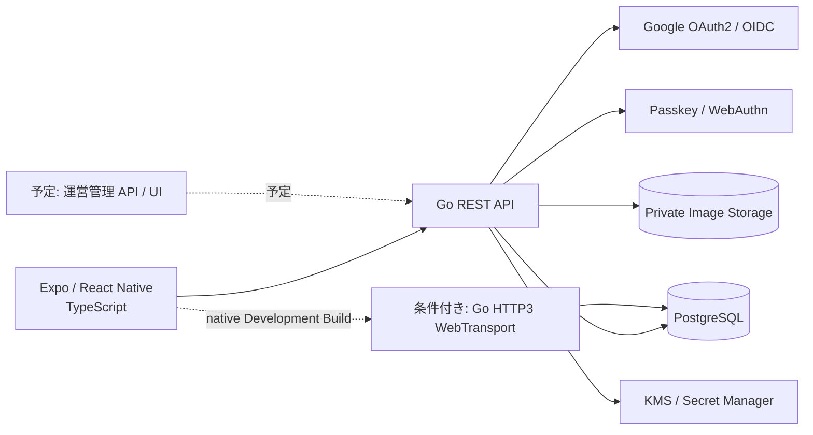
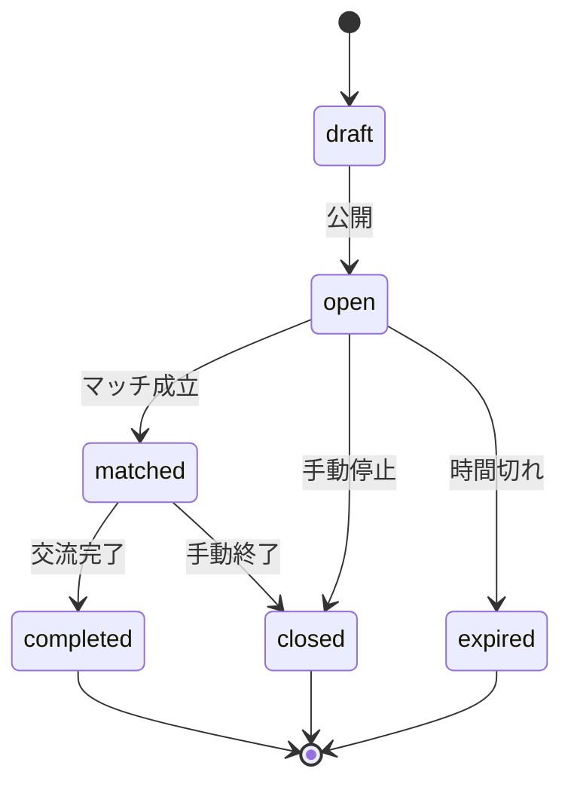
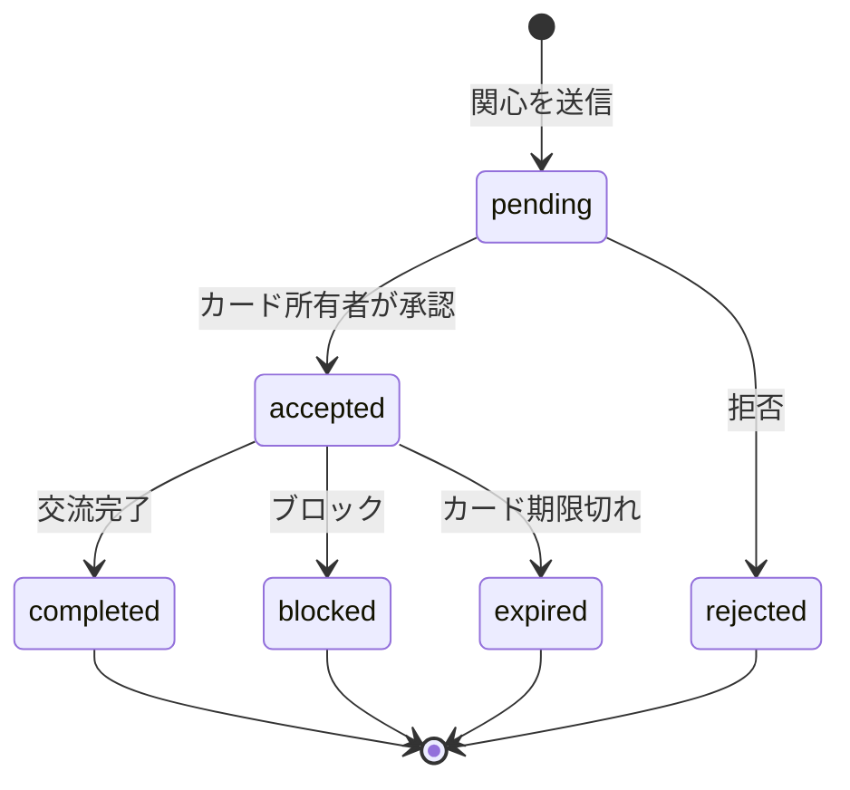

# アーキテクチャ概要

現行の実装はGo REST API、PostgreSQL、非公開画像ストレージを中心とする。チャットのリアルタイム配送は、設定時だけ起動するGoのHTTP/3 WebTransportサーバーで提供し、native client bridgeがない環境ではREST同期へ戻る。PostGIS、OSプッシュ、管理画面などは未実装または将来候補である。募集の利用日・開始／終了時刻は`Asia/Tokyo`固定の壁時計、絶対時刻はUTCで扱う。

## 1. システム構成

## 2. レイヤー責務

| レイヤー | 主な責務 | 実装 |
| --- | --- | --- |
| Presentation | 画面、フォーム、ナビゲーション、表示状態 | React Native / TypeScript |
| Client Service | REST、位置情報、Secure Storage、WebTransport connector契約。Expo GoはREST同期 | TypeScript |
| API Handler | HTTP 入出力、認証コンテキスト、エラー変換 | Go |
| Domain Service | カード公開、Haversine距離、マッチ、通報・ブロック、チャットのルール | Go |
| Repository | SQL、トランザクション | Go + SQL |
| Persistence | ユーザー、カード、マッチ、メッセージ等 | PostgreSQL（PostGIS未導入） |
| File Storage | 写真本体、暗号化済みファイル | 非公開ストレージ |
| QUIC / HTTP/3 | チャット用の低遅延transport、Chat Token検証、heartbeat、0-RTT拒否、複数インスタンスfan-out | Go（native client moduleは未同梱） |

## 3. データの流れ

### 3.1 検索

1. アプリが位置情報利用の同意を取得する。
2. アプリが現在地を Go API へ送る。
3. API が認証ユーザー、精度、期限、入力値を検証する。
4. GoのHaversine計算が募集カードとの距離を判定する。PostGISは未導入である。
5. API が公開半径内か、カードが有効か、ブロック対象でないかを判定する。
6. アプリへは距離帯または丸めたエリアだけを返す。

### 3.2 チャット

1. マッチ成立後、アプリがRESTでチャットを遅延作成し、対象chat専用の短命Chat Tokenを取得する。
2. 現行MVPでは暗号化メッセージをRESTで送受信し、`sequence` cursorで未同期分を補完する。
3. Go APIがユーザー、match、block、sessionの権限を確認し、平文を復号せず暗号文を保存する。
4. WebTransportが有効な環境では、native clientが同じChat TokenでHTTP/3へ接続し、サーバーが`sequence`付きで配送する。native clientがない環境ではRESTの明示同期を使う。
5. 会合中のBluetooth／位置推測値は別の短期補助APIで受け、認証や安全判定には利用しない。

現行のチャットはRESTの履歴取得・暗号文送信・既読更新を同期・復旧経路として残し、HTTP/3 WebTransportを唯一のリアルタイム配送経路として実装しています。WebTransport listenerは`ENABLE_CHAT_WEBTRANSPORT=true`とUDP/TLS設定がそろった場合だけ起動し、Expo Goでは利用しません。旧WebSocket endpointは410であり、自動fallbackやtokenのquery/cookie提示は行いません。Chat Tokenは通常のAccess Tokenとは別audienceで、chat・session・transport・世代に束縛します。Refresh Tokenはtransportへ送信しません。

### 3.3 写真

1. アプリで形式、サイズ、必要ならクライアント暗号化を行う。
2. API がマッチ参加者か、アップロード権限があるかを確認する。
3. API が MIME、サイズ、拡張子、画像内容、EXIF を検査する。
4. 非公開ストレージへ保存し、DB にはメタデータだけを登録する。
5. 取得時は、認証済み API または短期 URL を発行する。

## 4. 信頼境界

- Google は外部の認証基盤であり、サービスは ID Token を検証した結果だけを信頼する。
- アプリはユーザー端末上で動くため、クライアントから送信された距離・権限・評価値をそのまま信頼しない。
- Go API は認可の最終判断を行う。
- DB 接続情報、署名鍵、サーバー側秘密はアプリやリポジトリに埋め込まない。端末Key-Bは端末のSecure Storageに限定し、サーバーへ送信しない。
- 他ユーザーの正確な位置、本人確認書類、非公開写真は API の認可境界を越えて返さない。

## 5. 状態遷移の中心

### 5.1 募集カード

### 5.2 マッチ

## 6. 失敗時の方針

| 失敗 | 方針 |
| --- | --- |
| Google 認証失敗 | セッションを作成せず、再試行可能なエラーを表示 |
| Passkey 認証失敗 | 認証情報の有無を推測できないメッセージを表示 |
| 位置情報拒否 | 位置情報なし検索へフォールバック。正確な距離検索は不可 |
| WebTransport/QUIC 切断 | native clientが再接続し、`sequence` cursorでRESTから未同期メッセージを補完。0-RTTで状態変更は許可しない。native client未導入時はREST同期を使う |
| チャット送信結果不明 | 同じ `client_message_id` で期限・回数を制限して再送し、サーバー側の冪等結果を受け取る |
| 写真アップロード失敗 | 再試行可能な状態を表示し、未完了ファイルを公開しない |
| DB 一時障害 | リクエスト ID を返し、リトライ可能な処理だけ再試行 |
| Recovery Phrase 紛失 | 原則として復号不可。登録時に明示し、サポートは復号できない |

## 7. セッション失効の構成

- 運用環境は PostgreSQL の `sessions` テーブルをセッション失効の正本とする。
- ローカル開発・CI を含め、PostgreSQL の `sessions` テーブルをセッション失効の正本とする。
- アクセストークンは JWS 署名付き JWT とし、JWT の `sid` で DB のセッションを参照する。
- API は署名と有効期限の検証後、`sessions.revoked_at IS NULL`、ユーザー状態、セッション期限を確認する。
- Redis 等の別セッション DB は導入しない。
- HTTP/3 WebTransportは接続時・各state-changing frame・15秒heartbeatでセッション、token世代、accepted match、blockを再検証し、失効を検知したら接続を閉じる。RESTは履歴・送信・既読の同期経路として残る。
- PostgreSQL の複数 API インスタンスで即時通知が必要になった場合は、PostgreSQL の `LISTEN / NOTIFY` を利用する。

## 8. クライアント所有暗号鍵（v2）

最終設計は [Proton-style key management](ai/security/proton-style-key-management/proposal.md)
を正本とする。アカウントのMaster Key（実装上はKey-Aと同じ32byteのroot）は端末だけが保持し、
サーバーにはRecovery Phraseで包んだenvelope、画像ごとの暗号文、公開鍵だけを保存する。
HTTPの`/api/v1`は既存のURL互換のために残すが、root-key protocolはv2だけを受け付ける。

- Ed25519の端末Key-Bはリクエストproof専用で、鍵移行には使わない。
- 機種変更では新端末がX25519公開鍵を登録し、旧端末がPasskey再認証・端末proof・ユーザー確認を経てMaster Keyを新端末向けに包む。
- 旧端末がない場合は、24語Recovery Phraseを端末内でArgon2id + HKDF-SHA256へ通し、Master Keyを復号する。
- 画像本体は再暗号化せず、アカウント包みの画像DEKを新端末用に再包みする。失敗時に旧envelopeを消さない。
- Expo Goはハードウェア保護の証明にならない。Secure Enclave / Android Keystoreは対応するネイティブ本番ビルドでのみ実機確認する。
- 旧v1のKey-A envelope、Recovery Key、サーバー側Key-B materialはpre-release cutoverで無効化・削除する。古い開発アカウントはv2の鍵登録をやり直す。

公開プロフィール画像の`/api/v1/profile-photos`は現在も互換性のためサーバー復号する例外であり、ゼロアクセス対象ではない。
