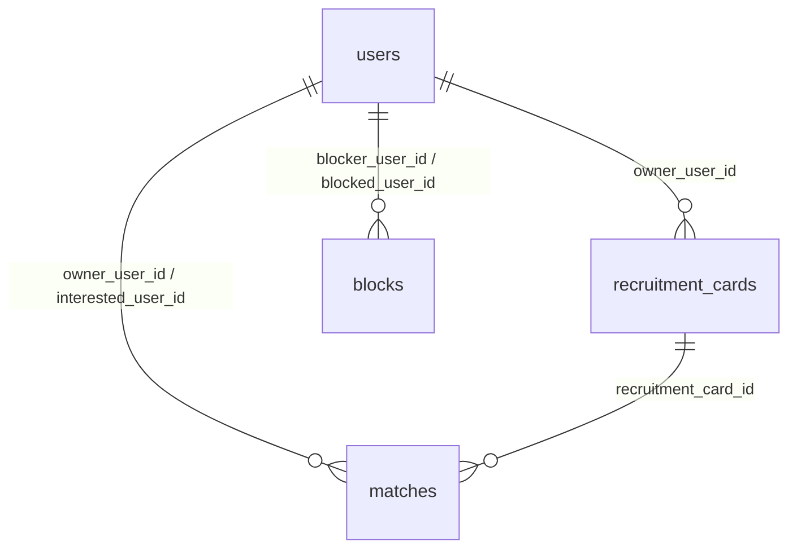

# DB仕様書（PostgreSQL）

最終更新: 2026-08-27

## 1. 採用方針

- DBはPostgreSQLのみ。本番、開発、CIで同じSQL migrationを使う。
- SQLiteは採用しない。暗号化画像本体もDBへ保存しない。
- クライアントからDBへ直接接続させず、Go APIの認証・認可を通す。
- 現在のmigrationはサービスIDをopaque `TEXT`で保存する。将来UUIDへ変更する場合は全API、ファイルパス、migrationを同時に更新する。
- migrationは`backend/migrations/*.sql`をファイル名順に適用する。アプリ起動時に同じDDLを再実行できる形にしている。

## 2. 現在のmigration

| ファイル | 内容 |
| --- | --- |
| `0001_init.sql` | 初期プレースホルダー（既存環境互換） |
| `0001_auth_sessions.sql` | users、Passkey credential、challenge、session、Refresh Token、retry、key envelope |
| `0002_images.sql` | photosの暗号文メタデータ |
| `0003_oauth_states.sql` | Google OAuth state |
| `0004_mobile_oauth_handoffs.sql` | アプリhandoffとchallenge |
| `0005_oauth_handoff_retry.sql` | crash-safe handoff応答 |
| `0006_refresh_attempt_nonce.sql` | Refresh応答nonce |
| `0007_passkey_storage.sql` | discoverable challengeのnullable user、credential JSON |
| `0008_photo_metadata.sql` | profile画像用wrapped key、MIME、暗号文サイズ |
| `0009_pre_auth_sessions.sql` | Google直後のPasskey専用pre-auth、`sessions.last_passkey_at` |
| `0010_session_handoffs.sql` | Web PasskeyからExpo Goへ返す暗号化済み短命session handoff |
| `0011_passkey_reauth.sql` | 既存sessionの直近Passkey再認証用ceremony type |
| `0013_session_handoff_retry.sql` | session handoff再送を同一`request_id`に限定する列 |
| `0014_passkey_bootstraps.sql` | Web Passkey用の短命bootstrap token hash、scope、source、期限、使用日時 |
| `0015_passkey_bootstrap_binding.sql` | bootstrapとWebAuthn ceremony tokenのbinding hash |
| `0016_recovery_proof.sql` | Recovery proof用の公開証明鍵、challenge、TTL・試行回数制限 |
| `0017_user_display_name.sql` | Passkey表示名に使うユーザー表示名 |
| `0018_device_image_keys.sql` | 端末公開鍵、画像鍵の端末別envelope、端末proof nonce、画像のKey-A由来wrapper |
| `0019_matching.sql` | `recruitment_cards`（最小構成）、`matches`、`blocks`。チャット解放判定に必要な最小のマッチ永続化 |
| `0020_messages.sql` | `messages`。チャットの本文・送信順・既読状態（現状は平文保存、REST APIのみ） |

注意: 現行の簡易migration runnerはSQLファイルを順番に実行する。migration履歴テーブルによる本番適用管理を導入する場合は、既存環境の適用済み状態を確認してから切り替える。

## 3. 認証テーブル

### `users`

| カラム | 型 | 用途 |
| --- | --- | --- |
| `id` | text | サービス用個人識別ID、PK |
| `google_subject_id` | text | Google OIDC `sub`、UNIQUE |
| `display_name` | text | Passkeyの登録画面に表示するユーザー名。空の場合は安全な固定fallback |
| `status` | text | `active / suspended / deleted` |
| `created_at` / `updated_at` | text | UTC RFC3339 |
| `deleted_at` | text | 論理削除時 |

### `passkey_credentials`

| カラム | 型 | 用途 |
| --- | --- | --- |
| `id` | text | credential recordのPK |
| `user_id` | text | `users.id`へのFK |
| `credential_id` | text | WebAuthn credential IDのBase64URL、UNIQUE |
| `public_key` | text | COSE公開鍵のBase64URL（legacy fallback） |
| `credential_json` | text | WebAuthn libraryのcredential JSON |
| `sign_count` | bigint | clone検知用カウンタ |
| `created_at` | text | 登録日時 |
| `last_used_at` | text | 最終認証日時 |

credential JSONは検証に必要な情報を保持する。DBアクセス権限を持つ運用者でも、秘密鍵を得られない設計にする。

### `auth_challenges`

| カラム | 型 | 用途 |
| --- | --- | --- |
| `id` | text | challenge recordのPK |
| `user_id` | text nullable | 登録・既知ユーザーloginは設定。discoverable loginはNULL |
| `type` | text | `passkey_register / passkey_login / passkey_reauth`。pre-auth token自体は別テーブルで管理 |
| `token_hash` | text | ceremony tokenのSHA-256 hash、UNIQUE |
| `scope` | text | WebAuthn `SessionData` JSON |
| `expires_at` | text | 現在5分 |
| `used_at` | text | 一回使用後 |
| `created_at` | text | 作成日時 |

`used_at IS NULL`かつ期限内だけを受け付け、検証処理の前に行ロックして一回使用にする。ceremony token平文はDBへ保存しない。

### `oauth_states`

`state_hash`、Google PKCE `code_verifier`、`app_redirect_uri`、`handoff_challenge`、期限、使用日時を持つ。state平文ではなくhashを検索し、callbackで一回消費する。

### `oauth_handoffs`

`code_hash`、`user_id`、アプリhandoff challenge、期限、使用日時、暗号化済み応答とnonceを持つ。handoff codeは一回限りだが、同じverifierによる期限内の再送だけは同じ応答を返す。

### `pre_auth_tokens`

Google交換直後に発行するPasskey専用の短命tokenを保存する。`token_hash`だけを保存し、scope（初回登録・既知ユーザーログイン・再認証）、ユーザー、5分の期限、`used_at`を管理する。通常API、鍵、プロフィール、写真、チャットには利用できない。

### `passkey_bootstraps`

Web URLへ渡すbootstrap tokenのサーバー側記録。平文tokenではなく`token_hash`だけを保存し、ユーザー、元sessionまたは`source_pre_auth_hash`、scope、許可済みredirect URI、handoff challenge、1分の期限、`used_at`、ceremony binding hashを管理する。Web URLにはAccess Token、Refresh Token、pre-auth tokenを入れず、bootstrapは一回だけ消費する。

### `session_handoffs`

Web Passkey成功後にExpo Goへ通常のSessionTokensを返すための短命codeを保存する。code hash、redirect URI、PKCE challenge、暗号化済みレスポンス、nonce、10分の期限、`exchange_request_id`を持つ。code単体では交換できず、同じverifier・同じrequest IDによる30秒以内の再送だけ同じ応答を返す。別request IDは拒否する。

## 4. セッションテーブル

### `sessions`

| カラム | 型 | 用途 |
| --- | --- | --- |
| `id` | text | JWS `sid`、PK |
| `user_id` | text | `users.id` |
| `family_id` | text | Refresh rotationの失効単位 |
| `status` | text | `active / revoked / expired` |
| `device_name` | text nullable | 端末表示名 |
| `created_at` / `last_seen_at` | text | 作成・最終利用 |
| `expires_at` | text | 絶対期限（現在90日） |
| `last_passkey_at` | text nullable | 直近Passkey成功時刻。session handoffなどの再認証境界に使用 |
| `revoked_at` / `revoked_reason` | text | 失効情報 |

Access Token検証時も`sessions.status`、`expires_at`、アイドル期限、`users.status`を確認する。ログアウト後に署名が正しい旧Access Tokenを受け付けない。

### `refresh_tokens`

| カラム | 型 | 用途 |
| --- | --- | --- |
| `id` | text | token世代ID |
| `session_id` | text | session FK |
| `token_hash` | text | Refresh TokenのSHA-256、平文禁止、UNIQUE |
| `issued_at` / `expires_at` | text | 発行・絶対期限 |
| `used_at` / `revoked_at` | text | rotation・失効 |

Refreshは対象行を`FOR UPDATE`し、旧token使用済み化、新token追加、session最終利用更新をtransactionで行う。

### `refresh_attempts`

| カラム | 型 | 用途 |
| --- | --- | --- |
| `id` | text | retry recordのPK |
| `session_id` | text | session FK |
| `request_id` | text | クライアントがRefreshごとに作るID |
| `old_token_hash` | text | 旧token hash |
| `response_ciphertext` | text | tokenを含む応答の暗号文 |
| `response_nonce` | text | AES-GCM nonce |
| `expires_at` / `created_at` | text | 現在retryは30秒 |

同じsession・request ID・旧token hashだけ同じ応答を復号して返す。別request IDの使用済みtokenはreuseとして全Refresh Tokenとsessionを失効する。

## 5. 画像・鍵テーブル

### `photos`

| カラム | 型 | 用途 |
| --- | --- | --- |
| `id` | text | 写真ID、PK |
| `owner_user_id` | text | 所有者FK |
| `visibility` | text | `private / profile` |
| `storage_path` | text | private保存領域の相対キー、UNIQUE |
| `cipher_sha256` | text | 保存暗号文のハッシュ |
| `nonce` | text | AES-256-GCM nonce |
| `algorithm` | text | 現在`AES-256-GCM`のみ |
| `key_version` | text | 鍵ローテーション |
| `wrapped_image_key` | text | legacyまたはprofile用のwrapped画像鍵 |
| `account_wrapped_image_key` | text | Key-A由来の鍵でラップした画像鍵。Recovery後の端末再登録に使う |
| `wrapping_algorithm` | text | ラップ方式 |
| `content_type` | text | profile復号配信時のMIME |
| `size_bytes` | bigint | 保存暗号文のサイズ |
| `server_wrapped_image_key` | text nullable | profile画像だけのRSA-OAEP-256 wrapped key |
| `created_at` / `deleted_at` | text | 作成・論理削除 |

画像平文はDBにもprivateフォルダにも保存しない。メモリcacheも暗号文のみとし、profile配信の平文はレスポンス作成中だけに存在させる。削除時はDBの公開状態、ファイル、cacheを一体で無効化する。

### `key_envelopes`

Key-AをRecovery Keyから導出した鍵で暗号化したenvelopeを保存する。`encrypted_key_a`、nonce、HKDFパラメータ、data salt、Ed25519 `recovery_public_key`、key versionだけを保持し、Key-A、Key-B、Recovery Keyの平文を保持しない。HTTP APIは`GET/PUT/DELETE /api/v1/me/key-envelopes`で提供し、全操作に直近Passkey再認証を要求する。公開証明鍵を持たない既存行はデータ保全のため残せるが、新Recovery proofには使わない。

### `devices` / `photo_device_key_envelopes` / `device_request_nonces`

Key-Bは端末ごとに生成し、Secure Storage／Keychain／Keystoreから外へ出さない。`devices`には`device_id`、version、Ed25519公開鍵、最終利用時刻だけを保存し、同じ端末IDの公開鍵差し替えは拒否する。`photo_device_key_envelopes`は画像鍵を端末Key-Bで包んだ値を端末単位で保存する。`account_wrapped_image_key`はRecovery後の新端末が画像鍵を自端末Key-Bで再包みするための暗号文であり、Key-AやKey-Bそのものではない。`device_request_nonces`は端末proofのnonce再利用を拒否する。`users`削除時は端末、envelope、nonceをcascadeまたは退会transactionで削除する。

### `key_b_materials`（legacy）

旧実装のアカウント共通Key-B用テーブル。現行APIでは参照・新規保存せず、既存データ保全のためmigrationからは削除しない。旧データを現行画像へ自動変換したことは意味しないため、legacy画像が残る本番環境では別途移行計画を確定する。

### `recovery_challenges`

Recovery Keyで復号したKey-Aの所有証明を一時的に受け付けるためのchallengeを保存する。challenge本文、pre-auth token、署名は保存せず、challenge hashとpre-auth token hashだけを保持する。`source_session_id`または`pre_auth_token_hash`のどちらか一方に束縛し、10分の期限、最大5回の署名試行、pre-auth単位の発行レート制限、使用済みフラグを持つ。`users`、`sessions`の削除時はchallengeもcascadeまたは退会トランザクションで削除する。

## 6. マッチング（実装済み: `recruitment_cards` / `matches` / `blocks`）

チャット（[機能仕様：チャット](features/chat.md)）は`matches.status = accepted`の参加者だけが利用できます。そのマッチ成立をPostgreSQLへ永続化する最小構成として、`0019_matching.sql`で次の3テーブルを追加しました。設計の背景と対応する機能仕様は[機能仕様：募集カード・マッチング](features/matching.md)を参照してください。

このフェーズでの方針:

- マッチは「ユーザー同士が直接申し込む」形ではなく、仕様通り「募集カードへの関心 → カード所有者が承認」というフローで成立します（`matching.md` 4章）。
- キーワード・距離検索、PostGIS、`draft`→`open`の公開ワークフロー、`reports`、監査ログは**今回のスコープ外**です。カードは作成時点で直接`open`になります。
- `profiles`、`reviews`、`user_locations`、`identity_verifications`もまだ追加していません（表示名は既存の`users.display_name`、アイコンは`photos`の`visibility='profile'`を流用）。

### `recruitment_cards`

| カラム | 型 | 用途 |
| --- | --- | --- |
| `id` | text | PK |
| `owner_user_id` | text | 作成者、`users`へのFK |
| `activity` | text | 交流したい内容の自由記述 |
| `location_label` | text nullable | 表示用の場所ラベル。緯度経度・PostGIS距離検索はまだ持たない |
| `available_date` / `start_time` | text | 日時・時間帯 |
| `duration_hours` | integer | 1以上 |
| `distance_km` | integer | `1 / 3 / 5`のみ許可（CHECK制約） |
| `status` | text | `draft / open / matched / closed / expired`。現在の実装では作成時に直接`open`になり、`draft`公開ワークフローは未実装 |
| `created_at` / `updated_at` | text | UTC RFC3339 |

### `matches`

| カラム | 型 | 用途 |
| --- | --- | --- |
| `id` | text | PK |
| `recruitment_card_id` | text | `recruitment_cards`へのFK |
| `owner_user_id` | text | カード所有者。素早い認可チェックのため`recruitment_cards`から複製 |
| `interested_user_id` | text | 関心を送ったユーザー |
| `status` | text | `pending / accepted / rejected / blocked / expired / completed` |
| `created_at` / `updated_at` | text | UTC RFC3339 |

`UNIQUE (recruitment_card_id, interested_user_id)`で同じユーザーが同じカードへ重複して関心を送れないようにします。`owner_user_id <> interested_user_id`をCHECK制約で強制し、自分のカードへの関心を防ぎます。カード所有者が承認すると`matches.status='accepted'`かつ`recruitment_cards.status='matched'`になり、以後そのカードは新しい関心を受け付けません（1枚のカードにつき成立は1件までという暫定判断。`matching.md`8章の要確認事項として残っています）。

### `blocks`

| カラム | 型 | 用途 |
| --- | --- | --- |
| `id` | text | PK |
| `blocker_user_id` | text | ブロックした側 |
| `blocked_user_id` | text | ブロックされた側 |
| `created_at` | text | UTC RFC3339 |

`UNIQUE (blocker_user_id, blocked_user_id)`で二重ブロックを防ぎます（`ON CONFLICT DO NOTHING`で冪等に扱う）。関心送信時（`matches`作成前）にこのテーブルを両方向でチェックし、ブロック関係があれば`ErrBlocked`を返します。`reports`、運営キュー、監査ログは`docs/features/safety.md`の範囲として別途実装します。

### 実装

`backend/internal/matching`がこの3テーブルを操作するService層です。HTTPハンドラは`backend/internal/httpapi/matching.go`（`POST/GET /recruitments`、`GET/POST /recruitments/{id}` と `/interest`、`POST /matches/{id}/accept`、`POST/GET /blocks`、`GET /me/blocks`、`DELETE /blocks/{user_id}`）。

## 7. チャット（実装済み: `messages`。WebSocket・Chat Tokenは未実装）

`0020_messages.sql`で`messages`テーブルを追加しました。[機能仕様：チャット](features/chat.md)のうち、履歴取得・送信のREST APIだけを実装しています。WebSocketによるリアルタイム配信、Chat Token（[chat-transport.md](features/chat-transport.md)）は次のフェーズです。

### `messages`

| カラム | 型 | 用途 |
| --- | --- | --- |
| `id` | text | PK |
| `match_id` | text | `matches`へのFK。チャットの単位は`matches.id`と同じ（`chat_id` = `match_id`） |
| `sender_user_id` | text | 送信者 |
| `body` | text | 本文。**現時点では平文で保存**（下記「暗号化の扱い」を参照） |
| `client_message_id` | text | 送信側が生成する冪等キー |
| `server_message_id` | bigint (`GENERATED ALWAYS AS IDENTITY`) | サーバー確定の表示順（`requirements.md` FR-011の`server_message_id`に対応） |
| `created_at` | text | UTC RFC3339 |
| `read_at` | text nullable | 既読時刻。現状はWebSocketの`message.read`実装待ちのため常にNULL |
| `deleted_at` | text nullable | 論理削除用に列だけ先に用意（削除APIは未実装。FR-011「削除済みメッセージは相手側で再表示できない」への対応は今後の課題） |

`UNIQUE (match_id, sender_user_id, client_message_id)`で同じ送信の再試行を冪等にします（`ON CONFLICT ... DO UPDATE SET id = messages.id`で元のメッセージを返し、二重登録も上書きもしません）。読み書き前に必ず「呼び出しユーザーがこのmatchの参加者か」「`matches.status='accepted'`か」「参加者間にブロックが無いか」を確認します（`backend/internal/chat.Service.authorize`）。ブロックはマッチ承認後に作られる可能性があるため、毎回チェックします。

### 暗号化の扱い（現状の判断）

`chat.md` 6章はE2EE採用時の設計（暗号化payload・nonce・key versionを送り、Go APIは鍵を持たない）を示していますが、9章では採用範囲自体が未決定です。今回のフェーズでは**平文保存を選択**しました（会話でユーザーに明示し、承認を得た判断）。将来E2EEを採用する場合、`body`を`ciphertext` / `nonce` / `key_version`列へ移行するmigrationと、鍵共有方式の設計（Key-A/Key-Bとは別に、マッチ参加者間で共有鍵をどう配送するか）が必要です。現時点ではその鍵共有方式自体が未設計です。

### 実装

`backend/internal/chat`がService層（`SendMessage`、`ListMessages`、`ListChats`）、`backend/internal/httpapi/chat.go`がHTTPハンドラ（`GET /chats`、`GET /chats/{id}/messages`、`POST /chats/{id}/messages`）です。認可は`matching.Service`の`GetMatch` / `IsBlocked`に委譲します。

## 8. これから追加するテーブル・制約

- `profiles`: 名前、国籍、icon photo、本人確認状態、likes、monster
- `reviews`、`user_locations`
- `identity_verifications`、`reports`、`audit_logs`
- `recruitment_cards`への緯度経度・PostGIS列、距離検索インデックス
- チャットのWebSocket接続・Chat Token（`aud=samurai-meet-chat`）用の状態管理

これらはAPI実装時にmigrationを追加し、PostgreSQL integration test、API仕様書、機能仕様書を同じ変更で更新する。

## 9. 削除・保持

退会では次の順序を固定する。

1. 新規認証・新規API利用を拒否する。
2. DB user rowをロックし、全sessionを失効する。
3. private暗号文ファイルとメモリcacheを削除する。
4. refresh/passkey/challenge/key envelope/device/envelope/nonce/handoff/photo metadataを削除して、users rowを完全削除する。
5. 削除結果を監査ログへ記録する（秘密情報は記録しない）。監査ログ実装まではアプリログへ秘密値を出さない。

バックアップ上の物理削除期限、チャット保持期間、監査ログ保持期間は運用・法務決定後にmigrationと運用手順へ反映する。
