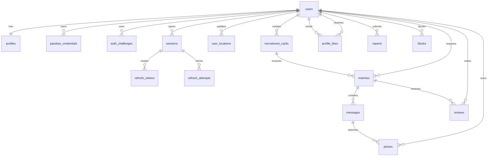

# DB 仕様書

## 1. 採用方針

- DB エンジンは PostgreSQL と SQLite のみとする。
- 本番・ステージングは PostgreSQL、ローカル開発・単体テストは SQLite を利用する。
- PostgreSQL では PostGIS 拡張を利用できる。PostGIS は別 DB ではなく PostgreSQL の拡張である。
- SQLite では距離計算を Go 側で行う。
- 距離検索のため PostGIS を有効化する。
- DB の主キーは UUID とする。
- `users` は認証アカウント、`profiles` は公開プロフィールとして分離する。
- 画像本体は DB へ保存せず、非公開ストレージのキーを保存する。
- migration は `backend/migrations/*.sql` で管理する。
- クライアントから DB を直接更新せず、Go API の認証・認可を通す。

## 2. ER 概要

## 3. テーブル定義

### 3.1 `users`

| カラム | 型 | 制約 / 用途 |
| --- | --- | --- |
| `id` | uuid | PK。サービス用個人識別 ID |
| `google_subject_id` | text | NOT NULL、UNIQUE。Google OIDC の `sub` |
| `status` | text | `active / suspended / deleted` |
| `created_at` | timestamptz | NOT NULL |
| `updated_at` | timestamptz | NOT NULL |
| `deleted_at` | timestamptz | 論理削除時のみ |

### 3.2 `profiles`

| カラム | 型 | 制約 / 用途 |
| --- | --- | --- |
| `user_id` | uuid | PK、`users.id` への FK |
| `name` | text | 表示名。長さ制限を設定 |
| `nationality_code` | char(2) | ISO 3166-1 等 |
| `icon_photo_id` | uuid | `photos.id`。任意 |
| `identity_status` | text | `unverified / pending / verified / rejected / expired` |
| `likes_count` | integer | `DEFAULT 0`、0 以上 |
| `monster` | jsonb または text | 仕様未確定 |
| `bio` | text | 任意の自己紹介 |
| `created_at` / `updated_at` | timestamptz | NOT NULL |

### 3.3 `recruitment_cards`

| カラム | 型 | 制約 / 用途 |
| --- | --- | --- |
| `id` | uuid | PK |
| `owner_user_id` | uuid | `users.id` への FK |
| `available_date` | date | 交流可能日 |
| `start_time` / `end_time` | time | 時間帯 |
| `timezone` | text | IANA タイムゾーン |
| `keywords` | text[] または正規化テーブル | 検索用 |
| `visibility_radius_km` | smallint | `1 / 3 / 5` の CHECK |
| `location` | geography(Point, 4326) | 距離検索用。外部へ正確な値を返さない |
| `status` | text | `draft / open / matched / closed / expired` |
| `expires_at` | timestamptz | 期限切れ処理用 |
| `created_at` / `updated_at` | timestamptz | NOT NULL |

### 3.4 `matches`

| カラム | 型 | 制約 / 用途 |
| --- | --- | --- |
| `id` | uuid | PK |
| `card_id` | uuid | `recruitment_cards.id` への FK |
| `requester_user_id` | uuid | 関心を送ったユーザー |
| `owner_user_id` | uuid | 募集カード作成者 |
| `status` | text | `pending / accepted / rejected / blocked / expired / completed` |
| `matched_at` | timestamptz | 相互承認時 |
| `created_at` / `updated_at` | timestamptz | NOT NULL |

制約：`UNIQUE(card_id, requester_user_id)`。`requester_user_id <> owner_user_id` も CHECK する。

### 3.5 `messages`

| カラム | 型 | 制約 / 用途 |
| --- | --- | --- |
| `id` | uuid | PK、サーバー側で採番 |
| `match_id` | uuid | `matches.id` への FK |
| `sender_user_id` | uuid | 送信者 |
| `message_type` | text | `text / photo / system` |
| `ciphertext` | bytea または text | 暗号化本文。暗号化方式確定後に決定 |
| `nonce` | bytea | AEAD 用 nonce |
| `key_version` | text | 鍵ローテーション用 |
| `client_message_id` | text | 冪等性制御。`match_id` と一意にする |
| `sent_at` | timestamptz | サーバー確定時刻 |
| `read_at` | timestamptz | 既読時刻 |
| `deleted_at` | timestamptz | 論理削除 |

### 3.6 `photos`

| カラム | 型 | 制約 / 用途 |
| --- | --- | --- |
| `id` | uuid | PK |
| `owner_user_id` | uuid | 所有者 |
| `message_id` | uuid | チャット添付時。アイコンは NULL 可 |
| `storage_key` | text | 非公開ストレージのキー |
| `mime_type` | text | サーバーで再検証 |
| `size_bytes` | bigint | サイズ上限を検証 |
| `width` / `height` | integer | 表示用 |
| `encrypted` | boolean | クライアント暗号化済みか |
| `nonce` | bytea | 暗号化時のみ |
| `created_at` / `deleted_at` | timestamptz | 保持・削除管理 |

### 3.7 認証・暗号化・安全系テーブル

| テーブル | 主なカラム | 目的 |
| --- | --- | --- |
| `passkey_credentials` | `user_id`, `credential_id`, `public_key`, `sign_count` | Passkey 公開鍵と端末資格情報 |
| `auth_challenges` | `user_id`, `type`, `token_hash`, `scope`, `expires_at`, `used_at` | `pre_auth_token` と Passkey challenge の一回性・期限管理 |
| `sessions` | `id`, `user_id`, `status`, `created_at`, `last_seen_at`, `expires_at`, `revoked_at`, `revoked_reason` | JWS 署名付き JWT の `sid` と紐づくログインセッション |
| `refresh_tokens` | `id`, `session_id`, `token_hash`, `issued_at`, `expires_at`, `used_at`, `revoked_at` | Refresh Token のローテーションと再利用検知。平文は保存しない |
| `refresh_attempts` | `session_id`, `request_id`, `old_token_hash`, `response_ciphertext`, `expires_at` | 通信結果が失われた同一 Refresh 操作を 30 秒だけ冪等に再取得 |
| `key_envelopes` | `user_id`, `encrypted_key_a`, `nonce`, `kdf_params`, `key_version` | 暗号化済み Key-A。Recovery Key 平文は保存しない |
| `user_locations` | `user_id`, `location`, `accuracy_m`, `captured_at`, `expires_at` | 最新位置。履歴を原則保存しない |
| `identity_verifications` | `user_id`, `provider`, `status`, `provider_reference`, `verified_at` | 本人確認状態とプロバイダー参照値 |
| `reviews` | `match_id`, `reviewer_user_id`, `reviewee_user_id`, `rating`, `comment` | 相互評価。レビュー方式は要確認 |
| `profile_likes` | `sender_user_id`, `receiver_user_id`, `created_at` | いいねの原票。一人一回を一意制約 |
| `reports` | `reporter_user_id`, `target_type`, `target_id`, `reason`, `status` | 通報と運営処理 |
| `blocks` | `blocker_user_id`, `blocked_user_id`, `created_at` | 表示・チャット・関心の遮断 |
| `audit_logs` | `actor_user_id`, `action`, `target`, `request_id`, `created_at` | 管理・セキュリティ監査 |

## 4. インデックス・制約

- `users.google_subject_id`：UNIQUE
- `recruitment_cards.location`：GiST 空間インデックス
- `recruitment_cards(status, available_date, expires_at)`：検索用複合インデックス
- `recruitment_cards.keywords`：GIN または正規化キーワードテーブルのインデックス
- `messages(match_id, sent_at)`：履歴取得用
- `matches(card_id, requester_user_id)`：UNIQUE
- `reviews(match_id, reviewer_user_id)`：UNIQUE
- `profile_likes(sender_user_id, receiver_user_id)`：UNIQUE
- `blocks(blocker_user_id, blocked_user_id)`：UNIQUE
- `sessions(user_id, revoked_at, expires_at)`：有効セッション確認用
- `auth_challenges(token_hash)`：UNIQUE。仮認証 token のハッシュ検索用
- `refresh_tokens(token_hash)`：UNIQUE。Refresh Token のハッシュ検索用
- `refresh_tokens(session_id, used_at, revoked_at)`：ローテーション・失効確認用
- `refresh_attempts(session_id, request_id)`：UNIQUE。同一 Refresh 操作の冪等性用
- 公開カードは `status = open`、`expires_at > now()`、かつ距離が半径以内の場合だけ返す。
- 位置情報と本人確認の詳細は、一般ユーザー向け SELECT 経路から除外する。

## 5. migration 方針

1. `0001_init.sql`：`users`, `profiles`, `recruitment_cards`, `matches`, `messages`, `photos`
2. `0002_auth.sql`：`passkey_credentials`, `auth_challenges`, `sessions`, `refresh_tokens`, `refresh_attempts`, `key_envelopes`
3. `0003_location.sql`：PostGIS、`user_locations`、地理空間インデックス
4. `0004_review.sql`：`reviews`, `profile_likes`
5. `0005_safety.sql`：`reports`, `blocks`, `audit_logs`

各 migration は前方適用可能な形で管理し、本番 DB へ手動 SQL を直接実行しない。削除・カラム変更は、ロールバックまたは段階的移行の手順を用意する。

## 6. `sessions` / `refresh_tokens` の詳細

### `auth_challenges`

| カラム | 型 | 用途 |
| --- | --- | --- |
| `id` | uuid | challenge ID |
| `user_id` | uuid | `users.id` |
| `type` | text | `pre_auth / passkey_register / passkey_login` |
| `token_hash` | bytea または text | 仮認証 token / challenge のハッシュ |
| `scope` | text[] または text | 許可する操作。`pre_auth` は Passkey 関連だけ |
| `expires_at` | timestamptz | 5 分以内を基本とする |
| `used_at` | timestamptz | 一回使用後に設定 |
| `created_at` | timestamptz | 作成日時 |

`used_at IS NULL` かつ `expires_at > now()` の challenge だけを受け付けます。`pre_auth_token` の平文は DB やログへ保存しません。

### `sessions`

| カラム | 型 | 用途 |
| --- | --- | --- |
| `id` | uuid | セッション ID。JWT の `sid` に入れる |
| `user_id` | uuid | `users.id` |
| `status` | text | `active / revoked / expired` |
| `family_id` | uuid | Refresh Token のローテーション単位 |
| `device_name` | text | ユーザーが識別する端末名。任意 |
| `created_at` | timestamptz | セッション作成日時 |
| `last_seen_at` | timestamptz | 最終 API / Refresh 利用時刻 |
| `expires_at` | timestamptz | 絶対期限 |
| `revoked_at` | timestamptz | 失効日時 |
| `revoked_reason` | text | `logout / logout_all / reuse_detected / admin / expired` 等 |

### `refresh_tokens`

| カラム | 型 | 用途 |
| --- | --- | --- |
| `id` | uuid | Refresh Token の世代 ID |
| `session_id` | uuid | `sessions.id` |
| `token_hash` | bytea または text | 平文ではなくハッシュを保存 |
| `issued_at` | timestamptz | 発行日時 |
| `expires_at` | timestamptz | アイドル・絶対期限の判定 |
| `used_at` | timestamptz | ローテーション済み日時 |
| `revoked_at` | timestamptz | 個別失効日時 |

Refresh 処理はトランザクション内で対象 token の更新と新 token の追加を一体化します。PostgreSQL では対象 token を `SELECT ... FOR UPDATE` でロックし、SQLite では `BEGIN IMMEDIATE` 等の書き込みトランザクションで競合を防ぎます。使用済み token が再度送られた場合は、同じ `family_id` のセッションを失効させます。

### `refresh_attempts`

| カラム | 型 | 用途 |
| --- | --- | --- |
| `id` | uuid | 冪等性記録 ID |
| `session_id` | uuid | `sessions.id` |
| `request_id` | uuid | クライアントが Refresh ごとに生成する ID |
| `old_token_hash` | bytea または text | その操作で使用した旧 token のハッシュ |
| `response_ciphertext` | bytea または text | 新 token を含むレスポンスの暗号化データ。平文は保存しない |
| `expires_at` | timestamptz | 30 秒後に失効 |
| `created_at` | timestamptz | 作成日時 |

同一 `session_id`・`request_id` の再送だけに同じレスポンスを返します。異なる `request_id` で旧 Refresh Token が送られた場合は、冪等な再送ではなく token reuse として扱います。

## 7. PostgreSQL と SQLite の使い分け

| 項目 | PostgreSQL | SQLite |
| --- | --- | --- |
| 用途 | 本番・ステージング | ローカル開発・単体テスト |
| 同時接続 | 複数 API インスタンスを想定 | 単一プロセスを基本とする |
| 距離検索 | PostGIS 拡張 | Go の Haversine 計算 |
| migration | PostgreSQL 方言を基準に管理 | 互換 SQL またはテスト用 migration。時刻型などの差異を吸収 |
| セッション失効 | `sessions` / `refresh_tokens` | 同じテーブルを SQLite に作成 |
| 通知 | 必要に応じて PostgreSQL `LISTEN / NOTIFY` | heartbeat / polling |

SQLite を本番の複数サーバー間セッション共有に使わない。DB エンジンを追加せずに水平スケールする場合は PostgreSQL を利用する。

## 8. データ保持

保持期間は法務・運用と確定する。少なくとも次を個別に決定する。

- 最新位置と期限切れ位置
- 期限切れ募集カード
- チャット本文と写真
- 本人確認プロバイダー参照値
- 通報・監査ログ
- バックアップ上の削除データ
