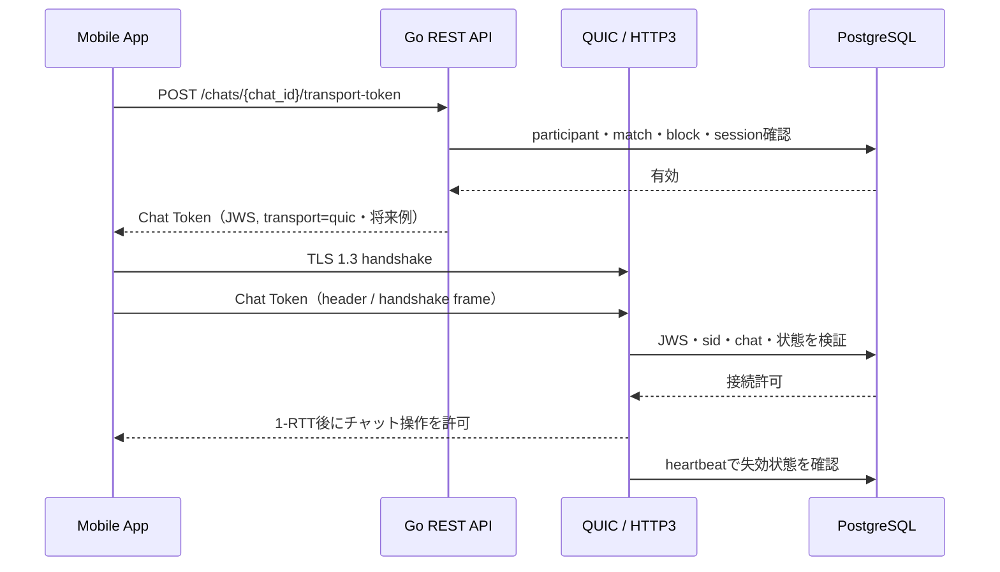

# 機能仕様：チャット通信トークン（transport token＋WebSocket 実装済み／QUIC 予定）

## 1. 位置づけ

本書は将来のQUICリアルタイム配送に向けた設計仕様です。現時点で実装済みなのは、RESTの履歴・暗号文送信・既読、短命transport tokenの発行・検証、および**WebSocketによるリアルタイム配送サーバー**（`backend/internal/chat/websocket.go` / `hub.go`、統合テスト `TestChatWebSocketDelivery`）です。QUIC／HTTP/3 WebTransportの配送はまだ設計段階で、`frontend/services/quic.ts`、`backend/internal/chat/quic.go`、フロントのWebSocketクライアント（`frontend/services/websocket.ts`）は未実装です。transport tokenが発行する `transport` の値は `websocket` のみで、`webtransport` / `quic` はそれを終端するサーバーが実装されるまで `ErrChatInvalidInput`（HTTP 400 `invalid_chat_request`）で拒否します。

将来は QUIC を標準 transport 候補とします。HTTP/3 WebTransportを使う場合もQUIC上の実装形態として扱い、WebSocketは自動採用しません。QUICは通信路のプロトコルであり、アプリケーションの認証・認可そのものではないため、QUIC / HTTP/3の暗号化通信上でチャット専用の短命トークンを別途検証します。

QUIC は TLS 1.3 を使って通信を保護しますが、チャット参加者かどうか、対象チャットにアクセスできるか、セッションが失効していないかは Go API 側で判定します。詳細は [RFC 9001](https://www.rfc-editor.org/rfc/rfc9001) と [RFC 9114](https://www.rfc-editor.org/rfc/rfc9114) を参照します。

### 1.1 QUICを優先する理由

- QUIC は TLS 1.3 と transport handshake を統合しており、通常の接続確立で不要な往復を減らしやすい。
- ストリームを多重化できるため、制御イベント、メッセージ、再同期などを分離し、あるストリームの損失が他の処理へ波及する範囲を抑えやすい。
- Connection ID による接続移行を利用でき、Wi-Fi とモバイル回線の切り替えなど、端末のネットワーク変化後も再接続を減らしやすい。
- UDP ベースの損失回復、輻輳制御、ストリーム単位のフロー制御を持ち、モバイル回線で遅延や帯域が変動するチャットに適用しやすい。
- 0-RTT 再送の危険性を明示的に制御しながら、再接続後の未同期メッセージ取得とリアルタイム配送を同じ認可モデルで設計できる。

上記は QUIC を採用する設計上の利点であり、実機・回線・サーバー負荷で検証します。0-RTT のアプリケーションデータは再送され得るため、状態変更には利用しません。

WebSocket は自動フォールバックにしません。QUIC が対象端末または運用環境で技術的に成立しない場合だけ、制約、性能、保守性、セキュリティ影響を比較し、チームで合意・記録したうえで例外採用を決定します。
例外採用時も、Chat Token/JWS、TLS、セッション失効、リプレイ対策、`client_message_id`の冪等性、再送上限などの要件は維持し、採用理由・影響・rollback条件・API/監査更新を同じ決定記録に残します。

### 1.2 QUICとJWSの役割分担

- QUIC / TLS 1.3 は通信路の暗号化、パケット完全性、handshake、損失回復、輻輳制御を担う。JWSでQUICの暗号化を代替しない。
- Chat Token（JWS）はアプリケーション層の認証・認可・接続管理を担い、`aud`、`chat_id`、`sid`、`jti`、`iat`、`exp`、`transport` を検証する。
- Chat Token は対象チャットとセッションに束縛し、セッション失効、ブロック、マッチ終了、アカウント停止をheartbeatとDB確認で反映する。
- 同じメッセージの再送は `client_message_id` で冪等化し、再接続時は `sequence` cursor で未同期分を補完する。
- Tokenの切り替え時は `token_seq` と接続単位の巻き戻し防止を使い、古いJWSを新しい接続へ再利用できないようにする。WebSocket配送では実装済み（`token.renew` フレーム、接続はハイウォーターマークで旧世代を拒否）。
- QUICがパケットを再送する場合と、アプリがメッセージを自動再送する場合を分けて扱う。アプリの再送は同じ `client_message_id` を使い、サーバーが既存結果を返せるようにする。
- 自動再送は通信断、タイムアウト、5xxなど一時的な失敗だけに限定し、指数バックオフ、最大試行回数、期限を設ける。4xx、入力不正、Chat Token失効、認可拒否では自動再送しない。

### 1.3 接続確立の順序（将来実装）

1. アプリが通常の Access Token で `POST /chats/{chat_id}/transport-token` を呼び出す。
2. APIが `accepted` マッチ、参加者、ブロック、ユーザー状態、`sid` の有効性を確認し、Chat Token（JWS）を返す。
3. クライアントがQUICのTLS 1.3 handshakeを完了する。1-RTT handshake完了前は、メッセージ送信、既読更新、写真送信などの状態変更を送らない。
4. Chat TokenはURL query stringへ入れず、HTTP/3 WebTransportなら認証ヘッダー、native QUICなら認証handshake frameへ載せる。
5. サーバーがJWS、`sid`、`chat_id`、`matches`、`blocks`、ユーザー状態を検証して接続を確立する。
6. 接続確立後にheartbeatを15〜30秒ごとに送り、セッション失効・ブロック・マッチ終了・アカウント停止を検知したら接続を閉じる。



## 2. 推奨するトークン分離

| トークン | 対象 | 暫定有効期間 | 発行経路 |
| --- | --- | --- | --- |
| Access Token | REST API、通常のセッション | 1 分（案）。残り 30 秒で切替 | Google + Passkey 成功後、または Refresh |
| Chat Token | QUIC（HTTP/3 / WebTransport）のチャット接続 | Access Token の切替とは独立した2分の短命 token | 有効な Access Token で REST API を呼び出す |
| Refresh Token | Access Token の更新 | 30 日アイドル / 90 日絶対 | QUIC 上では使用しない |

Access Token の 1 分期限と、Refresh 時に旧 Access Token を `exp` まで許可する切替処理は、[認証機能仕様](auth.md) と [API 仕様書](../api.md) に定義します。Chat Token の期限・切替はこの Access Token 更新とは別に決定します。

## 3. Chat Token claims（案）

Chat Token は JWS 署名付き JWT とします。

```json
{
  "iss": "samurai-meet-api",
  "aud": "samurai-meet-chat",
  "sub": "user-uuid",
  "sid": "session-uuid",
  "chat_id": "match-uuid",
  "jti": "chat-token-uuid",
  "transport": "quic",
  "iat": 1724414400,
  "exp": 1724414460
}
```

- `aud` は `samurai-meet-chat` に限定する。
- `chat_id` は一つのマッチに限定する。
- Chat TokenはRESTのAccess Tokenとして扱わず、対象chat transportの接続開始だけに使う。
- `sid` で `sessions` と紐付け、セッション失効を反映する。
- `token_seq` は `(session, chat)` 単位の単調増加世代番号。`POST /chats/{id}/transport-token` のたびに `chat_token_sequences` を +1 し、発行する Chat Token に埋め込む。接続は受理済みの最大 `token_seq` を保持し、それ以下への `token.renew` を拒否する（WebSocket配送で実装済み）。
- Token を URL の query string に含めない。WebSocket配送では接続直後の認証フレーム `{"type":"auth","chat_token":"…"}` で渡す（5秒以内）。HTTP/3 なら認証ヘッダー、独自 QUIC なら認証 handshake frame を使う。

### 3.1 Claimごとの意味と検証

| Claim | 検証・用途 |
| --- | --- |
| `iss` | `samurai-meet-api` 固定。別発行者のtokenを拒否する。 |
| `aud` | `samurai-meet-chat` 固定。通常API用Access Tokenとの混用を拒否する。 |
| `sub` | 認証済みユーザー。RESTで発行を要求したユーザーと一致させる。 |
| `sid` | DBの有効なセッション。失効・停止済みセッションを拒否する。 |
| `chat_id` | 一つのチャットに限定。参加者・match状態と再確認する。 |
| `jti` | tokenを一意に識別し、監査・接続制限・再利用検知に使う。 |
| `transport` | QUIC採用時は`quic`固定。別transportへ流用しない。 |
| `iat` / `exp` | 発行時刻と短い有効期限。期限切れ・未来時刻・許容clock skew超過を拒否する。 |
| `token_seq` | `(session, chat)` 単位の単調増加世代番号。接続は受理済み最大値を保持し、`token.renew` が同値以下なら `error(stale_token)` で拒否する（接続は維持）。WebSocket配送で実装済み。 |

JWSは署名検証に成功しても、それだけで接続を許可しません。DBのセッション、ユーザー状態、チャット参加権限、ブロック、マッチ状態を毎回確認します。

## 4. 発行 API（実装済み）

### `POST /chats/{chat_id}/transport-token`

通常の Access Token で呼び出します。Go API は次を確認してから Chat Token を発行します。

- Access Token の署名・期限・DB セッションが有効
- `matches.status = accepted`（`completed` は `chat_not_available` で拒否。完了後のチャットは REST の履歴閲覧・既読のみで、`transport-token` 発行も WebSocket 接続も不可）
- 呼び出しユーザーがマッチ参加者
- ブロック・停止・通報による遮断状態がない
- 対象チャットが削除・終了されていない

Response（将来QUICを採用した場合の例）：

```json
{
  "data": {
    "chat_token": "short-lived-chat-jwt",
    "expires_at": "2026-08-23T12:01:00Z",
    "transport": "quic"
  }
}
```

Chat TokenはRefresh Tokenで更新しません。期限前に、通常のREST APIで次のChat Tokenを取得する設計です。現行コードのHTTP handler既定値・サービス受理値はともに `websocket` で一致しており（`chatTransportToken` の既定値、`IssueTransportToken` の受理値）、このendpointはWebSocket接続で動作確認済みです。requestの `transport` は省略時 `websocket`、明示する場合も `websocket` のみ受理し、`webtransport` / `quic` は `ErrChatInvalidInput`（HTTP 400）で拒否します。上記Responseの `transport: "quic"` は将来のQUIC採用時の設計例で、現行の発行値は `websocket` です。

将来QUIC／HTTP/3 WebTransportを採用する際に、そのサーバー実装と同じ変更で受理値を追加します。それまでは、REST履歴・送信・既読とWebSocket配送を現行経路とし、WebSocket未接続・再接続直後は`sequence` cursorによるRESTポーリングで補完します。

## 5. Chat Token の切り替え（WebSocket配送で実装済み）

Chat Token を更新する場合も短い重複期間と `token_seq` を利用しますが、これは Access Token の Refresh Token ローテーションとは別の処理です。

- Chat Token の期限前に次の token を `POST /chats/{id}/transport-token` で取得する。新しい token は `token_seq` が 1 大きい。
- クライアントは接続を張ったまま `{"type":"token.renew","chat_token":"…"}` を送る。サーバーは署名・`aud`・`chat_id`・`transport`・`sub`・`sid`・セッション有効性・`token_seq` を検証し、成功時 `{"type":"token.renewed","token_seq":N,"token_expires_at":"…"}` を返して接続の期限を前進させる。
- `token_seq` が接続の受理済み最大値以下なら `error(stale_token)` で拒否する（接続は維持）。別 chat/user/session の token は `error(forbidden)`。
- 期限切れを待ってから更新せず、通信中の token が有効な間に切り替える。期限までに `token.renew` が来なければ、heartbeat が `closing(token_expired)` で接続を閉じる。
- Refresh Token は Chat Token の切り替えには使わない。

## 6. 接続の失効確認（WebSocket配送は実装済み）

- 接続開始時に Chat Token、`sid`、`chat_id`、`matches.status=accepted`、`blocks`、チャット open を確認する（`chat.authenticateWS`）。
- 接続中は 20 秒ごとの heartbeat で `sessions`（`status=active` / `revoked_at IS NULL` / 未失効 / 未アイドル失効）とマッチ・ブロック・チャット状態を再確認する。失効を検知したら `closing` フレームを送って接続を閉じる。
- heartbeat は接続が保持する Chat Token の `exp` も確認し、`token.renew` されないまま期限を過ぎていれば `closing(token_expired)` で閉じる。
- heartbeat はアクティブな接続の `sessions.last_seen_at` を更新し、WebSocketだけを使うクライアントのセッションを維持する。
- ユーザー・チャット単位の接続数を `maxConnectionsPerUser`（現在 4）で制限する。
- メッセージ送信はユーザー単位のトークンバケット（`chat.Service.sendLimiter`）でレート制限する。REST と WebSocket は同じ予算を共有し、接続数上限とは独立にスパム・ハラスメント経路を塞ぐ。超過時、REST は `429` ＋ `Retry-After`、WebSocket は `rate_limited` エラーフレーム（`retry_after_seconds` 付き、接続維持）。
- 複数 API インスタンス構成は PostgreSQL `LISTEN / NOTIFY` fan-out（`chat.Service.StartClusterFanout` / `cluster.go`）で対応済み。各インスタンスの `message.created` / `message.read` / `typing` を `chat_events`（非 public schema は `chat_events_<schema>`）チャネルへ NOTIFY し、他インスタンスのリスナーがローカルソケットへ再配送する。ペイロードは最小情報（`sequence` 等）で、受信側が暗号文行を DB から再取得する。発行元インスタンスのイベントは自分では再配送しない。NOTIFY 取りこぼしはクライアントの再接続時 REST 補完で回収する。単一インスタンス運用では `StartClusterFanout` を呼ばず NOTIFY を出さない。

## 7. 0-RTT の扱い

QUIC の 0-RTT アプリケーションデータは攻撃者に再送される可能性があります。そのため、1-RTT handshake が完了するまで次の操作を受け付けません。

- メッセージ送信
- 既読更新
- 写真送信
- 評価、ブロック、通報などの状態変更

0-RTT を利用する場合も、再送されても影響がない接続開始・能力確認だけに限定します。通常のチャット操作は 1-RTT 後に行います。

0-RTTの再送だけでなく、期限切れ・失効済み・対象外chat・古い`token_seq`のJWSを再利用した接続も拒否します。JWSの署名だけではリプレイ攻撃を防げないため、短い`exp`、`jti`、`sid`、`chat_id`、token世代、接続数制限、heartbeatによる失効確認を組み合わせます。

### 7.1 リプレイ攻撃対策の層

| 層 | 対策 | 防ぐ対象 |
| --- | --- | --- |
| QUIC packet | TLS 1.3 AEAD、packet number、接続単位の暗号鍵、損失回復 | 改ざん、盗聴、同一接続内の古いpacketの再利用 |
| QUIC handshake | 0-RTTでは状態変更を受け付けず、1-RTT後だけ操作を許可 | 0-RTT application dataの再送 |
| JWS Chat Token | 署名、`aud`、`sid`、`chat_id`、短い`exp`、`jti`、token世代、接続数制限 | tokenの別API・別chat・失効後への流用、接続の増殖 |
| Message API | `client_message_id`の一意制約と冪等応答 | 同じ送信操作・自動再送による二重登録 |
| Sync cursor | サーバー確定の`sequence`と履歴補完 | 応答欠落、再接続後の取りこぼし |

`jti`は署名付きtokenの識別子であり、単独ではリプレイ防止になりません。短い有効期限、DBセッション確認、対象chat確認、接続単位のnonceまたはtoken世代、heartbeat、接続数制限を組み合わせます。

### 7.2 アプリケーションメッセージの自動再送（確定契約）

QUICのtransport層が失われたpacketを再送することと、アプリケーションが送信操作を再試行することは別です。バックエンドの冪等性は実装済み（下記）なので、フロントは以下の**固定契約**で自動再送を実装します。

#### バックエンドが保証すること（実装済み）

- `messages` は `(chat_id, sender_user_id, client_message_id)` に一意制約を持つ。
- 同じ `client_message_id` の再送は新規行を作らず、**最初のメッセージ行をそのまま返す**。
  - WebSocket `message.send`: `message.ack` に `duplicate: true` を付けて返す。`message.created` は相手へ再配送しない。
  - REST `POST /chats/{id}/messages`: 初回と同じ本文で `201 Created` を返す（本文が正、ステータスは冪等判定に使わない）。
- `client_message_id` の形式: 非空・有効なUTF-8・**最大128文字**・制御文字と空白文字を含まない。違反は `invalid_chat_request`（400）／WS `invalid_input`。

#### フロントの再送ルール

| 状況 | 動作 |
| --- | --- |
| QUIC / WebSocket の packet loss | transport層に任せ、アプリイベントを新規作成しない。 |
| 接続断・書き込みtimeout・`ack`/応答が来ない | 保留中の同じ `client_message_id` を再送する。 |
| HTTP 5xx / WS `chat_failed` | 一時障害として同じ `client_message_id` を再送する。 |
| HTTP 429 (`chat_rate_limited`) / WS `rate_limited` | `Retry-After` または `retry_after_seconds` の秒数だけ待ってから1回だけ再送。無ければ再送しない。いずれも下記の最大試行回数・全体期限を超えない。WS はこの間も接続を維持する。 |
| HTTP 400/401/403/404、WS `invalid_input`/`message_too_large`/`blocked`/`chat_not_available`/`forbidden`、Chat Token失効 | **自動再送しない。** 必要ならtoken再取得・再接続・再ログインを先に行い、元の送信はユーザー操作か上位状態機械で再評価する。 |
| `typing.start` / `typing.stop` | 永続イベントではないため再送しない。 |

#### 固定パラメータ

- **最大試行回数**: 初回送信 + 再送3回（計4回）。
- **バックオフ**: 1回目 1s、2回目 2s、3回目 4s（指数、基数2）。各待機に **±50% の均等ジッター**（`delay * random(0.5, 1.5)`）を掛ける。
- **全体期限**: 最初の送信試行から **30秒**。期限を超えたら再送を止め、メッセージを `failed` 表示にする。
- **停止条件**: `message.ack`（WS）または成功HTTP応答（REST）を受けた時点で即停止。上記「自動再送しない」の応答を受けた時も即停止。
- **`client_message_id` の生成**: 1つの論理送信につき1回だけ生成し（UUIDv4推奨）、全再送で同一値を使う。ユーザーが同じ本文を再入力した場合は別の論理送信として新しいIDを振る。
- **再送の多重起動防止**: 同じ `client_message_id` の再送タイマーは常に1つ。アプリ再起動後に未確定の送信を復元する場合も、同じIDで再送する。

これらは負荷試験の結果で見直す場合があるが、その際は本節・§9・API仕様・フロント実装を同じ変更で更新する。

## 8. 実装分担

| 処理 | 実装 |
| --- | --- |
| Chat Token 取得、切り替え、期限管理 | TypeScript / React Native（未接続） |
| WebSocket クライアント | TypeScript（`frontend/services/websocket.ts` 未実装） |
| QUIC / WebTransport クライアント（将来） | TypeScript + native module。Expo の対応状況を PoC で確認 |
| Chat Token 発行・検証 | Go（REST発行・署名検証・WebSocket接続時検証を実装済み） |
| WebSocket サーバー | Go（`coder/websocket`、`backend/internal/chat/websocket.go` 実装済み） |
| QUIC / HTTP/3 サーバー（将来） | Go。採用ライブラリを PoC で決定（WebSocketで先行） |
| 参加者・セッション・ブロック判定 | Go + PostgreSQL（実装済み） |
| 失効通知 | heartbeat / polling（実装済み） |
| 複数インスタンス配送 | Go。`LISTEN / NOTIFY` fan-out（`cluster.go`、実装済み） |

MVP のリアルタイム配送は WebSocket（実装済み）で、同じ Chat Token の認可モデルを適用します。QUIC / HTTP/3 WebTransport は将来の標準候補で、Expo の対応状況を見て後追いします。

この文書は設計契約であり、QUICサーバー、native QUIC / WebTransportクライアント、フロントのWebSocketクライアント、アプリケーション自動再送の実装完了を意味しません。実装追加時はAPI仕様、状態管理、監査ログ、負荷試験、実機E2Eを同じ変更で更新します。

## 9. 受け入れ条件

- 通常の Access Token で Chat Token を取得できる。（実装済み）
- Chat Token をプロフィール、Recovery、Key-B、他のチャットへ利用できない。（`aud` / `chat_id` / `transport` 束縛で実装済み）
- 期限前に次の Chat Token をRESTで取得できる。（実装済み）
- セッション失効、ブロック、マッチ終了後にチャット接続が閉じる。（実装済み・統合テスト）
  - ブロックは送信経路とheartbeatの両方で検知し、`error(blocked)` → `closing(blocked)`（`TestChatWebSocketDelivery`）。
  - セッション失効はheartbeatで検知し `closing(forbidden)`（`TestChatWebSocketClosesOnSessionRevoke`）。失効していない相手側の接続は維持される。
  - マッチ `completed` / `cancelled` はheartbeatで検知し、両参加者へ `closing(chat_not_available)`（`TestChatWebSocketClosesOnMatchCompletion`）。`completed` 後は履歴・既読のみで、送信・WS・transport-token は不可。
  - heartbeat はアクティブ接続の `sessions.last_seen_at` を前進させる（`TestChatWebSocketHeartbeatKeepsSessionWarm`）。
- 0-RTT でメッセージ送信などの状態変更ができない。（WebSocketは1-RTT。QUIC採用時に再確認）
- 接続中の Chat Token ローテーションと巻き戻し拒否（`token_seq`）を実装済み。`token.renew` で期限を前進させ、受理済み世代以下は `stale_token` で拒否、期限切れ未更新は heartbeat が `token_expired` で切断（統合テスト `TestChatWebSocketTokenRotation` / `TestChatWebSocketClosesOnTokenExpiryWithoutRotation`）。
- 通信断・タイムアウト・5xx時は、同じ`client_message_id`で自動再送する。再送は計4回・バックオフ1/2/4秒（±50%ジッター）・全体期限30秒（§7.2の確定契約）。（フロント側の受入条件）
- 4xx・入力不正・認証失効・認可拒否・`blocked`/`chat_not_available`では自動再送しない。`rate_limited` は `Retry-After` / `retry_after_seconds` に従って再送する。（フロント側の受入条件）
- 同じ`client_message_id`の再送でメッセージが二重登録されない。（バックエンド実装済み・`(chat_id,sender_user_id,client_message_id)`一意制約）
- Chat Token、Refresh Token が URL、ログ、クラッシュレポートに出ない。
- Expo 実機での再接続・失効伝播・トークンローテーションの負荷試験は [chat-load-test.md](chat-load-test.md) の手順書で実施する（ローンチ前 QA ゲート・未実施）。

## 10. 未決事項

- QUIC上の実装形態（native QUIC または HTTP/3 WebTransport）とendpoint。
- Expo Managed Workflow で利用できる native module とビルド方式。
- Chat Token の期限、切り替え間隔、重複期間の負荷試験。Access Token の 1 分 Refresh とは別に決定する。手順は [chat-load-test.md](chat-load-test.md) §3 シナリオ 3・4。
- `token_seq` の管理単位は決定済み: 発行は `(session, chat)` 単位のDBカウンタ（`chat_token_sequences`）、接続維持中の巻き戻し拒否は接続単位のハイウォーターマーク。
- MVPはWebSocketで確定。QUIC / WebTransport へ移行するか、両対応にするかの判断基準と時期。

## 11. QUIC 実装の確定方針

リアルタイム配送の次実装は、独自ALPNを使う生QUICではなく、**HTTP/3 上の WebTransport** とする。WebTransport session は QUIC/TLS 1.3 で確立し、最初の reliable bidirectional stream に既存と同じ `auth` フレームを送る。Chat Token を URL query やログに載せない。

- endpoint は `https://<chat-host>/api/v1/wt/chats/{chat_id}` とし、UDP 443 と TLS 1.3 を必須にする。
- 初期版は reliable stream 1本だけを使う。datagram、0-RTT application data、状態変更を伴う early data は許可しない。
- `aud`、`sub`、`sid`、`chat_id`、`jti`、`iat`、`exp`、`transport=webtransport`、DB session、match、block を接続時・heartbeat時に検証する。
- `message.send`、`message.read`、token rotation、`client_message_id` 冪等性、`sequence` cursor 補完は WebSocket と同じ service 層を共有する。
- Expo Go にはネイティブ WebTransport 実装を追加できない。iOS は Development Build / 本番ビルドに native module を含め、実機で UDP遮断・ネットワーク切替・失効・再接続を検証する。
- WebSocket は移行期間の fallback に限定する。WebTransport 接続が利用可能な端末では新規接続を WebTransport 優先とし、恒久的な最終transportとして扱わない。

`backend/pkg/transport/quic` の専用ALPN設定は将来の raw QUIC PoC 用の安全な制限値であり、プロダクトtransportを意味しない。raw QUIC はWebとの相互運用性を失うため、本機能の採用対象外とする。
