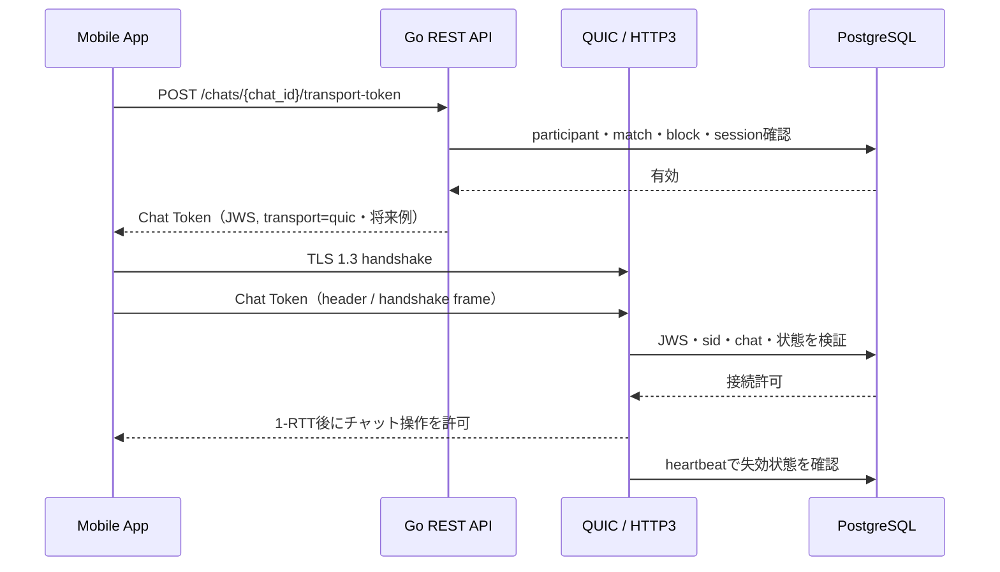

# 機能仕様：チャット通信トークン（QUIC・予定）

## 1. 位置づけ

本書は将来のリアルタイム配送に向けた設計仕様であり、現行実装の完了報告ではありません。現行のチャットはRESTの履歴・暗号文送信・既読です。QUIC／WebTransport／WebSocketの配送クライアントとサーバーはまだ存在せず、`frontend/services/quic.ts` と `backend/internal/chat/quic.go` は未実装です。

将来は QUIC を標準 transport 候補とします。HTTP/3 WebTransportを使う場合もQUIC上の実装形態として扱い、WebSocketは自動採用しません。QUICは通信路のプロトコルであり、アプリケーションの認証・認可そのものではないため、QUIC / HTTP/3の暗号化通信上でチャット専用の短命トークンを別途検証します。

QUIC は TLS 1.3 を使って通信を保護しますが、チャット参加者かどうか、対象チャットにアクセスできるか、セッションが失効していないかは Go API 側で判定します。詳細は [RFC 9001](https://www.rfc-editor.org/rfc/rfc9001) と [RFC 9114](https://www.rfc-editor.org/rfc/rfc9114) を参照します。

### 1.1 QUICを優先する理由

- QUIC は TLS 1.3 と transport handshake を統合しており、通常の接続確立で不要な往復を減らしやすい。
- ストリームを多重化できるため、制御イベント、メッセージ、再同期などを分離し、あるストリームの損失が他の処理へ波及する範囲を抑えやすい。
- Connection ID による接続移行を利用でき、Wi-Fi とモバイル回線の切り替えなど、端末のネットワーク変化後も再接続を減らしやすい。
- UDP ベースの損失回復、輻輳制御、ストリーム単位のフロー制御を持ち、モバイル回線で遅延や帯域が変動するチャットに適用しやすい。
- 0-RTT 再送の危険性を明示的に制御しながら、再接続後の未同期メッセージ取得とリアルタイム配送を同じ認可モデルで設計できる。

上記は QUIC を採用する設計上の利点であり、実機・回線・サーバー負荷で検証します。0-RTT のアプリケーションデータは再送され得るため、状態変更には利用しません。

WebSocket は自動フォールバックにしません。QUIC が対象端末または運用環境で技術的に成立しない場合だけ、制約、性能、保守性、セキュリティ影響を比較し、チームで合意・記録したうえで例外採用を決定します。
例外採用時も、Chat Token/JWS、TLS、セッション失効、リプレイ対策、`client_message_id`の冪等性、再送上限などの要件は維持し、採用理由・影響・rollback条件・API/監査更新を同じ決定記録に残します。

### 1.2 QUICとJWSの役割分担

- QUIC / TLS 1.3 は通信路の暗号化、パケット完全性、handshake、損失回復、輻輳制御を担う。JWSでQUICの暗号化を代替しない。
- Chat Token（JWS）はアプリケーション層の認証・認可・接続管理を担い、`aud`、`chat_id`、`sid`、`jti`、`iat`、`exp`、`transport` を検証する。
- Chat Token は対象チャットとセッションに束縛し、セッション失効、ブロック、マッチ終了、アカウント停止をheartbeatとDB確認で反映する。
- 同じメッセージの再送は `client_message_id` で冪等化し、再接続時は `sequence` cursor で未同期分を補完する。
- Tokenの切り替え時は `token_seq` と接続単位の巻き戻し防止を使い、古いJWSを新しい接続へ再利用できないようにする。これは配送実装時に追加する。
- QUICがパケットを再送する場合と、アプリがメッセージを自動再送する場合を分けて扱う。アプリの再送は同じ `client_message_id` を使い、サーバーが既存結果を返せるようにする。
- 自動再送は通信断、タイムアウト、5xxなど一時的な失敗だけに限定し、指数バックオフ、最大試行回数、期限を設ける。4xx、入力不正、Chat Token失効、認可拒否では自動再送しない。

### 1.3 接続確立の順序（将来実装）

1. アプリが通常の Access Token で `POST /chats/{chat_id}/transport-token` を呼び出す。
2. APIが `accepted` マッチ、参加者、ブロック、ユーザー状態、`sid` の有効性を確認し、Chat Token（JWS）を返す。
3. クライアントがQUICのTLS 1.3 handshakeを完了する。1-RTT handshake完了前は、メッセージ送信、既読更新、写真送信などの状態変更を送らない。
4. Chat TokenはURL query stringへ入れず、HTTP/3 WebTransportなら認証ヘッダー、native QUICなら認証handshake frameへ載せる。
5. サーバーがJWS、`sid`、`chat_id`、`matches`、`blocks`、ユーザー状態を検証して接続を確立する。
6. 接続確立後にheartbeatを15〜30秒ごとに送り、セッション失効・ブロック・マッチ終了・アカウント停止を検知したら接続を閉じる。



## 2. 推奨するトークン分離

| トークン | 対象 | 暫定有効期間 | 発行経路 |
| --- | --- | --- | --- |
| Access Token | REST API、通常のセッション | 1 分（案）。残り 30 秒で切替 | Google + Passkey 成功後、または Refresh |
| Chat Token | QUIC（HTTP/3 / WebTransport）のチャット接続 | Access Token の切替とは独立した2分の短命 token | 有効な Access Token で REST API を呼び出す |
| Refresh Token | Access Token の更新 | 30 日アイドル / 90 日絶対 | QUIC 上では使用しない |

Access Token の 1 分期限と、Refresh 時に旧 Access Token を `exp` まで許可する切替処理は、[認証機能仕様](auth.md) と [API 仕様書](../api.md) に定義します。Chat Token の期限・切替はこの Access Token 更新とは別に決定します。

## 3. Chat Token claims（案）

Chat Token は JWS 署名付き JWT とします。

```json
{
  "iss": "samurai-meet-api",
  "aud": "samurai-meet-chat",
  "sub": "user-uuid",
  "sid": "session-uuid",
  "chat_id": "match-uuid",
  "jti": "chat-token-uuid",
  "transport": "quic",
  "iat": 1724414400,
  "exp": 1724414460
}
```

- `aud` は `samurai-meet-chat` に限定する。
- `chat_id` は一つのマッチに限定する。
- Chat TokenはRESTのAccess Tokenとして扱わず、対象chat transportの接続開始だけに使う。
- `sid` で `sessions` と紐付け、セッション失効を反映する。
- `token_seq` による更新順序管理は未実装（接続中ローテーション導入時に追加）。
- Token を URL の query string に含めない。WebSocket配送では接続直後の認証フレーム `{"type":"auth","chat_token":"…"}` で渡す（5秒以内）。HTTP/3 なら認証ヘッダー、独自 QUIC なら認証 handshake frame を使う。

### 3.1 Claimごとの意味と検証

| Claim | 検証・用途 |
| --- | --- |
| `iss` | `samurai-meet-api` 固定。別発行者のtokenを拒否する。 |
| `aud` | `samurai-meet-chat` 固定。通常API用Access Tokenとの混用を拒否する。 |
| `sub` | 認証済みユーザー。RESTで発行を要求したユーザーと一致させる。 |
| `sid` | DBの有効なセッション。失効・停止済みセッションを拒否する。 |
| `chat_id` | 一つのチャットに限定。参加者・match状態と再確認する。 |
| `jti` | tokenを一意に識別し、監査・接続制限・再利用検知に使う。 |
| `transport` | QUIC採用時は`quic`固定。別transportへ流用しない。 |
| `iat` / `exp` | 発行時刻と短い有効期限。期限切れ・未来時刻・許容clock skew超過を拒否する。 |
| `token_seq` | token切り替え順序。配送実装時に追加し、古い世代への巻き戻しを拒否する。 |

JWSは署名検証に成功しても、それだけで接続を許可しません。DBのセッション、ユーザー状態、チャット参加権限、ブロック、マッチ状態を毎回確認します。

## 4. 発行 API（REST部品あり・既定値不整合）

### `POST /chats/{chat_id}/transport-token`

通常の Access Token で呼び出します。Go API は次を確認してから Chat Token を発行します。

- Access Token の署名・期限・DB セッションが有効
- `matches.status = accepted`
- 呼び出しユーザーがマッチ参加者
- ブロック・停止・通報による遮断状態がない
- 対象チャットが削除・終了されていない

Response（将来QUICを採用した場合の例）：

```json
{
  "data": {
    "chat_token": "short-lived-chat-jwt",
    "expires_at": "2026-08-23T12:01:00Z",
    "transport": "quic"
  }
}
```

Chat TokenはRefresh Tokenで更新しません。期限前に、通常のREST APIで次のChat Tokenを取得する設計です。現行コードには発行部品がありますが、HTTP handlerの既定値は`quic`、サービス側の受理値は`websocket`または`webtransport`で一致していません。コード整合まで、このendpointを動作済みとみなしません。以下の`quic`は将来のQUIC採用時の設計例です。

将来のQUIC採用時はtransport-token requestで`transport=quic`を使う案ですが、現行の受理値との整合をコードで確定する必要があります。既存のREST履歴・送信・既読を現行経路とし、QUIC配送とQUICクライアントが未実装の間は`sequence` cursorによるRESTポーリングを使います。

## 5. Chat Token の切り替え（QUIC配送実装時に追加）

Chat Token を更新する場合も短い重複期間と `token_seq` を利用できますが、これは Access Token の Refresh Token ローテーションとは別の処理です。

- Chat Token の期限前に次の token を取得する。
- 切り替え中は旧 token と新 token に 10〜15 秒程度の重複期間を持たせる。
- `token_seq`や接続単位の巻き戻し防止はQUIC配送実装時に追加する。
- Refresh Token は Chat Token の切り替えには使わない。
- 期限切れを待ってから更新せず、通信中の token が有効な間に切り替える。

## 6. 接続の失効確認（WebSocket配送は実装済み）

- 接続開始時に Chat Token、`sid`、`chat_id`、`matches.status=accepted`、`blocks`、チャット open を確認する（`chat.authenticateWS`）。
- 接続中は 20 秒ごとの heartbeat で `sessions`（`status=active` / `revoked_at IS NULL` / 未失効 / 未アイドル失効）とマッチ・ブロック・チャット状態を再確認する。失効を検知したら `closing` フレームを送って接続を閉じる。
- heartbeat はアクティブな接続の `sessions.last_seen_at` を更新し、WebSocketだけを使うクライアントのセッションを維持する。
- ユーザー・チャット単位の接続数を `maxConnectionsPerUser`（現在 4）で制限する。
- 複数 API インスタンス構成での `LISTEN / NOTIFY` fan-out は未実装（§後述の未決事項）。現状のハブはプロセス内。

## 7. 0-RTT の扱い

QUIC の 0-RTT アプリケーションデータは攻撃者に再送される可能性があります。そのため、1-RTT handshake が完了するまで次の操作を受け付けません。

- メッセージ送信
- 既読更新
- 写真送信
- 評価、ブロック、通報などの状態変更

0-RTT を利用する場合も、再送されても影響がない接続開始・能力確認だけに限定します。通常のチャット操作は 1-RTT 後に行います。

0-RTTの再送だけでなく、期限切れ・失効済み・対象外chat・古い`token_seq`のJWSを再利用した接続も拒否します。JWSの署名だけではリプレイ攻撃を防げないため、短い`exp`、`jti`、`sid`、`chat_id`、token世代、接続数制限、heartbeatによる失効確認を組み合わせます。

### 7.1 リプレイ攻撃対策の層

| 層 | 対策 | 防ぐ対象 |
| --- | --- | --- |
| QUIC packet | TLS 1.3 AEAD、packet number、接続単位の暗号鍵、損失回復 | 改ざん、盗聴、同一接続内の古いpacketの再利用 |
| QUIC handshake | 0-RTTでは状態変更を受け付けず、1-RTT後だけ操作を許可 | 0-RTT application dataの再送 |
| JWS Chat Token | 署名、`aud`、`sid`、`chat_id`、短い`exp`、`jti`、token世代、接続数制限 | tokenの別API・別chat・失効後への流用、接続の増殖 |
| Message API | `client_message_id`の一意制約と冪等応答 | 同じ送信操作・自動再送による二重登録 |
| Sync cursor | サーバー確定の`sequence`と履歴補完 | 応答欠落、再接続後の取りこぼし |

`jti`は署名付きtokenの識別子であり、単独ではリプレイ防止になりません。短い有効期限、DBセッション確認、対象chat確認、接続単位のnonceまたはtoken世代、heartbeat、接続数制限を組み合わせます。

### 7.2 アプリケーションメッセージの自動再送

QUICのtransport層が失われたpacketを再送することと、アプリケーションが送信操作を再試行することは別です。アプリの自動再送は次の契約で行います。

| 状況 | 動作 |
| --- | --- |
| QUIC packet loss | QUICに任せ、同じアプリイベントを新規作成しない。 |
| 接続断・timeout・応答欠落 | 保留中の同じ`client_message_id`を自動再送する。サーバーは既存メッセージまたは既存ackを返す。 |
| 5xx | 一時障害として同じ`client_message_id`を期限・回数付きで再送する。 |
| 429 | `Retry-After`がある場合だけ従い、上限を超えて再送しない。 |
| 400/401/403/404、入力不正、Chat Token失効 | 自動再送しない。必要ならtoken再取得・再接続・再ログインを先に行い、元の操作はユーザーまたは上位状態機械で再評価する。 |
| typingイベント | 永続イベントではないため、自動再送しない。 |

自動再送には指数バックオフとjitter、最大試行回数、全体期限を設けます。初期値は「最大3回の再送、全体30秒、1秒・2秒・4秒を基準にしたbackoff」とし、実機・回線・サーバー負荷試験で確定します。`message.ack`またはRESTの成功応答を受けた後は再送を停止します。

## 8. 実装分担

| 処理 | 実装 |
| --- | --- |
| Chat Token 取得、切り替え、期限管理 | TypeScript / React Native（未接続） |
| WebSocket クライアント | TypeScript（`frontend/services/websocket.ts` 未実装） |
| QUIC / WebTransport クライアント（将来） | TypeScript + native module。Expo の対応状況を PoC で確認 |
| Chat Token 発行・検証 | Go（REST発行・署名検証・WebSocket接続時検証を実装済み） |
| WebSocket サーバー | Go（`coder/websocket`、`backend/internal/chat/websocket.go` 実装済み） |
| QUIC / HTTP/3 サーバー（将来） | Go。採用ライブラリを PoC で決定（WebSocketで先行） |
| 参加者・セッション・ブロック判定 | Go + PostgreSQL（実装済み） |
| 失効通知 | heartbeat / polling（実装済み）。`LISTEN / NOTIFY` は複数インスタンス時に追加 |

MVP のリアルタイム配送は WebSocket（実装済み）で、同じ Chat Token の認可モデルを適用します。QUIC / HTTP/3 WebTransport は将来の標準候補で、Expo の対応状況を見て後追いします。

この文書は設計契約であり、QUICサーバー、native QUIC / WebTransportクライアント、フロントのWebSocketクライアント、アプリケーション自動再送の実装完了を意味しません。実装追加時はAPI仕様、状態管理、監査ログ、負荷試験、実機E2Eを同じ変更で更新します。

## 9. 受け入れ条件

- 通常の Access Token で Chat Token を取得できる。（実装済み）
- Chat Token をプロフィール、Recovery、Key-B、他のチャットへ利用できない。（`aud` / `chat_id` / `transport` 束縛で実装済み）
- 期限前に次の Chat Token をRESTで取得できる。（実装済み）
- セッション失効、ブロック、マッチ終了後にチャット接続が閉じる。（heartbeatで実装済み・統合テスト `TestChatWebSocketDelivery`）
- 0-RTT でメッセージ送信などの状態変更ができない。（WebSocketは1-RTT。QUIC採用時に再確認）
- 古い token の接続巻き戻し拒否（`token_seq`）は未実装。接続確立時のみ token を検証し、維持はセッションheartbeatで担保。
- 通信断・タイムアウト・一時的なサーバーエラー時は、同じ`client_message_id`で期限・回数を制限した自動再送ができる。（フロント側の受入条件）
- 入力不正、認証失効、認可拒否などの永続的な失敗では自動再送しない。（フロント側の受入条件）
- Chat Token、Refresh Token が URL、ログ、クラッシュレポートに出ない。

## 10. 未決事項

- QUIC上の実装形態（native QUIC または HTTP/3 WebTransport）とendpoint。
- Expo Managed Workflow で利用できる native module とビルド方式。
- Chat Token の期限、切り替え間隔、重複期間の負荷試験。Access Token の 1 分 Refresh とは別に決定する。
- `token_seq` を接続単位で管理するか、ユーザー・チャット単位で管理するか。
- MVPはWebSocketで確定。QUIC / WebTransport へ移行するか、両対応にするかの判断基準と時期。
