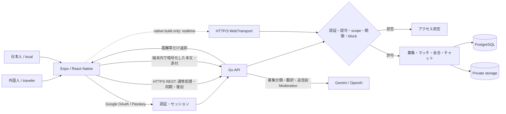
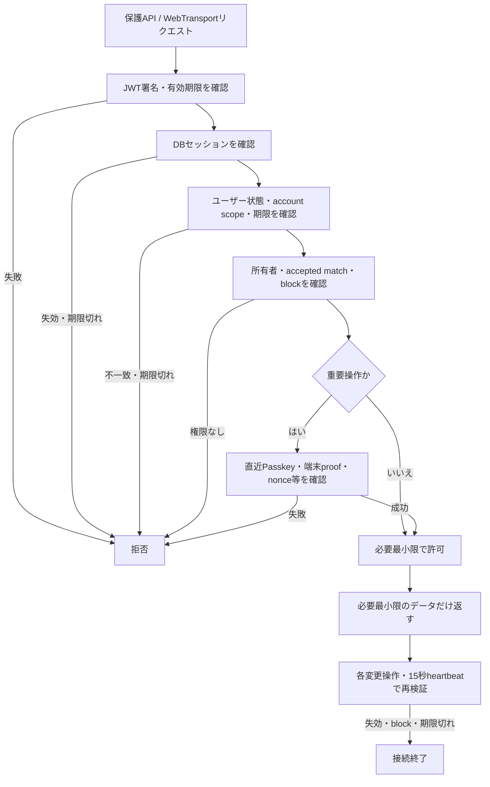

# Samurai Meet 機能一覧・ハッカソン向け訴求ポイント

最終更新: 2026-09-04

この資料は、Samurai Meet の主要機能、現在の実装状態、ハッカソン発表での訴求ポイントを整理したものです。

現行コードの実装状態は [実装状態の境界](ai/system/current-status.md)、詳細仕様は [機能別仕様書](features/README.md) を正とします。

---

# プロダクト概要

## 一言で

**外国人と話してみたい人に、実際に会って交流できる機会を提供するアプリ。**

Samurai Meet は、日本人と外国人が、

* 話したいこと・一緒にしたいこと
* 会える時間
* 現在地からの距離

をもとに相手を探し、双方が同意した場合だけチャットや実際の交流へ進めるサービスです。

単にSNS上でつながるのではなく、

**「外国人と話してみたいけれど、機会がない」**

という人に、実際に会って交流するきっかけを提供します。

---

# Samurai Meet の特徴

## 1. 外国人と実際に話せる機会を作る

SNSや翻訳サービスでは外国人と接点を持つことはできますが、

**実際に会って話すきっかけ**

までは簡単には作れません。

Samurai Meetでは、話したい内容・時間・場所を指定して募集し、条件の合う相手を探せます。

---

## 2. 相互承認してから交流を始める

知らない相手から突然DMが届く仕組みにはしません。

利用者が募集に対して「興味がある」を送り、募集者が承認した場合だけマッチングが成立します。

**双方が交流したいと判断して初めてチャットが開く設計**です。

---

## 3. AIで言語の壁を下げる

外国語に自信がなくても交流を始められるよう、

* 募集文の分類・キーワード候補生成
* メッセージの言語判定
* 日本語・外国語間の翻訳
* Original表示への切り替え

を提供します。

AIそのものを目的にするのではなく、

**「言葉が分からないから話しかけられない」という最初の壁を下げる**

ために利用します。

---

## 4. 実際に会うサービスだからこそ安全性を重視

Samurai Meetでは、

* 相互承認
* 正確な現在地を公開しない検索
* メッセージModeration
* 暗号化チャット
* 通報
* ブロック
* セッション失効
* 端末単位の鍵管理

などを組み合わせています。

単一の安全機能だけに依存せず、

**複数の安全対策を重ねる設計**にしています。

---

# Zero Trust を前提とした設計

Samurai Meetでは、

**「ユーザー・端末・通信・サーバーを最初から完全には信用しない」**

というZero Trustの考え方を設計の軸にしています。

実際に知らない人同士が会うサービスだからこそ、

**一度ログインしたから安全**
**同じユーザーだから常に安全**
**サーバー内部だから信用できる**

とは考えません。

---

## Zero Trust の具体例

| 考え方                | Samurai Meetでの実装・設計                         |
| ------------------ | ------------------------------------------- |
| 認証済みでも継続的に確認する     | セッション更新、短命Token、heartbeatによる失効検知            |
| 端末を無条件に信用しない       | Passkey、端末proof、端末単位の鍵管理                    |
| サーバーを秘密情報の保管場所にしない | root key・Recovery Phrase・チャット鍵を平文でサーバーに預けない |
| 最小権限               | 承認済みマッチの参加者だけがチャット・添付へアクセス可能                |
| 状態変更を慎重に扱う         | HTTP/3 0-RTTによる状態変更を拒否                      |
| 必要な情報だけ公開する        | 正確な位置座標ではなく距離帯を表示                           |
| 信頼関係を固定しない         | ブロック・取消・セッション失効で既存アクセスを遮断                   |
| 複数の防御を重ねる          | 認証、認可、暗号化、Moderation、通報・ブロックを組み合わせる         |

---

# 機能一覧

| 領域                     | 利用者ができること                                | 現在の状態                         | ハッカソンでの訴求ポイント                    |
| ---------------------- | ---------------------------------------- | ----------------------------- | -------------------------------- |
| Google OAuth / Passkey | GoogleアカウントやPasskeyでログイン                 | 実装済み。native Passkey実機E2Eは確認待ち | パスワードだけに依存しない認証                  |
| セッション管理                | Token更新、ログアウト、全端末ログアウト                   | 実装済み                          | ログイン後も継続的にセッションを検証するZero Trust設計 |
| Recovery Phrase        | 24語Recovery Phraseによる復旧                  | 部分実装・確認待ち                     | サーバーだけに依存せず、本人が復旧手段を持つ           |
| 端末鍵管理                  | client-owned root key、端末proof、端末移行       | 部分実装・確認待ち                     | 端末単位で信頼を管理し、鍵をサーバーへ平文保存しない       |
| プロフィール                 | 名前、国籍、アイコン、自己紹介、表示言語                     | API・オンボーディング実装済み              | 日本人・外国人双方が利用可能                   |
| 利用モード                  | local / traveler モード                     | 実装済み                          | 日本人側と旅行者側の利用シーンを一つのアプリで支える       |
| 募集カード                  | 日時、時間帯、内容、キーワード、公開半径を指定                  | 実装済み                          | 「外国人と話したい」という気持ちを具体的な募集へ変える      |
| AI募集補助                 | 自然文からカテゴリ・キーワード候補を生成                     | 実装済み                          | 入力のハードルを下げ、自然な文章から募集を作れる         |
| 現在地検索                  | 1 / 3 / 5km、日時、キーワードなどで検索                | API・検索導線実装済み                  | 近くの交流機会を見つけられる                   |
| 位置情報保護                 | 正確な座標ではなく距離帯を表示                          | 実装済み                          | 「近くにいる」は分かるが「どこにいるか」までは公開しない     |
| 応募                     | 募集へ「興味がある」を送信                            | 実装済み                          | 知らない相手へ突然DMを送らない                 |
| 相互承認                   | 募集者が承認・辞退                                | 実装済み                          | 双方の意思確認後に初めて交流を開始                |
| 応募取消                   | 承認前なら応募を取り消せる                            | 実装済み                          | 利用者が自分の意思を後から変更できる               |
| マッチング                  | 承認後にマッチ成立                                | 実装済み                          | 一方向のフォローではなく明示的な双方同意             |
| 会合管理                   | planned / active / completed / cancelled | バックエンド実装済み                    | マッチング後、実際に会うところまで状態管理            |
| 再開同意                   | cancelled後の再開には双方の同意が必要                  | バックエンド実装済み                    | 一度終了した信頼関係を勝手に復活させない             |
| アプリ内通知                 | 応募、承認、辞退、チャットなどを通知                       | 実装済み                          | 必要なイベントを利用者へ確実に伝える               |
| 1対1チャット                | 承認済みマッチのみチャット可能                          | 実装済み                          | 最小権限の考え方をチャットにも適用                |
| 既読                     | メッセージ既読管理                                | 実装済み                          | 待ち合わせ時のコミュニケーションを支える             |
| 編集・削除                  | 自分のメッセージを編集・削除                           | 実装済み                          | 実用的なチャット体験                       |
| AI翻訳                   | 相手の文章を表示言語へ翻訳                            | 実装済み                          | 外国語が得意でなくても交流を始められる              |
| Original表示             | 翻訳前の原文を確認                                | 実装済み                          | AI翻訳だけを無条件に信用しない                 |
| Moderation             | 送信前にメッセージを安全判定                           | 実装済み                          | 実際に会うサービスだからこそ送信前に危険性を判定         |
| Moderation fail-closed | Moderation不能時は送信を停止                      | 実装済み                          | 安全判定が壊れた場合に「とりあえず通す」をしない         |
| クライアント暗号化              | メッセージ本文を端末側で暗号化                          | 実装済み                          | サーバーを完全には信用せず、秘密情報を最小化           |
| チャット鍵分離                | サーバーがチャット鍵を保持しない                         | 実装済み                          | サーバー侵害時の影響範囲を小さくする               |
| 暗号化写真                  | 写真を端末側で暗号化して送信                           | 実装済み。2端末E2E確認待ち               | 添付ファイルも本文と同じ考え方で保護               |
| HTTP/3 WebTransport    | 低遅延双方向通信                                 | バックエンド実装済み                    | 会う直前のリアルタイムな連絡に対応できる通信基盤         |
| 短命Chat Token           | チャット接続専用の短命Token                         | 実装済み                          | 長期間有効な認証情報を使い回さない                |
| heartbeat失効            | 接続状態・Token失効を検知                          | 実装済み                          | 接続後も継続的に信頼状態を確認                  |
| 0-RTT保護                | 0-RTTでの状態変更を拒否                           | 実装済み                          | Replayを考慮した通信設計                  |
| fan-out                | 複数インスタンス間でメッセージ配信                        | 実装済み                          | 将来的な水平スケールを考慮                    |
| 通報                     | ユーザー・募集・メッセージ・写真を通報                      | API・画面実装済み                    | 問題が起きた対象を具体的に報告可能                |
| ブロック                   | ユーザーをブロック・解除                             | API・画面実装済み                    | 信頼を取り消し、既存関係を遮断できる               |
| 本人確認                   | 本人確認状態の表示・検索                             | 仕様・一部画面のみ                     | 今後、会う相手を判断する材料として追加予定            |
| 相互評価                   | 会った後に相手を評価                               | 仕様のみ                          | 実際の交流経験を次回の判断材料へつなげる             |
| Demoアカウント              | 24時間限定アカウントで主要機能を体験                      | コード・テスト実装済み。一部E2E未確認          | 審査員が個人情報を使わず核心機能を体験可能            |

---

# Samurai Meet のアピールポイント

## 1. 「外国人と話したい」を実際の交流までつなげる

Samurai Meetは、単なるSNSでもチャットアプリでもありません。

**外国人と話してみたいという気持ちを、実際に会って交流するところまでつなげる**

ことを目的にしています。

募集、検索、応募、相互承認、チャット、翻訳、会合管理までを一つの体験として設計しています。

---

## 2. Zero Trust をアプリ全体に適用

Zero Trustを単なるインフラの考え方としてではなく、

**利用者同士の交流設計にも適用している**

ことが特徴です。

* ログイン済みだから信用する → しない
* マッチ済みだから永続的に信用する → しない
* サーバー内部だから安全 → 前提にしない
* AI翻訳だから正しい → 原文も確認可能
* 一度許可したから永続的に許可する → ブロック・失効可能

という考え方を一貫させています。

---

## 3. Privacy by Design

後から暗号化を追加するのではなく、

最初から、

* 正確な位置情報を公開しない
* 秘密鍵をサーバーに平文保存しない
* チャット本文をクライアント側で暗号化
* 必要なユーザーだけアクセス可能

という設計を採用しています。

---

## 4. 相互承認を中心にした交流設計

多くのSNSでは、相手の同意なしにDMを送ることができます。

Samurai Meetでは、

**応募 → 承認 → マッチング → チャット**

という順番を必須にしています。

対面交流につながるサービスだからこそ、

「連絡できるかどうか」自体を認可として扱っています。

---

## 5. 安全性を一つの機能に依存しない

本人確認だけで安全になるとは考えていません。

Samurai Meetでは、

**認証 + 認可 + 相互承認 + 位置情報保護 + Moderation + 暗号化 + 通報 + ブロック**

を組み合わせます。

一つの対策が突破・失敗しても、他の仕組みで被害を抑えるDefense in Depthの考え方です。

---

## 6. AIを「主役」ではなく「障壁をなくす道具」として使う

AIを使うこと自体を目的にはしていません。

* 募集を作りやすくする
* 言葉の違いを吸収する
* 危険なメッセージを抑制する

という、

**国際交流を妨げる障壁を減らすための技術**

としてAIを配置しています。

---

## 7. デモだけではなく実運用を意識した設計

ハッカソン向けの最低限のCRUDだけでなく、

* Token失効
* Recovery
* 暗号鍵管理
* 冪等性
* 再接続
* heartbeat
* 水平スケール
* ブロック後の認可
* アカウント削除
* 全端末ログアウト

など、

**実際にサービスとして運用する場合に必要になる部分まで設計・実装しています。**

---

# 発表で特に強調する5項目

機能をすべて説明するのではなく、発表では次の5つを中心にします。

### 1. 外国人と実際に話せる機会

「外国人と話したい。でも普段は機会がない。」

その問題を、場所・時間・目的を使った募集によって解決します。

### 2. 相互承認

知らない相手から突然メッセージが来るのではなく、

**双方が会いたいと思った場合だけ交流を開始します。**

### 3. AI翻訳

外国語が得意でなくても、

**言葉を理由に交流を諦めなくていい**

ようにします。

### 4. Zero Trust

実際に知らない人と会うサービスだからこそ、

**最初から誰も・何も完全には信用しない**

設計にしています。

### 5. Privacy & Safety by Design

暗号化や安全対策を後付けするのではなく、

**サービス設計の最初から組み込んでいます。**

---

# 発表用の短いアピール

Samurai Meetは、外国人と話してみたい日本人と、日本人と交流してみたい外国人に、実際に会って話せる機会を提供するサービスです。

特徴は、単純なマッチングだけでなく、

**相互承認・AI翻訳・位置情報保護・暗号化・Moderation・通報・ブロック**

までを一つの体験として設計していることです。

さらに、Samurai MeetではZero Trustの考え方を採用しています。

一度ログインしたユーザーや端末、サーバーを無条件に信用せず、認証・認可・短命Token・端末鍵・暗号化などを組み合わせています。

**「知らない人と実際に会うサービスだからこそ、安全性を後付けしない。」**

これがSamurai Meetの大きな特徴です。

---

# 発表時の表現ルール

| テーマ          | 推奨する説明                                    | 避ける説明               |
| ------------ | ----------------------------------------- | ------------------- |
| Zero Trust   | 「ユーザー・端末・通信・サーバーを無条件に信用せず、継続的な認証・認可を行う設計」 | 「絶対に安全」             |
| チャット暗号       | 「本文・添付をクライアント側で暗号化し、サーバーはチャット鍵を保持しない」     | 「完全E2EE」と断定する       |
| Moderation   | 「暗号化前に安全判定を行う明示的な例外」                      | 「サーバーから一切本文が見えない」   |
| WebTransport | 「バックエンド経路を実装している」                         | native実機接続まで検証済みと断定 |
| 本人確認         | 「今後の安全性向上のための拡張機能」                        | 完成済みと説明する           |
| 評価           | 「今後実装予定」                                  | 現在利用できると説明する        |
| 通知           | 「アプリ内通知を実装」                               | OSプッシュ通知対応済みと説明する   |
| Demo         | 「期限・用途を限定した審査用導線」                         | 本番利用向け機能として説明する     |

---

# 関連資料

* [機能別仕様書一覧](features/README.md)
* [実装状態の境界](ai/system/current-status.md)
* [チャット仕様](features/chat.md)
* [募集・マッチング仕様](features/matching.md)
* [安全対応](features/safety.md)
* [Demo仕様](features/demo-account.md)
* [審査員向けリモートテストキット](human/remote-test-kit.md)
* [アーキテクチャ概要](architecture.md)

---

# 使用技術スタック（発表用）

詳細な実装分担は [技術選定・実装分担](tech-stack.md) を参照してください。ここでは、各技術がSamurai Meetの体験にどう関わるかを簡潔に示します。

| 層 | 使用技術 | 役割・発表での意味 | 現在の状態 |
| --- | --- | --- | --- |
| クライアント | Expo / React Native / TypeScript / Expo Router | iOS・Androidで募集からチャットまで同じ体験を提供 | 画面・REST接続済み。native機能は個別に確認待ち |
| API・業務ロジック | Go | 認証、認可、募集、マッチ、会合、チャットの最終判断 | 実装済み |
| データベース | PostgreSQL | 状態遷移、セッション失効、通知、チャットメタデータを一貫して管理 | 実装済み。PostGISは未導入 |
| 認証 | Google OAuth2 / OIDC、Passkey / WebAuthn | Googleで識別し、Passkeyで認証・重要操作の再確認を行う | 実装済み。native Passkey実機E2Eは確認待ち |
| 通信 | HTTPS REST、HTTP/3 WebTransport | RESTを通常処理・同期・復旧に使い、WebTransportを低遅延配送に使う | WebTransportはバックエンド実装済み。native bridge・実機接続は確認待ち |
| 暗号・鍵管理 | AES-256-GCM、Argon2id、HKDF-SHA-256、X25519、Ed25519、Secure Storage | チャットDEK、root key、Recovery、端末proofをクライアント中心に管理 | コード実装済み。hardware保護・2端末E2Eは確認待ち |
| AI | Gemini、OpenAI Moderation | 募集分類、キーワード候補、翻訳、送信前の安全判定を補助 | 実装済み。Moderation・翻訳は暗号化前の明示例外 |
| 位置検索 | Go Haversine + PostgreSQL | 近さを判定しつつ、他ユーザーには距離帯だけを返す | 実装済み。PostGIS化は将来候補 |
| ファイル保存 | 非公開ストレージ、暗号文BLOB | チャット添付を公開バケットへ置かず、参加者だけに取得させる | チャット添付実装済み。プロフィール画像には互換上のサーバー復号例外あり |
| 検証 | Bun test、Go test、GitHub Actions | 暗号、認証、状態遷移、API、回帰をコードで確認 | 自動テストあり。自動テストと実機E2Eは別ゲート |

# サービス全体の仕組み

基本の流れは、利用者が募集を作成し、相手が条件を検索して応募し、募集者が承認した後にだけチャットと会合セッションを利用できる、というものです。WebTransportが使えない環境では、RESTが同期・復旧経路になります。

# Zero Trust と呼ぶ理由

Zero Trustは「絶対に安全」という意味でも、「サーバーから一切データが見えない」という意味でもありません。暗黙の信頼を置かず、リクエストごとに証拠を確認し、必要最小限だけ許可するセキュリティモデルです。

Samurai Meetでは、ログイン済みであることだけでは操作を許可しません。次の情報を組み合わせて、現在その操作を許可してよいかを判断します。

- 誰か：JWTの署名・有効期限、DBセッション、ユーザー状態
- どの関係か：募集の所有者か、accepted matchの参加者か、ブロック関係がないか
- どの範囲か：Demo/通常アカウントのscope、対象リソースの所有権、期限
- どの端末か：必要な操作ではPasskey、端末proof、nonceなどを追加確認
- 今も有効か：短命Token、ログアウト・失効、WebTransportの各変更操作とheartbeatで継続再検証

## 関連する考え方との違い

| 用語 | Samurai Meetでの意味 |
| --- | --- |
| Zero Trust | 認証済みという一つの事実だけで信用せず、本人・端末・対象・状態を継続的に検証する |
| Privacy by Design | 正確な位置ではなく距離帯だけを公開するなど、必要な情報だけを扱う |
| Client-side encryption / Zero-knowledge boundary | root keyやチャット鍵をサーバーへ平文で預けず、暗号文中心で扱う。ただしサービス全体が完全なZero Knowledgeではない |
| Defense in Depth | 認証、認可、相互承認、暗号化、Moderation、通報、ブロックを重ねる |
| Replay protection | 短命Token、nonce、冪等ID、0-RTTの状態変更拒否で再送・リプレイの影響を抑える |

発表では、次の一言にすると伝わりやすく、過大な保証にもなりません。

> Samurai Meetは、ログイン済みという一つの証明だけで信用せず、「誰が、どの端末で、どの相手との関係で、今も有効か」を確認してから、必要最小限の操作だけを許可します。
