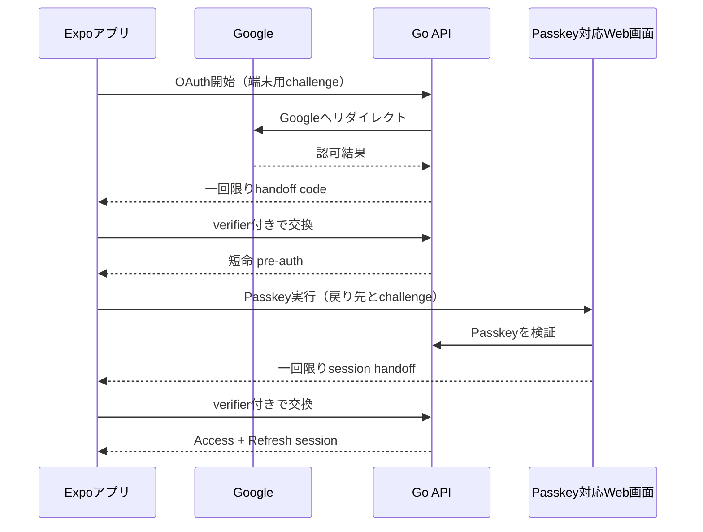
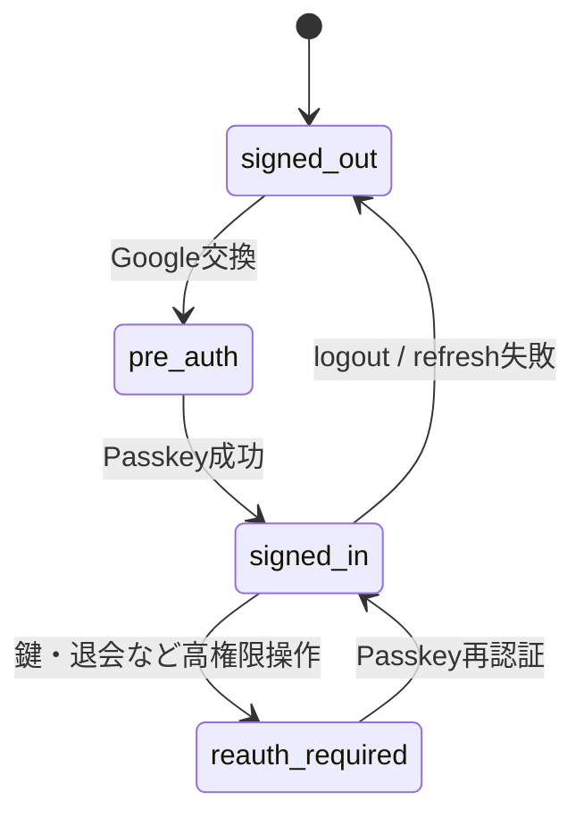

# ログインの流れ

Googleで本人の入口を確認した後、Passkeyで端末利用を確認します。Googleだけで通常セッションを発行しないため、アカウント乗っ取り時の影響を小さくします。

Expo Go は開発中のOAuth/deep link確認には使えます。ただしネイティブPasskey、iOS/Androidのアプリリンク確認はDevelopment Buildと実機が必要です。
