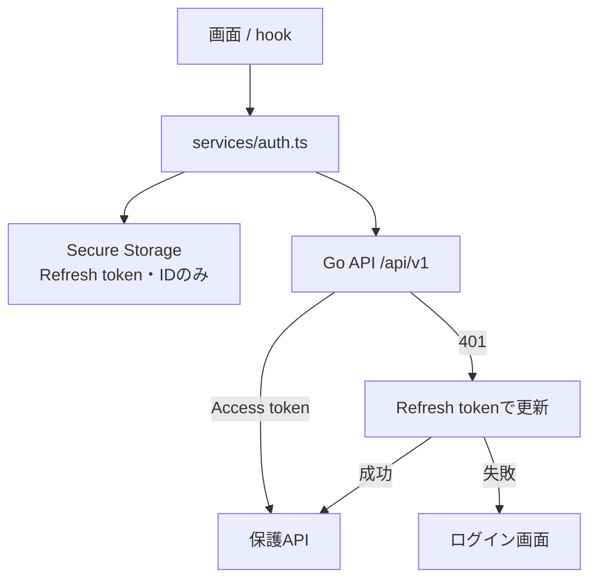
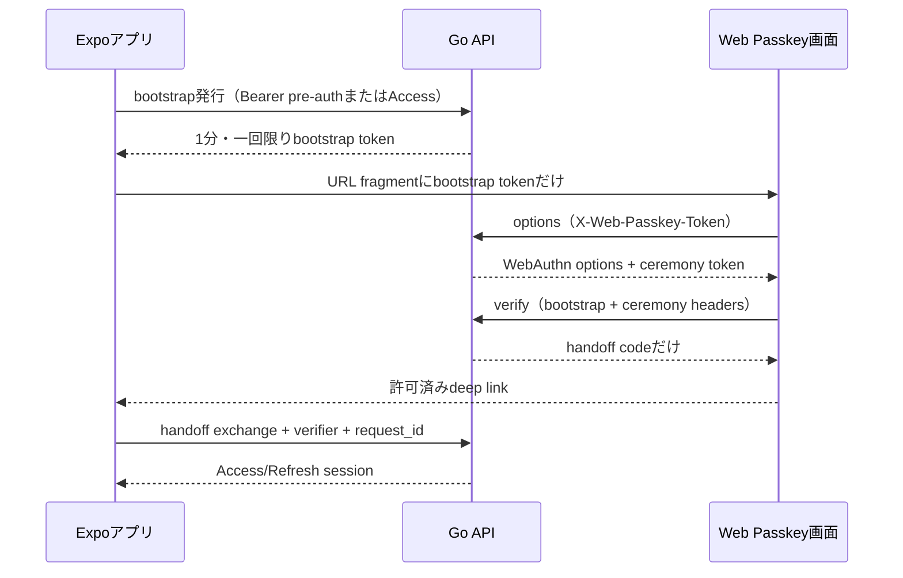

# フロントエンドとAPIのつなぎ方

フロントエンドは `frontend/`、APIは `backend/` です。テスト専用画面をバックエンドに同梱しないため、本番と開発で画面の実装がずれません。

Web Passkeyは、アプリの秘密tokenをURLへ載せない設計です。

URLにAccess Token、Refresh Token、`pre_auth_token`、ユーザーIDは入りません。Web APIの応答はキャッシュされず、ブラウザから参照元情報も送られないようにします。handoffの再送は、同じ`request_id`で短時間に行った場合だけ許可されます。

開発時は `frontend/.env` の `EXPO_PUBLIC_API_BASE_URL` を `http://127.0.0.1:8080/api/v1` 等に設定できます。未指定でも、`NODE_ENV=development` のExpo Webを `http://localhost` または `http://127.0.0.1` で開いた場合だけローカルGo API（`http://127.0.0.1:8080/api/v1`）を自動選択します。iPhoneを含むネイティブクライアントは、未指定なら本番APIドメイン（`https://samurai-meet.disnana.com/api/v1`）へ接続します。ローカルGo APIへ接続する場合は、端末から到達できるURLを`EXPO_PUBLIC_API_BASE_URL`へ明示してください。Expo Webを標準ポートで起動する場合はブラウザのOriginが `http://localhost:8081` になるため、バックエンドも `APP_ENV=development`、`DEV_CLIENT_ORIGIN=http://localhost:8081`、`WEBAUTHN_RP_ID=localhost`、`WEBAUTHN_RP_ORIGIN=http://localhost:8081` に揃えます。Google OAuthをローカルGo APIで完結させる場合は`GOOGLE_REDIRECT_URI=http://localhost:8080/auth/callback`をGoogle Cloud Consoleへ登録し、同じcallbackをGo側へ設定します。`APP_ENV`だけを変更しても`.env`に残った本番callbackやDB接続先は切り替わりません。`localhost` と `127.0.0.1`、ポート番号は完全一致です。本番の `CLIENT_ORIGIN` や本番WebAuthn OriginをローカルWebへ流用しないでください。CORSは固定Originだけを許可します。

Passkey用Web画面は、Goバックエンドの `/passkey` から配信します。`WEB_PASSKEY_URL` はこの同一Originの画面を指し、画面から相対URLでPasskey APIを呼び出します。

## 接続先と日時

ネイティブクライアントの既定APIは `https://samurai-meet.disnana.com/api/v1` です。`EXPO_PUBLIC_API_BASE_URL`を明示した場合だけ別環境へ接続します。iPhoneからローカルGo APIを確認する場合は、端末から到達できるURLを明示してください。設定しない限り、LANの`8080`へ自動接続しません。

募集の`available_date`、`start_time`、`end_time`はユーザーの端末設定ではなく`Asia/Tokyo`として入力・解釈します。APIの`timezone`も`Asia/Tokyo`固定で、空の場合はサーバーが同値へ正規化し、その他のタイムゾーンは拒否します。`created_at`や`expires_at`などの絶対時刻はUTC RFC3339で扱います。

以前報告された募集画面の初期表示時の`invalid_recruitment_date`は、ISO内部値と`Asia/Tokyo`固定化で解消し、自動テストで確認済みです。募集画面の起動から公開・応募・通知遷移までのiOS実機全通し確認は未完了です。
