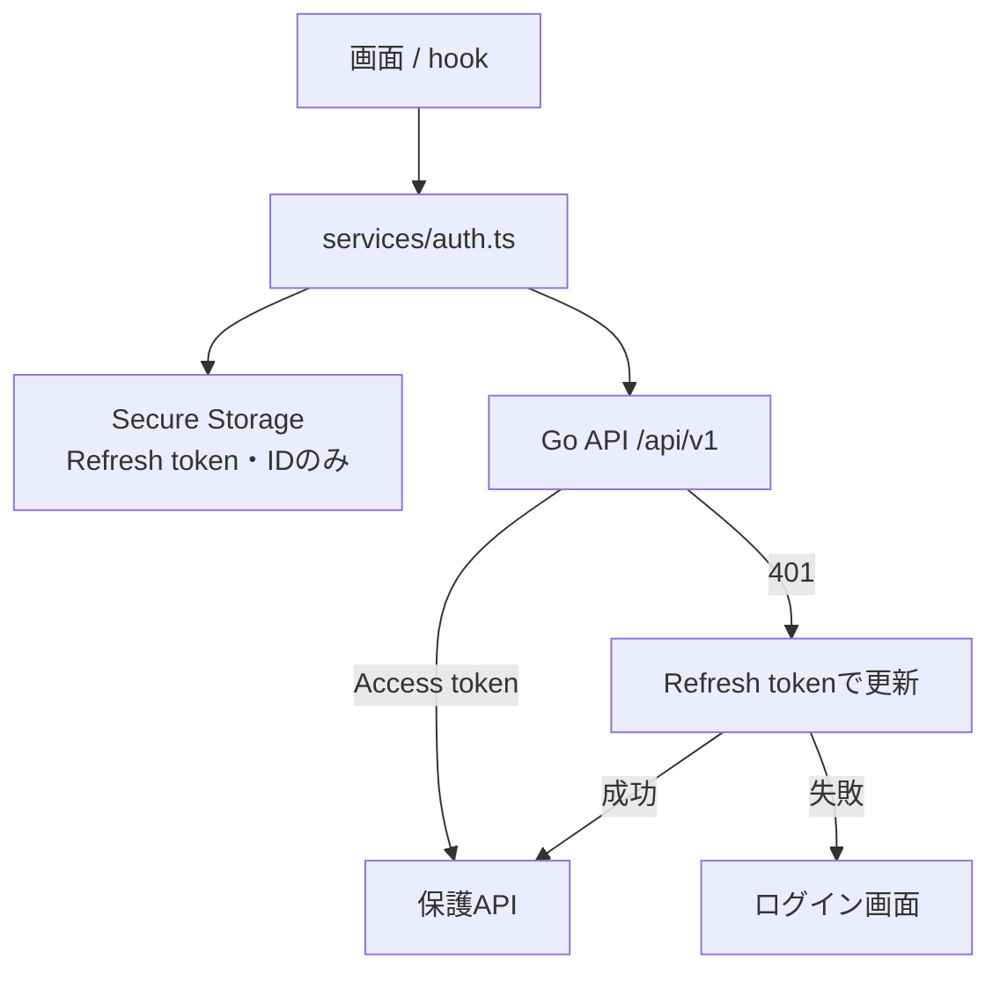
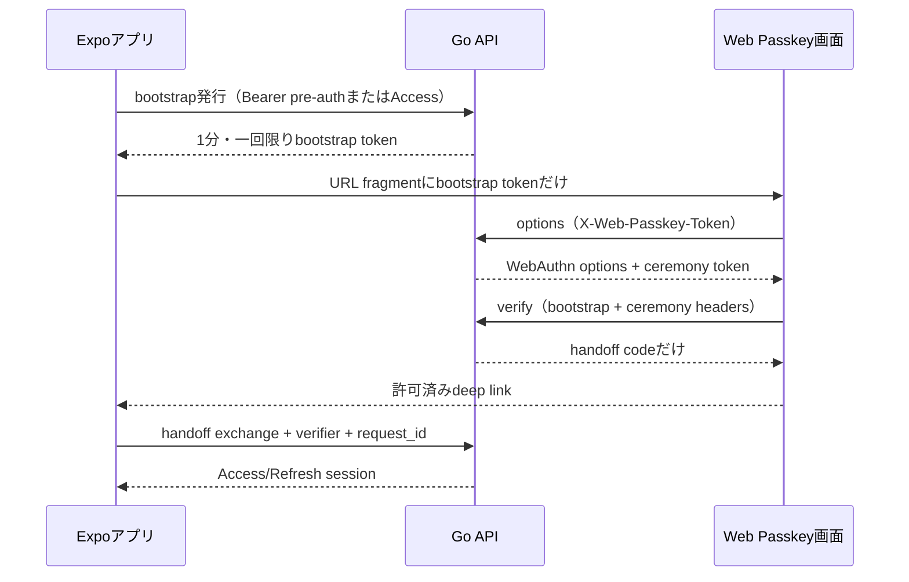

# フロントエンドとAPIのつなぎ方

フロントエンドは `frontend/`、APIは `backend/` です。テスト専用画面をバックエンドに同梱しないため、本番と開発で画面の実装がずれません。

Web Passkeyは、アプリの秘密tokenをURLへ載せない設計です。

URLにAccess Token、Refresh Token、`pre_auth_token`、ユーザーIDは入りません。Web APIの応答はキャッシュされず、ブラウザから参照元情報も送られないようにします。handoffの再送は、同じ`request_id`で短時間に行った場合だけ許可されます。

開発時は `frontend/.env` の `EXPO_PUBLIC_API_BASE_URL` を `http://127.0.0.1:8080/api/v1` 等に設定します。ブラウザから接続する場合だけ、バックエンドの `DEV_CLIENT_ORIGIN` または `CLIENT_ORIGIN` と一致させます。CORSは「指定された一つのOriginだけ」を許可します。

Passkey用Web画面は、Goバックエンドの `/passkey` から配信します。`WEB_PASSKEY_URL` はこの同一Originの画面を指し、画面から相対URLでPasskey APIを呼び出します。
