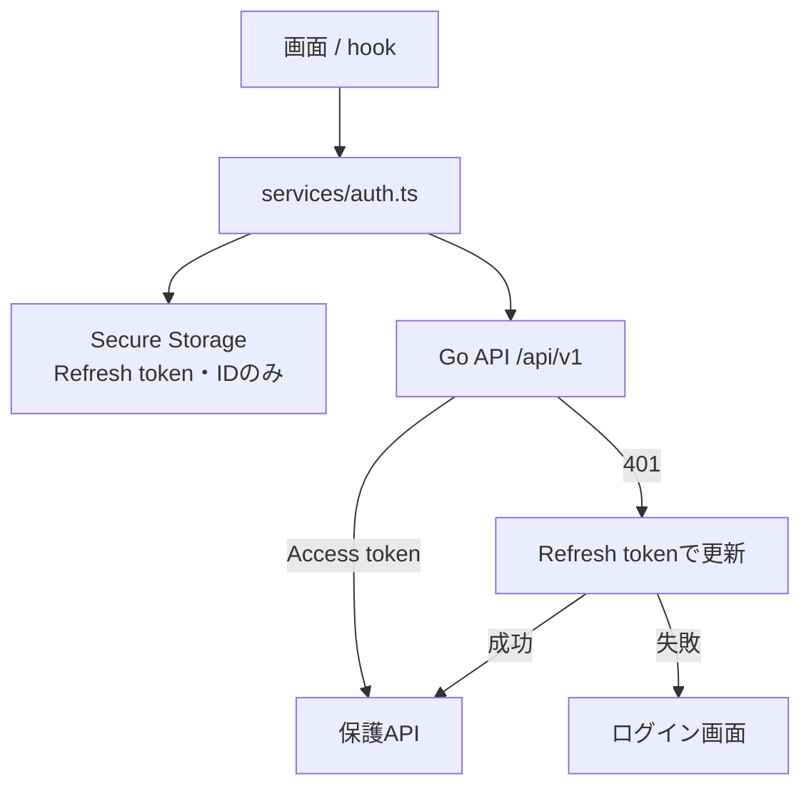

# フロントエンドとAPIのつなぎ方

フロントエンドは `frontend/`、APIは `backend/` です。テスト専用画面をバックエンドに同梱しないため、本番と開発で画面の実装がずれません。

開発時は `frontend/.env` の `EXPO_PUBLIC_API_BASE_URL` を `http://127.0.0.1:8080/api/v1` 等に設定します。ブラウザから接続する場合だけ、バックエンドの `DEV_CLIENT_ORIGIN` または `CLIENT_ORIGIN` と一致させます。CORSは「指定された一つのOriginだけ」を許可します。

Passkey用Web画面は、正式フロントエンドのWeb配信に置きます。現在の `WEB_PASSKEY_URL` の到達先を、正式なWeb Passkey実装へ置換することがリリース前の必須作業です。APIをUI配信元として使ってはいけません。
