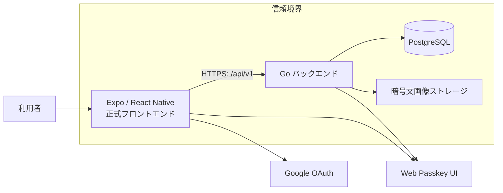

# 全体像

Samurai Meet は、スマホアプリがGo製APIを呼び、PostgreSQLに必要最小限の認証・状態を保存する構成です。バックエンドは画面を配信しません。画面は `frontend/` が責任を持ちます。

## 用語

- **API**: 画面から送られた要求を処理する窓口です。
- **セッション**: ログイン済みであることを表す、短時間の利用許可です。
- **Access Token**: API呼び出し専用の短命な鍵。端末の永続保存には入れません。
- **Refresh Token**: Access Tokenを更新するための長めの鍵。端末のSecure Storageだけに保存します。
- **Passkey**: 端末の生体認証や画面ロックを使うログイン方式です。

実装済み・未実装の正確な一覧は [実装状態とバックログ](../ai/plans/backlog.md) を参照してください。
