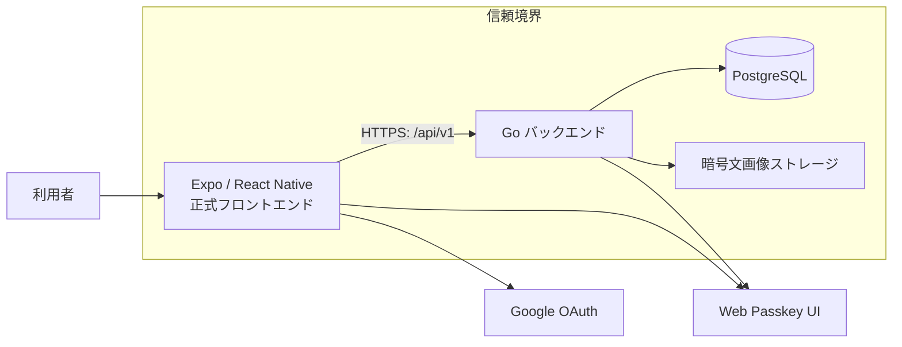

# 全体像

Samurai Meet は、スマホアプリがGo製APIを呼び、PostgreSQLに必要最小限の認証・状態を保存する構成です。バックエンドは画面を配信しません。画面は `frontend/` が責任を持ちます。

## 現在の実装範囲

- Go/PostgreSQL側の認証、プロフィール取得・更新、募集カード、検索、応募、承認/辞退、通知一覧・未読管理は実装済みです。
- 外国人/日本人の募集・検索・応募導線、募集管理・応募履歴・応募取り下げ、通知遷移は正式`frontend/`からAPIへ接続されています。日時入力の初期パース問題はISO/JST化と自動テストで解消済みですが、iOS実機での一連の動作は未確認です。
- 通知はアプリ内のREST一覧・既読管理です。OSのプッシュ通知はまだ実装していません。
- チャット画面はバックエンドの暗号化REST APIへ接続済みで、本文・位置情報・画像添付、既読、編集・削除、チャットDEK復旧、翻訳を扱います。バックエンドのリアルタイム配送は条件付きのHTTP/3 WebTransportで、Expo GoではREST同期を使います。native WebTransport bridgeと実機2端末E2Eは未完了で、旧WebSocket endpointは再導入しません。
- チャット送信前Moderationは暗号化前の平文例外です。通常はOpenAIを使い、未設定・障害時はfail-closedで送信を止めます。`CHAT_MODERATION_DEV_FREE_MODE=true`を明示した一時確認では、起動警告付きでローカル保守的判定を使えますが、OpenAIの代替ではなく実データを使いません。
- 募集の日付・時刻入力とサーバー解釈は`Asia/Tokyo`固定です。絶対時刻の保存・返却はUTC RFC3339です。

接続先、Expo Goの制約、既知の検証停止点は [フロントエンド接続](frontend-connection.md) と [安全性と今後の実装順](security-and-roadmap.md) を確認してください。

## 用語

- **API**: 画面から送られた要求を処理する窓口です。
- **セッション**: ログイン済みであることを表す、短時間の利用許可です。
- **Access Token**: API呼び出し専用の短命な鍵。端末の永続保存には入れません。
- **Refresh Token**: Access Tokenを更新するための長めの鍵。端末のSecure Storageだけに保存します。
- **Passkey**: 端末の生体認証や画面ロックを使うログイン方式です。

実装済み・未実装の正確な一覧は [実装状態とバックログ](../ai/plans/backlog.md) を参照してください。
