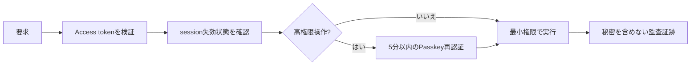

# 安全性と今後の実装順

このプロジェクトでは「ネットワーク・端末・内部サービスのどれも最初から信用しない」ゼロトラストを採用します。毎回、利用者・端末・操作目的・期限を確認します。

優先順位は、(1) 端末Key-Bの実機・監査確認、(2) 端末画像暗号化の画面統合、(3) 退会reconcilerと削除監査、(4) native Passkey実機確認、(5) 業務APIです。完了条件と依存関係は [AI向けバックログ](../ai/plans/backlog.md) にあります。
