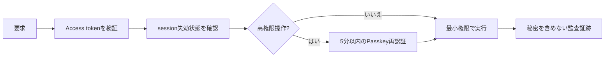

# 安全性と今後の実装順

このプロジェクトでは「ネットワーク・端末・内部サービスのどれも最初から信用しない」ゼロトラストを採用します。毎回、利用者・端末・操作目的・期限を確認します。

## 現在の残作業

優先順位は、(1) 募集・応募・通知遷移のiOS実機E2E、(2) native Passkey・端末Key-Bの実機/監査確認、(3) 端末画像暗号化の画面統合、(4) 退会reconcilerと削除監査、(5) プロフィール編集・チャット・会合/近接のフロント接続、(6) QUIC/WebTransport配送です。募集・マッチングAPI、募集管理・応募履歴、通知のアプリ内REST接続は残作業ではありません。

通知は現在アプリ内通知だけで、OSプッシュ配送は未実装です。通常のiPhone接続先は `https://samurai-meet.disnana.com/api/v1`、ローカルAPIは環境変数で明示した場合だけ使います。完了条件と依存関係は [AI向けバックログ](../ai/plans/backlog.md) を参照してください。
