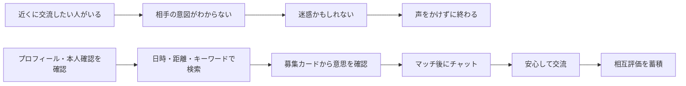
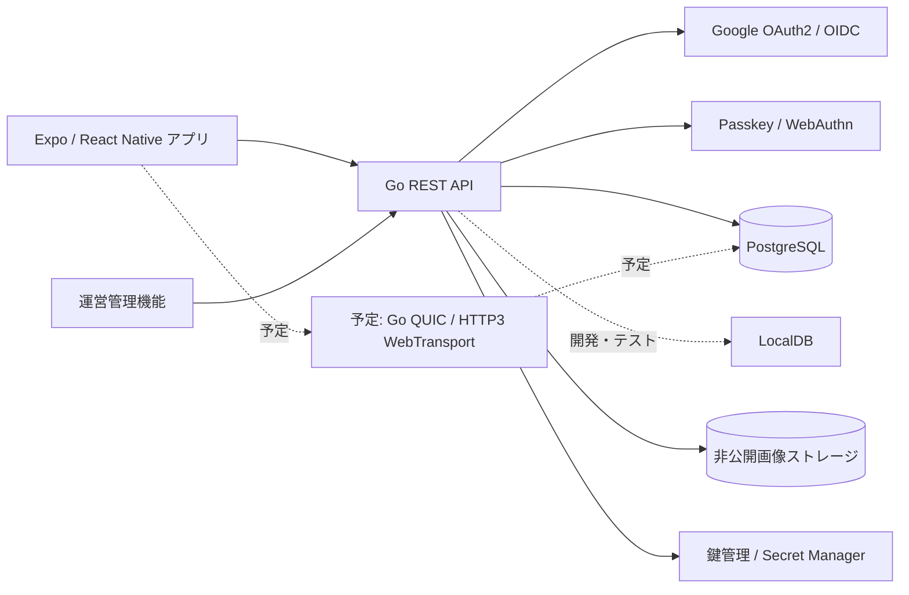
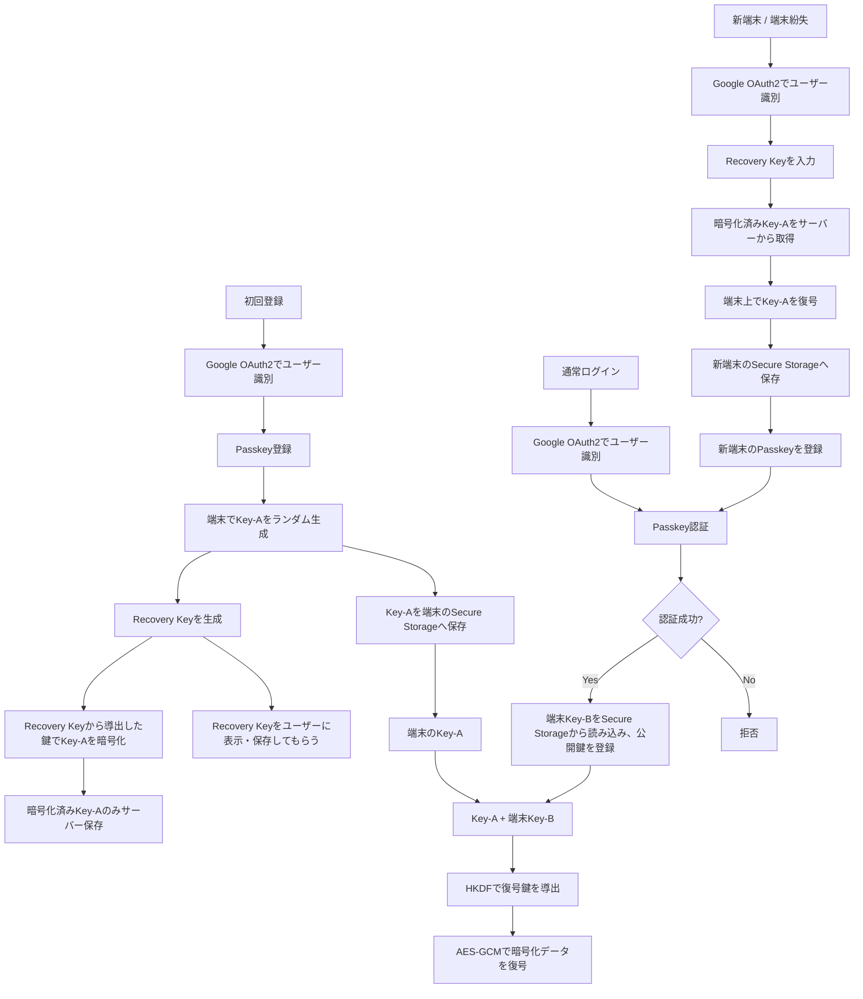

# Samurai Meet 要件定義書

## 文書情報

| 項目 | 内容 |
| --- | --- |
| プロジェクト名 | Samurai Meet |
| 文書名 | 要件定義書 |
| 版 | 0.1（初版ドラフト） |
| 作成日 | 2026-08-23 |
| ステータス | レビュー前 |
| 想定読者 | 企画、デザイン、フロントエンド、バックエンド、インフラ、運用担当 |

> 本書は、提示された機能・認証フロー・DB項目・ファイル構成を実装可能な要件に整理したものです。数値目標や本人確認方式など、確定していない内容は「暫定」または「要確認」と記載しています。

> 注意：本書は目標要件の初版ドラフトであり、現行実装の完了表ではありません。現在の実装範囲は [実装状態の境界](ai/system/current-status.md)、HTTP契約は [backend/API_SPEC.md](../backend/API_SPEC.md)、DBとmigrationは [DB仕様書](database.md) を正とします。特にPostGIS、QUICリアルタイム配送、OSプッシュ通知、評価・本人確認・通報は現行未実装または未確定です。

## 詳細仕様書へのリンク

本書は全体方針を扱います。実装時は、次の詳細仕様書を併せて参照してください。

- [ドキュメント一覧](README.md)
- [アーキテクチャ概要](architecture.md)
- [技術選定・実装分担](tech-stack.md)
- [API 仕様書](api.md)
- [DB 仕様書](database.md)
- [機能別仕様書](features/README.md)

## 1. プロダクト概要

Samurai Meet は、近くにいる日本人・外国人同士が、時間・場所・キーワードをきっかけに、安心して交流を始められるモバイルサービスです。

ユーザーはプロフィール、本人確認状態、募集カード、現在地をもとに交流相手を探し、マッチ後にチャットや写真共有を行います。交流後は相互評価を行い、次のユーザーが安心して相手を選べる情報を蓄積します。

### 1.1 プロダクトの一文定義

> 近くにいる、話したい人が見えることで、知らない人に話しかける最初の一歩をつくる。

### 1.2 想定プラットフォーム

- クライアント：iOS / Android（Expo、React Native、Expo Router）
- API サーバー：Go
- DB：PostgreSQL（開発・CI・運用）
- リアルタイム通信：QUIC（HTTP/3 / WebTransport）を目標とする。現行はRESTチャットのみ
- 認証：Google OAuth2 / OIDC、Passkey
- 画像保存：自前サーバーまたはプライベートなオブジェクトストレージ

## 2. 背景・目的

### 2.1 現状の課題

街中で困っている外国人や、交流したそうな人を見かけても、自分から声をかけることができません。英語などの語学力があっても、次のような不安によって行動に移せないケースがあります。

- 相手が話しかけられることを望んでいるかわからない
- 知らない人に声をかけることへの怖さがある
- 迷惑に思われる、断られるかもしれないという不安がある
- 会話の目的、時間、場所、使用言語が事前にわからない
- 交流したいと思っても、短時間で相手を見つける手段がない

### 2.2 課題の重要性

この課題を放置すると、近距離にいる人同士が交流できる機会を失います。また、旅行者は必要な情報や助けを得られず、地域側も国際交流や地域体験の機会を逃します。

一方で、面識のない人同士を直接つなぐサービスには、なりすまし、迷惑行為、待ち合わせ時の安全、位置情報の漏えいといったリスクがあります。そのため、単なる検索機能ではなく、本人確認、必要最小限の位置情報表示、チャット、通報・ブロックを一体で設計します。

### 2.3 解決すべき目標

#### 主目標

- 「話しかけてもよい相手か」「何を話せばよいか」がわかる状態をつくり、話しかける心理的ハードルを下げる。

#### 副目標

- 近さ、日時、時間帯、キーワードが合う相手を短時間で見つけられるようにする。
- Google OAuth2 と Passkey、本人確認表示により、相手を判断する材料を提供する。
- 本人同士が合意した後にチャットを開始できるようにする。
- 交流後の相互評価を、次のマッチングの安心材料にする。

### 2.4 本書の目的

- 企画、デザイン、開発、テスト、運用の共通認識をつくる。
- MVP の対象範囲と非対象範囲を明確にする。
- 機能要件、非機能要件、DB、API、認証方式の判断基準を定義する。
- 未決事項を可視化し、開発開始前に意思決定できるようにする。

## 3. 課題分析

### 3.1 課題の詳細

| 課題ID | 課題 | ユーザーへの影響 |
| --- | --- | --- |
| C-001 | 近くにいる人が交流を望んでいるかわからない | 声をかける判断ができない |
| C-002 | 知らない人に話しかけるのが怖い | 行動を起こせない |
| C-003 | 会話のきっかけがない | 話題や目的を考える負担が大きい |
| C-004 | 隙間時間に合う相手を探せない | 短時間の国際交流機会を逃す |
| C-005 | 相手の信頼性を判断する情報が少ない | マッチング・対面への不安が残る |
| C-006 | 交流後の良し悪しが次の人に伝わらない | 安心材料が蓄積されない |

### 3.2 Why 分析

1. 話しかけたいが、相手が望んでいるか判断できない。
2. 判断できないため、迷惑・拒否・危険への不安が生まれる。
3. 事前に目的、時間、キーワード、プロフィールを確認できない。
4. その結果、声をかける代わりに何もしないまま通り過ぎる。

Samurai Meet では、募集カード、検索、本人確認、プロフィール、マッチ後チャットを組み合わせ、対面前の不確実性を小さくします。

### 3.3 発生頻度・影響度

日本を訪れる外国人の母数は大きく、JNTO の発表では 2025 年の訪日外客数は 42,683,600 人です。これは交流ニーズの直接的な人数ではありませんが、外国人との接点が発生する機会の規模を示す参考指標です。

出典：[JNTO「訪日外客数（2025年12月推計値）」](https://www.jnto.go.jp/news/press/20260121_monthly.html)

開発前に、次のユーザー調査で対象課題の発生頻度と受容性を計測します。

- 過去 3 か月以内に、外国人へ話しかけたいと思った回数
- 話しかけなかった理由
- 交流に使える平均時間
- 位置情報・本人確認・プロフィール公開への許容度
- 対面交流に進むために必要な安心材料

### 3.4 課題の影響範囲

| 対象 | 影響 |
| --- | --- |
| 日本人ユーザー | 国際交流の機会損失、声かけへの心理的負担 |
| 外国人ユーザー | 会話相手や地域情報を得る機会の損失 |
| サービス運営 | 不適切利用への対応、本人確認・通報・削除の運用負荷 |
| 周辺地域 | 交流による地域体験の増加、トラブル時の安全対応 |
| プライバシー | 位置情報、本人確認情報、写真、チャットの漏えいリスク |

### 3.5 既存の対策と限界

| 既存手段 | 限界 |
| --- | --- |
| 翻訳アプリ | 翻訳はできるが、話しかけてよい相手かはわからない |
| SNS | 不特定多数への発信が中心で、近距離・短時間の条件指定が難しい |
| 地図・レビューサービス | 場所の情報が中心で、交流相手との合意形成はできない |
| イベント・交流会 | 開催日時と場所が固定され、隙間時間の利用に向かない |
| 一般的なマッチングサービス | 恋愛・長期関係を前提とする場合があり、本サービスの目的と異なる |

## 4. 解決方針（Solution Concept）

### 4.1 解決策の概要

1. ユーザーがプロフィールと本人確認状態を登録する。
2. ユーザーが、日時、時間帯、キーワード、公開半径を指定した募集カードを作成する。
3. 現在地と検索条件を使い、近くで条件が合う募集カードを表示する。
4. 双方の意思が確認できたらマッチし、チャットを開始する。
5. チャットで目的や待ち合わせを確認し、必要に応じて写真を共有する。
6. 交流後に相互評価を行い、安心材料を蓄積する。

### 4.2 ビフォー／アフター



### 4.3 想定ユーザー

| ペルソナ | ニーズ | 代表的な利用場面 |
| --- | --- | --- |
| 地域在住の日本人 | 外国人と短時間で交流したい | 駅、観光地、カフェ周辺で 30 分話したい |
| 日本を訪れている外国人 | 地域情報や日本語会話の相手がほしい | 観光の合間に近くの人と交流したい |
| 日本在住の外国人 | 継続的に地域の人と交流したい | 仕事・学校の空き時間に会話したい |
| 運営者 | 安全な交流を維持したい | 通報、本人確認、利用停止、監視を行う |

### 4.4 プロダクトの成功条件

- 初回ユーザーがプロフィールと募集カードを短時間で作成できる。
- 検索結果を見て、なぜその相手が表示されたか理解できる。
- マッチ前に、相手の目的・時間・距離・本人確認状態を確認できる。
- マッチ後に、対面せずともチャットで不安を解消できる。
- 交流後に評価・通報・ブロックを適切に行える。
- 位置情報と本人確認情報を、目的に必要な範囲を超えて公開しない。

## 5. 対象範囲と前提条件

### 5.1 MVP の対象範囲

- Google OAuth2 による登録・ログイン
- Passkey の登録・認証
- プロフィールの作成・編集・表示
- 本人確認状態の申請・表示
- 現在地の取得と近距離検索
- 募集カードの作成・編集・削除・表示
- キーワード、日時、距離による検索・マッチング
- マッチ後のチャット、既読、写真送信
- 交流後の相互評価、いいね数の集計
- 新端末・端末紛失時の Recovery Key による復旧
- 通報、ブロック、アカウント削除（安全上の必須機能）

### 5.2 非対象範囲

- 決済、課金、チケット販売
- 恋愛・婚活を目的とした機能
- 大人数のグループチャット
- サービス内での通訳・翻訳品質の保証
- 緊急通報や救助の代替
- ユーザーの正確な現在地の他ユーザーへの表示
- 本人確認書類の無期限保存
- 未成年者の利用（対象年齢・保護者同意の方針決定まで対象外）

### 5.3 前提条件・制約

- 現在地取得はユーザーの明示的な許可を必要とする。
- 外国人ユーザーも利用するため、初期 UI は日本語・英語対応を前提とする。
- DB エンジンは PostgreSQL のみとする。PostGIS は将来の性能改善候補であり、現行の距離判定はGoのHaversineで行う。
- チャットのリアルタイム配送は将来QUICを標準候補とし、HTTP/3 WebTransportを含むQUIC上の実装で実現する。現行はRESTの履歴・送信・既読であり、QUIC／WebTransport／WebSocket配送は未実装である。WebSocketは標準経路にせず、QUICが技術的に成立しない場合だけ、理由・代替案・運用影響をチームで合意したうえで例外採用を決定する。
- QUICの採用理由、QUIC/TLS 1.3とJWSの役割、リプレイ攻撃対策、packet再送とアプリ再送の境界は [チャット通信仕様](features/chat-transport.md) を正本とする。
- 画像は DB にバイナリを直接保存せず、ストレージキーとメタデータを DB に保存する。
- 個人情報の取扱いは、適用される個人情報保護法・GDPR 等を確認して確定する。法的判断は専門家レビューを受ける。

## 6. 機能要件

### 6.1 機能一覧

| 機能ID | 機能名 | 対応課題 | 概要・利用方法 | 優先度 |
| --- | --- | --- | --- | --- |
| FR-001 | Google 登録・ログイン | C-002, C-005 | Google OAuth2 / OIDC でユーザーを識別し、アカウントを作成・ログインする | Must |
| FR-002 | Passkey 登録・認証 | C-002, C-005 | Google 認証後に端末の Passkey を登録し、通常ログインで追加認証する | Must |
| FR-003 | セッション管理 | C-005 | ログアウト、トークン更新、アカウント削除、利用停止状態を管理する | Must |
| FR-004 | プロフィール作成・編集 | C-001, C-002, C-003 | 名前、国籍、アイコン、自己紹介、交流キーワード等を登録・編集する | Must |
| FR-005 | 本人確認 | C-002, C-005 | 本人確認の状態を申請・審査・表示する。詳細な証明書類は他ユーザーに公開しない | Must |
| FR-006 | 現在地の取得 | C-004, C-005 | 端末の位置情報許可を取得し、検索・カード表示の距離計算に利用する | Must |
| FR-007 | 募集カード管理 | C-001, C-003, C-004 | 日時、時間帯、キーワード、公開半径を指定して募集を作成・編集・削除する | Must |
| FR-008 | キーワード検索 | C-003, C-004 | キーワード、日時、距離、本人確認状態等で募集カードを絞り込む | Must |
| FR-009 | マッチング | C-001, C-002, C-005 | 募集カードへの関心を送り、双方の合意後にチャットを解放する | Must |
| FR-010 | チャット一覧 | C-003, C-004, C-005 | マッチ済みの相手、最新メッセージ、未読数を表示する | Must |
| FR-011 | 個別チャット | C-002, C-003, C-005 | マッチ相手とテキストをリアルタイム送受信し、既読を管理する | Must |
| FR-012 | 写真送信 | C-003, C-005 | チャット内で写真をアップロード・表示・削除する | Should |
| FR-013 | 相互評価・いいね | C-005, C-006 | 交流後に双方が評価し、プロフィールの集計値に反映する | Must |
| FR-014 | 通報・ブロック | C-002, C-005 | 不適切なユーザー、カード、メッセージを通報・遮断する | Must |
| FR-015 | Recovery Key 復旧 | C-005 | 新端末・端末紛失時に暗号化済み Key-A を復旧する | Must |

### 6.2 機能詳細

#### FR-001 Google 登録・ログイン

- Google OAuth2 / OIDC の認可コードフロー + PKCE を利用する。
- Google ID Token はサーバー側で署名、issuer、audience、expiry、subject (`sub`) を検証する。
- Google の `sub` を `google_subject_id` として保存し、サービス内のユーザー ID と一意に紐付ける。
- Google のメールアドレスを主キーやサービス内の個人識別子として使用しない。
- 初回ログイン時はアカウントを作成し、プロフィール作成へ遷移する。
- 既存ユーザーは Passkey 認証へ進む。

#### FR-002 Passkey 登録・認証

- WebAuthn / Passkey の公開鍵をサーバーに保存する。
- 秘密鍵は端末の Secure Storage / OS 管理領域から外へ出さない。
- Passkey 認証失敗時は保護されたエラーを返し、認証情報の存在を推測できないようにする。
- 新端末復旧後は、新端末の Passkey を登録する。元のフロー図の「復旧後に Passkey 認証へ戻る」部分は、実装時にこの登録手順を含めるか確定する。

#### FR-004 プロフィール

必須項目と公開範囲は次のとおりです。

| 項目 | 必須 | 他ユーザーへの公開 | 備考 |
| --- | --- | --- | --- |
| 名前 | Yes | Yes | 表示名。戸籍上の氏名は保存しない方針を推奨 |
| 国籍 | Yes | Yes | ISO 3166-1 alpha-2 等のコードで管理 |
| アイコン | No | Yes | 写真またはアバター。削除・差し替え可能 |
| 本人確認済みか | 自動 | Yes | `未申請 / 審査中 / 確認済み / 否認` の状態表示 |
| いいね数 | 自動 | Yes | 直接編集不可。評価データから集計 |
| モンスター | 要確認 | 要確認 | 意味、データ形式、公開範囲を決定する |
| 自己紹介 | No | Yes | 文字数上限と禁止語を設定 |

#### FR-005 本人確認

- 本人確認の詳細データは本人確認プロバイダーまたは限定された運営領域で扱う。
- 他ユーザーには、原則として「本人確認済み」バッジだけを表示する。
- 審査状態は `pending / verified / rejected / expired` を基本とする。
- 否認理由は、個人情報を過度に開示しない一般化されたメッセージで表示する。
- 本人確認プロバイダー、対象年齢、再確認期限、保存期間は要決定。

#### FR-006 現在地の取得

- 位置情報の利用目的を説明し、OS の許可ダイアログを表示する。
- 取得するのは検索に必要な位置情報と精度情報に限定する。
- 他ユーザーへは正確な緯度・経度を表示せず、距離帯または概算エリアを表示する。
- 位置情報の保存には有効期限を持たせ、期限を過ぎたデータは削除または無効化する。
- 許可されない場合は、キーワード・日時だけの検索を提供する。

#### FR-007 募集カード

募集カードの入力項目は次のとおりです。

| 項目 | 内容 |
| --- | --- |
| 誰の募集か | 作成者の名前、国籍、アイコン、本人確認状態を表示 |
| 日時 | 交流可能日。国内利用向けに`Asia/Tokyo`固定の壁時計として扱う |
| 時間帯 | 開始時刻・終了時刻、または定義済み時間帯 |
| キーワード | 交流目的、話したい言語、興味分野など。複数指定可 |
| 公開半径 | 1 km / 3 km / 5 km のいずれか |
| 位置 | 距離計算用。正確な値は他ユーザーへ表示しない |
| 有効期限 | 日時・時間帯の終了後に自動非表示 |
| 状態 | `draft / open / matched / closed / expired` |

#### FR-008 キーワード検索・マッチング候補

- キーワードは完全一致に限定せず、表記揺れ・大文字小文字・言語差を考慮する。
- 初期実装では、正規化したキーワードの部分一致またはタグ一致を採用する。
- 検索結果には、表示理由として「距離」「日時」「一致キーワード」を表示する。
- 公開半径外のカードは表示しない。
- 本人確認済みのみ、時間帯、キーワード、距離、カード状態で絞り込めるようにする。
- 現行の距離計算はGoのHaversineで行い、クライアントだけでは判定しない。PostGISによる地理空間検索は将来候補とする。

#### FR-009 マッチング

- ユーザーは募集カードに対して関心を送る。
- チャット開始条件は「双方が関心を示した状態」とする。
- 片方が拒否、ブロック、通報した場合はチャットを開始・継続できない。
- 同一ユーザーが同一カードへ重複して関心を送れない。
- カードが期限切れになった場合、新規マッチを停止する。

#### FR-011 個別チャット

- マッチ成立後にのみアクセスできる 1 対 1 チャットとする。
- テキスト、送信時刻、送信者、既読状態を管理する。
- 将来QUIC接続を実装した場合は、切断後に再接続し、未送信・未受信メッセージをREST APIで同期する。現行はRESTポーリングである。
- 通信断・タイムアウト・一時的なサーバーエラーで送信結果が不明な場合は、同じ `client_message_id` を使って期限・回数を制限した自動再送を行う。入力不正、認証失効、認可拒否では再送しない。
- サーバーはメッセージの順序を `server_message_id` とサーバー時刻で確定する。
- 削除済みメッセージは相手側で内容を再表示できない状態にする。監査ログの保存方針は要決定。

#### FR-012 写真

- 許可する MIME type、ファイルサイズ、解像度を設定する。
- EXIF の GPS 情報はアップロード前またはサーバー側で除去する。
- 写真は非公開ストレージに保存し、短時間有効な取得 URL または認証済み API 経由で配信する。
- ウイルス・不正ファイル検査、サムネイル生成、削除処理を行う。
- 本人確認書類の写真をチャット写真として扱わないよう、UI と利用規約で制限する。

#### FR-013 相互評価・いいね

- マッチまたは交流の完了後、各ユーザーは相手を一度だけ評価できる。
- 評価は 1〜5 の数値評価、または「良い / 改善が必要」の定義済み項目から選択する。方式は要決定。
- 相手への公開情報は、平均評価・件数・いいね数など集計値を基本とし、自由記述は本人の同意なく公開しない。
- 評価後の編集・取消・異議申立ての可否を定義する。
- いいね数はクライアントから更新させず、評価テーブルから集計または安全なカウンター更新で管理する。

#### FR-014 通報・ブロック

- ユーザー、募集カード、メッセージ、写真を通報対象にする。
- ブロックした相手のカード、プロフィール、チャットを非表示にする。
- 通報理由は選択式と任意コメントを用意する。
- 運営者は通報を確認し、警告、非表示、利用停止、削除を実行できる。
- 緊急事態は本サービスの通報機能ではなく、警察・救急等へ連絡する旨を明示する。

### 6.3 ユースケース

| UC-ID | シナリオ | 主な手順 | 完了条件 |
| --- | --- | --- | --- |
| UC-001 | 初回登録 | Google ログイン → Passkey 登録 → Key-A / Recovery Key 設定 → プロフィール作成 | 利用可能なユーザーが作成される |
| UC-002 | 近くの相手を探す | 位置情報許可 → キーワード・日時を入力 → 検索 | 条件に合うカードが距離順等で表示される |
| UC-003 | 募集する | 日時・時間帯・キーワード・半径を入力 → 公開 | 公開半径内のユーザーにカードが表示される |
| UC-004 | マッチして話す | カード確認 → 関心を送る → 相互承認 → チャット | チャットでメッセージを交換できる |
| UC-005 | 写真を送る | チャットで写真選択 → 検査・アップロード → 表示 | 相手が認証済み経路で写真を表示できる |
| UC-006 | 交流後に評価する | マッチを完了 → 相互評価を入力 | 評価が一度だけ集計される |
| UC-007 | 新端末へ復旧する | Google 認証 → Recovery Key 入力 → 暗号化 Key-A を取得・復号 → 新端末 Passkey 登録 | 新端末で暗号化データへアクセスできる |

## 7. 非機能要件

### 7.1 性能要件（暫定）

| 要件ID | 要件 | 暫定目標 |
| --- | --- | --- |
| NFR-P-001 | 通常 API 応答 | p95 1 秒以内（画像アップロードを除く） |
| NFR-P-002 | 検索結果表示 | 検索実行から p95 2 秒以内 |
| NFR-P-003 | チャット配送 | 接続中の相手へ p95 2 秒以内に配送 |
| NFR-P-004 | 同時 QUIC 接続 | MVP で 1,000 接続を目標。負荷試験後に確定 |
| NFR-P-005 | 画像アップロード | 進捗表示を行い、タイムアウト時に再試行できる |

### 7.2 セキュリティ要件

#### 認証・認可

- Google OAuth2 / OIDC の ID Token をサーバーで検証する。
- OAuth の `state`、PKCE、redirect URI の厳格な検証を実装する。
- API は認証済みユーザーのサービス用個人識別 ID (`user_id`) で認可する。
- 他ユーザーのプロフィール編集、カード編集、チャット取得、写真取得を禁止する。
- 管理者 API は一般ユーザー API と分離し、強い認証と監査ログを要求する。
- アクセストークン、リフレッシュトークン、Recovery Key、秘密鍵をログに出力しない。
- Access Token は JWS 署名付き JWT とし、`sid` で DB の `sessions` を参照する。
- API は JWT の署名・有効期限だけで認証を完了させず、DB のセッション失効状態とユーザー状態を確認する。
- Refresh Token は不透明な乱数とし、DB にはハッシュだけを保存して、使用ごとにローテーションする。
- リフレッシュは、ログイン直後、Access Token の残り 30 秒以内、アプリ復帰時、401 発生時、QUIC 再接続時に行う。毎リクエストでは行わない。

#### Key-A / Key-B / Recovery Key

- Key-A は端末側で暗号学的に安全な乱数から生成し、端末の Secure Storage に保存する。
- Recovery Key は十分なエントロピーを持つ値とし、画面表示時にユーザーへ安全な保存を促す。
- サーバーには Recovery Key の平文を保存しない。
- Recovery Key から鍵導出関数で復号鍵を作り、Key-A を AES-GCM 等で暗号化する。
- サーバーには暗号化済み Key-A、nonce、KDF パラメータ、鍵バージョンだけを保存する。
- Key-B は端末ごとにクライアントで生成し、Secure Storage／Keychain／Keystoreから外へ出さない。サーバーには端末IDとEd25519公開鍵だけを登録する。
- 画像などの高機密APIはAccess Tokenだけで許可せず、端末Key-B由来の署名、時刻、ワンタイムnonce、body hashを検証する。
- クライアントは Key-A と端末Key-Bを組み合わせ、HKDF でデータ暗号鍵を導出する。Recovery後はKey-A由来の画像鍵wrapperから新端末のKey-B envelopeを作り直す。
- 画像・暗号化対象データは AES-256-GCM 等で暗号化し、nonce の再利用を禁止する。
- 暗号方式、鍵長、端末Key-Bのversion更新、proof失効条件は、実装前にセキュリティレビューで確定する。Key-B配布APIは設けない。

#### 位置情報・写真・個人情報

- 位置情報は目的、利用期間、表示範囲を明示し、同意を取得する。
- 他ユーザーには正確な緯度・経度を返さない。
- 写真の EXIF GPS、デバイス情報、不要なメタデータを削除する。
- ストレージは公開バケットにせず、所有者またはチャット参加者だけが取得できるようにする。
- アカウント削除時のプロフィール、カード、チャット、写真、評価、バックアップの削除・匿名化方針を定義する。

### 7.3 可用性・運用要件（暫定）

| 要件ID | 要件 | 暫定目標 |
| --- | --- | --- |
| NFR-O-001 | 稼働率 | 月間 99.5% 以上（MVP） |
| NFR-O-002 | DB バックアップ | 日次フルバックアップ、ポイントインタイムリカバリを検討 |
| NFR-O-003 | RPO | 24 時間以内。重要データは短縮を検討 |
| NFR-O-004 | RTO | 4 時間以内 |
| NFR-O-005 | 監視 | API エラー率、遅延、DB、ストレージ、QUIC 接続数を監視 |
| NFR-O-006 | 監査 | ログイン、本人確認、通報、利用停止、管理者操作を監査ログに残す |
| NFR-O-007 | デプロイ | DB migration をバージョン管理し、ロールバック手順を持つ |

### 7.4 ユーザビリティ・アクセシビリティ

- 初回登録から最初の検索または募集公開までを短い導線にする。
- 日本語・英語を切り替えられる設計にする。
- 位置情報許可が拒否された場合でも、理由と代替手段を提示する。
- 本人確認済み、募集の有効期限、距離、時間帯をカード上で判別できるようにする。
- エラーは原因と再試行方法をユーザーの言語で表示する。
- 色だけに依存せず、ラベル・アイコン・テキストで状態を示す。
- チャットでは送信中、送信済み、既読、失敗を区別する。

### 7.5 保守性・テスト

- フロントエンド、API、DB の契約を型または OpenAPI 等で管理する。
- 認証、位置情報の範囲判定、公開権限、カード期限切れ、復旧フローを自動テストする。
- QUIC の再接続、パケット損失、リプレイ、重複送信、期限・回数制限付き自動再送、順序逆転、オフライン復帰をテストする。
- 本人確認・通報・アカウント削除の運用手順をステージング環境で確認する。

## 8. 成果指標（KPI / KGI）

### 8.1 KGI

> ユーザーが、近くにいる人への声かけ・交流開始に感じる心理的ハードルを下げる。

測定には、初回利用前と一定期間利用後のアンケートを使用します。主観指標だけでなく、実際の検索、マッチ、初回メッセージ、評価までの行動指標を併用します。

### 8.2 KPI（初期仮説）

| 指標ID | 指標 | 初期目標 | 測定方法 |
| --- | --- | --- | --- |
| KPI-001 | プロフィール完成率 | 登録者の 70% 以上 | 必須プロフィール保存ユーザー / 登録者 |
| KPI-002 | 募集カード作成率 | 登録者の 50% 以上 | 有効なカードを 1 件以上作成したユーザー |
| KPI-003 | 検索から関心送信への転換率 | 20% 以上 | 検索閲覧者に対する関心送信者 |
| KPI-004 | マッチ後 24 時間以内の初回メッセージ率 | 50% 以上 | マッチ後に初回メッセージを送った割合 |
| KPI-005 | 初回メッセージ返信率 | 40% 以上 | 24 時間以内に相手から返信があった割合 |
| KPI-006 | 交流後の相互評価完了率 | 50% 以上 | マッチ成立者に対する双方評価完了者 |
| KPI-007 | 安全性指標 | 通報率・ブロック率を継続監視 | 1,000 マッチあたりの件数と内容 |
| KPI-008 | 心理的ハードル | 事前比で平均 1.0 点改善 | 5 段階アンケートの前後差 |

> 上記数値は初期仮説です。βテストでベースラインを計測し、ユーザー獲得数、安全性、継続率と併せて正式目標を決定します。

## 9. システム構成

### 9.1 論理構成



### 9.2 コンポーネント責務

| コンポーネント | 責務 |
| --- | --- |
| Expo アプリ | 画面、OS 権限、Secure Storage、Key-A、暗号化、現行RESTクライアント。QUICクライアントは予定 |
| Go API | 認証後のセッション、プロフィール、カード、検索、マッチ、画像認可。評価等は予定 |
| QUIC（HTTP/3 / WebTransport） | マッチ済みチャットのリアルタイム配送、再接続・認証（予定） |
| PostgreSQL | ユーザー、プロフィール、カード、マッチ、メッセージ、評価、監査データ |
| PostGIS | 位置情報の距離検索・公開半径判定（将来候補。現行はGo Haversine） |
| 画像ストレージ | 暗号化済みまたはアクセス制御済み画像の保存 |
| KMS / Secret Manager | DB 接続情報、署名鍵、サーバー側秘密等の保護。端末Key-Bは対象外 |

## 10. DB 要件

### 10.1 データ設計方針

- 現行サービス内の主キーは推測困難なopaque `TEXT`である。UUIDへ変更する場合は、API・ファイルパス・migrationを同時に更新する別計画として扱う。
- Google の `sub` は外部識別子として保存し、サービス内 ID と分離する。
- アカウント情報と公開プロフィール情報を分離する。
- 画像本体は DB に保存せず、ストレージキーだけを保存する。
- 位置情報は期限付きで保存し、正確な値を API レスポンスへ返さない。
- `likes_count` 等の集計値はクライアントから直接更新させない。
- 削除・停止・期限切れを論理状態として扱い、必要な監査情報を保持する。

### 10.2 主要テーブル

以下の型や制約は初版の目標設計例である。現行の実際の型・制約・migrationは [DB仕様書](database.md) と `backend/migrations/*.sql` を正とし、特に現行IDはUUID文字列を前提にしない。

#### `users`：認証・アカウント

| カラム | 型の例 | 制約・用途 |
| --- | --- | --- |
| `id` | uuid | PK。サービス用個人識別 ID |
| `google_subject_id` | text | NOT NULL、UNIQUE。Google OAuth2 の `sub` |
| `status` | enum | `active / suspended / deleted` |
| `created_at` | timestamptz | 作成日時 |
| `updated_at` | timestamptz | 更新日時 |
| `deleted_at` | timestamptz | 論理削除日時 |

#### `profiles`：公開プロフィール

| カラム | 型の例 | 制約・用途 |
| --- | --- | --- |
| `user_id` | uuid | PK / `users.id` への FK |
| `name` | text | 表示名 |
| `nationality_code` | char(2) | ISO 3166-1 等 |
| `icon_photo_id` | uuid | `photos.id` への FK。任意 |
| `identity_status` | enum | `unverified / pending / verified / rejected / expired` |
| `likes_count` | integer | 0 以上。集計値、直接編集不可 |
| `monster` | jsonb または text | 意味・形式・公開範囲は要確認 |
| `bio` | text | 任意の自己紹介 |
| `created_at` / `updated_at` | timestamptz | 監査用 |

#### `recruitment_cards`：募集カード

| カラム | 型の例 | 制約・用途 |
| --- | --- | --- |
| `id` | uuid | PK |
| `owner_user_id` | uuid | 作成者。`users.id` への FK |
| `available_date` | date | 交流可能日 |
| `start_time` / `end_time` | time | 時間帯 |
| `timezone` | text | IANA タイムゾーン |
| `keywords` | text[] または別テーブル | 検索対象。GIN インデックスを検討 |
| `visibility_radius_km` | smallint | CHECK (`1`, `3`, `5`) |
| `location` | geography(Point, 4326) | 距離計算用。API では丸めて扱う |
| `status` | enum | `draft / open / matched / closed / expired` |
| `expires_at` | timestamptz | 自動非表示日時 |
| `created_at` / `updated_at` | timestamptz | 監査用 |

#### `matches`：関心・マッチ状態

| カラム | 型の例 | 制約・用途 |
| --- | --- | --- |
| `id` | uuid | PK |
| `card_id` | uuid | `recruitment_cards.id` への FK |
| `requester_user_id` | uuid | 関心を送ったユーザー |
| `owner_user_id` | uuid | カード所有者 |
| `status` | enum | `pending / accepted / rejected / blocked / expired / completed` |
| `matched_at` | timestamptz | 相互承認日時 |
| `created_at` / `updated_at` | timestamptz | 監査用 |

`card_id` と `requester_user_id` の組み合わせには一意制約を設定し、重複関心を防ぎます。

#### `messages`：チャットメッセージ

| カラム | 型の例 | 制約・用途 |
| --- | --- | --- |
| `id` | uuid | PK |
| `match_id` | uuid | `matches.id` への FK |
| `sender_user_id` | uuid | 送信者 |
| `message_type` | enum | `text / photo / system` |
| `ciphertext` | bytea または text | 暗号化本文。方式確定後に型を確定 |
| `nonce` | bytea | AES-GCM 等の nonce |
| `key_version` | text | 鍵ローテーション用 |
| `sent_at` | timestamptz | サーバー確定時刻 |
| `read_at` | timestamptz | 既読時刻 |
| `deleted_at` | timestamptz | 論理削除 |

#### `photos`：写真メタデータ

| カラム | 型の例 | 制約・用途 |
| --- | --- | --- |
| `id` | uuid | PK |
| `owner_user_id` | uuid | 所有者 |
| `message_id` | uuid | チャット添付時の `messages.id`。アイコンは NULL 可 |
| `storage_key` | text | 非公開ストレージ上のキー |
| `mime_type` | text | 許可形式を検証 |
| `size_bytes` | bigint | サイズ上限を検証 |
| `width` / `height` | integer | 表示・サムネイル用 |
| `encrypted` | boolean | クライアント暗号化済みか |
| `nonce` | bytea | 暗号化時の nonce |
| `created_at` / `deleted_at` | timestamptz | 保持・削除管理 |

#### その他の推奨テーブル

| テーブル | 目的 |
| --- | --- |
| `passkey_credentials` | WebAuthn credential ID、公開鍵、sign count、登録端末情報 |
| `auth_challenges` | `pre_auth_token` と Passkey challenge のハッシュ、scope、期限、使用済み日時 |
| `key_envelopes` | 暗号化済み Key-A、nonce、KDF パラメータ、鍵バージョン |
| `sessions` | JWS 署名付き JWT の `sid` と紐づくログインセッション、失効日時、端末情報 |
| `refresh_tokens` | Refresh Token のハッシュ、期限、使用済み日時、ローテーション単位 |
| `refresh_attempts` | `refresh_request_id` と暗号化済みレスポンスによる 30 秒の冪等性記録 |
| `user_locations` | 最新位置、精度、取得日時、有効期限。履歴保存は原則しない |
| `reviews` | reviewer、reviewee、match、評価値、公開状態 |
| `profile_likes` | いいねの送信者・受信者・日時。一人一回を一意制約 |
| `identity_verifications` | 本人確認プロバイダー、状態、参照 ID、審査日時 |
| `reports` | 通報者、対象種別、対象 ID、理由、処理状態 |
| `blocks` | ブロックする側・される側、作成日時 |
| `audit_logs` | 管理者操作、認証イベント、重要状態変更 |

### 10.3 インデックス・整合性

- `users.google_subject_id`：UNIQUE
- `recruitment_cards.location`：GiST 空間インデックス
- `recruitment_cards.status, available_date, expires_at`：複合インデックス
- `recruitment_cards.keywords`：GIN または正規化キーワードテーブル
- `messages.match_id, sent_at`：複合インデックス
- `matches.card_id, requester_user_id`：UNIQUE
- `reviews.match_id, reviewer_user_id`：UNIQUE
- すべての外部キーに削除時の挙動を定義し、意図しない連鎖削除を避ける。

## 11. API / QUIC 要件

### 11.1 REST API（案）

| メソッド | パス | 概要 |
| --- | --- | --- |
| `GET` | `/api/v1/auth/google/start` | Google 認証開始 |
| `POST` | `/api/v1/auth/google/exchange` | 認可コードをセッションへ交換 |
| `POST` | `/api/v1/auth/passkey/register/options` | Passkey 登録オプション取得 |
| `POST` | `/api/v1/auth/passkey/register/verify` | Passkey 登録結果検証 |
| `POST` | `/api/v1/auth/passkey/login/options` | Passkey 認証オプション取得 |
| `POST` | `/api/v1/auth/passkey/login/verify` | Passkey 認証結果検証 |
| `POST` | `/api/v1/auth/refresh` | Refresh Token のローテーションと Access Token 更新 |
| `POST` | `/api/v1/auth/logout` | ログアウト |
| `POST` | `/api/v1/auth/logout-all` | 全端末のセッション失効 |
| `GET` | `/v1/me/sessions` | 自分のログインセッション一覧 |
| `DELETE` | `/v1/me/sessions/{id}` | 指定セッションの失効 |
| `GET` | `/v1/me` | 自分のアカウント・プロフィール取得 |
| `PATCH` | `/v1/me/profile` | プロフィール更新 |
| `POST` | `/v1/me/location` | 現在地更新 |
| `POST` | `/v1/me/verification` | 本人確認申請 |
| `GET` | `/v1/recruitments` | 募集カード検索 |
| `POST` | `/v1/recruitments` | 募集カード作成 |
| `GET` | `/v1/recruitments/{id}` | 募集カード詳細 |
| `PATCH` | `/v1/recruitments/{id}` | 募集カード更新 |
| `DELETE` | `/v1/recruitments/{id}` | 募集カード削除・非公開 |
| `POST` | `/v1/recruitments/{id}/interest` | 関心を送る |
| `POST` | `/v1/matches/{id}/accept` | 関心を承認 |
| `GET` | `/v1/chats` | チャット一覧 |
| `GET` | `/v1/chats/{id}/messages` | メッセージ履歴取得 |
| `POST` | `/v1/photos` | 写真アップロード |
| `POST` | `/v1/matches/{id}/reviews` | 相互評価登録 |
| `POST` | `/v1/reports` | 通報 |
| `POST` | `/v1/blocks` | ブロック |
| `POST` | `/v1/recovery/restore` | Recovery Key による復旧 |
| `DELETE` | `/v1/me` | アカウント削除 |

### 11.2 QUIC（HTTP/3 / WebTransport・予定）

- 接続先：環境ごとに設定する QUIC endpoint（`chat_id` 単位。HTTP/3 WebTransport の場合は HTTPS URL として提供する）
- 接続時に API セッションを検証する。
- クライアントイベント例：`message.send`、`message.read`、`typing.start`、`typing.stop`
- サーバーイベント例：`message.created`、`message.ack`、`message.read`、`error`
- メッセージ送信にはクライアント側の一意な `client_message_id` を付与し、再送による二重登録を防ぐ。
- QUIC が一時的に利用できない場合は、REST の送信・ポーリングへフォールバックする。WebSocket への切替は自動で行わず、QUIC が技術的に成立しない場合だけチーム合意で決定する。

### 11.3 API 共通ルール

- 募集の利用日・開始／終了時刻は`Asia/Tokyo`固定の壁時計として扱い、`created_at`や`expires_at`等の絶対時刻はISO 8601 / UTCで扱う。
- エラー形式を統一する。例：`{ "code": "AUTH_REQUIRED", "message": "...", "request_id": "..." }`
- ページング、並び順、検索条件の上限を定義する。
- 認証が必要なエンドポイントは `401`、権限不足は `403`、入力不正は `400`、競合は `409` を基本とする。

## 12. 認証・暗号化フロー



### 12.1 フロー上の重要事項

- Key-A の平文をサーバーへ送信しない。
- Recovery Key の平文をサーバーへ送信・保存しない設計を優先する。
- Recovery Key を紛失した場合の復旧不能リスクを、登録時に明示する。
- Recovery Key の試行回数、レート制限、アカウントロック、サポート対応を決定する。
- 端末Key-Bの生成・端末限定保存・公開鍵登録・proof nonce再利用防止を設計レビューで確定する。サーバーはKey-B平文を保持しない。
- 新端末では、復旧後に必ず新しい Passkey を登録できるようにする。

## 13. ファイル構成

### 13.1 フロントエンド

```text
frontend/
├── app/                        # Expo Router によるページ
│   ├── (auth)/
│   │   ├── login.tsx           # ログイン画面
│   │   └── register.tsx        # 新規登録画面
│   ├── (tabs)/
│   │   ├── index.tsx           # マッチング画面（メイン）
│   │   ├── chat.tsx            # チャット一覧
│   │   └── profile.tsx         # プロフィール画面
│   ├── chat/
│   │   └── [id].tsx            # 個別チャット画面
│   └── _layout.tsx             # 全体レイアウト・ナビゲーション
├── components/
│   ├── MatchCard.tsx           # マッチング候補カード
│   ├── ChatBubble.tsx          # チャット吹き出し
│   └── ProfileForm.tsx         # プロフィール編集フォーム
├── hooks/
│   ├── useAuth.ts              # 認証状態管理
│   ├── useMatching.ts          # マッチングロジック
│   └── useChatTransport.ts     # 将来のQUIC接続管理
├── services/
│   ├── api.ts                  # REST API通信
│   ├── storage.ts              # Secure Storage・画像ストレージ連携（DBへ直接接続しない）
│   └── quic.ts                 # 将来のQUICクライアント（未実装）
├── types/
│   └── index.ts                # 型定義
├── app.json                    # Expo設定
├── package.json
└── tsconfig.json
```

### 13.2 バックエンド

```text
backend/
├── cmd/
│   └── server/
│       └── main.go             # エントリーポイント
├── internal/
│   ├── auth/
│   │   ├── handler.go          # 認証エンドポイント
│   │   └── oauth.go            # Google OAuth連携
│   ├── user/
│   │   ├── handler.go          # ユーザーAPI
│   │   ├── model.go            # ユーザーモデル
│   │   └── repository.go       # DBアクセス
│   ├── matching/
│   │   ├── handler.go          # マッチングAPI
│   │   └── service.go          # マッチングロジック
│   ├── chat/
│   │   ├── handler.go          # チャットAPI
│   │   ├── quic.go             # 将来のQUICハンドリング（未実装）
│   │   └── model.go            # メッセージモデル
│   ├── image/
│   │   ├── handler.go          # 画像アップロードAPI
│   │   └── storage.go          # 自前サーバへの画像保存処理
│   └── db/
│       └── database.go         # PostgreSQL 接続・migration 適用
├── pkg/
│   └── middleware/
│       └── auth.go             # 認証ミドルウェア
├── migrations/
│   └── 0001_init.sql           # 初期テーブル定義
├── go.mod
└── go.sum
```

### 13.3 初期 migration の対象

提示されている `users, profiles, matches, messages` に加え、MVP では次のテーブルを追加します。

- `recruitment_cards`
- `photos`
- `reviews`
- `profile_likes`
- `user_locations`
- `passkey_credentials`
- `auth_challenges`
- `sessions`
- `refresh_tokens`
- `refresh_attempts`
- `key_envelopes`
- `identity_verifications`
- `reports`
- `blocks`
- `audit_logs`

## 14. 受け入れ条件（MVP）

- Google OAuth2 で新規登録・再ログインができる。
- Google 認証直後は仮認証権限に限定され、Passkey 成功後に通常のセッションが発行される。
- Access Token の期限前に Refresh Token をローテーションでき、使用済み token の再利用でセッションを失効できる。
- Refresh 後も旧 Access Token は `exp` まで利用でき、旧 Refresh Token は同一 `refresh_request_id` の再送以外では利用できない。
- `sessions` の失効後は、期限内の Access Token も API と QUIC で利用できない。
- 初回登録時に Passkey、Key-A、Recovery Key を設定できる。
- プロフィールを作成・編集でき、本人確認状態が表示される。
- 位置情報許可後、1 km / 3 km / 5 km の公開半径で募集カードを検索できる。
- 日時、時間帯、キーワード、公開半径を指定して募集カードを公開できる。
- 条件外のカードが検索結果に表示されない。
- 相互承認前に個別チャットが開かない。
- マッチ後、テキストを送信し、QUIC 切断後も履歴を復元できる。
- 写真のアクセス権限がチャット参加者に限定される。
- 交流後、双方が一度ずつ評価でき、集計値へ反映される。
- ユーザーを通報・ブロックできる。
- 新端末で Recovery Key を使って Key-A を復旧し、新しい Passkey を登録できる。
- アカウント削除時のデータ処理が、定義した保持・削除方針に従う。

## 15. 未決事項・要確認事項

| No. | 論点 | 決定が必要な内容 |
| --- | --- | --- |
| Q-001 | 「モンスター」 | 何を表す項目か、型、公開範囲、編集権限 |
| Q-002 | 本人確認 | プロバイダー、対象年齢、審査方法、再確認、保存期間 |
| Q-003 | 相互評価 | 5 段階、定型項目、自由記述、いいねとの関係 |
| Q-004 | マッチ成立条件 | 双方の関心、カード所有者の承認、期限切れ時の扱い |
| Q-005 | 新端末復旧 | Recovery Key と Google / Passkey の順序、サポート復旧の可否 |
| Q-006 | Key-B | 端末生成、Secure Storage、公開鍵登録、version更新、表示・移行方針 |
| Q-007 | 暗号化範囲 | チャット本文・写真・プロフィール・評価のどこまで E2EE にするか |
| Q-008 | 年齢制限 | 18 歳以上に限定するか、未成年者の保護者同意を設けるか |
| Q-009 | 位置情報保持 | 最新値のみか、カード作成時位置を保存するか、保持時間 |
| Q-010 | 時間帯 | 自由入力か、「朝 / 昼 / 夕方 / 夜」などの選択式か |
| Q-011 | 画像保存 | 自前サーバーの容量、バックアップ、ウイルス検査、削除 SLA |
| Q-012 | 対応言語 | 日本語・英語以外の追加時期、ユーザー生成コンテンツの翻訳方針 |
| Q-013 | KPI | βテストでベースラインを計測し、正式目標を確定 |

## 16. 開発の推奨順序

1. 認証、ユーザー、プロフィール、DB migration
2. 募集カード、現在地、現行Haversine距離検索（PostGIS化は将来）
3. 関心送信・マッチ状態管理
4. チャット一覧、RESTメッセージ履歴、将来のQUIC配送
5. 写真アップロード、アクセス制御、EXIF 除去
6. 本人確認、相互評価、いいね集計
7. 通報・ブロック・管理者運用
8. Recovery Key、Key-A / Key-B、暗号化データの統合
9. 負荷試験、脅威モデリング、プライバシー・法務レビュー

> 暗号化・本人確認・位置情報は後付けが難しいため、画面実装より先にデータ境界と脅威モデルを確定してください。
