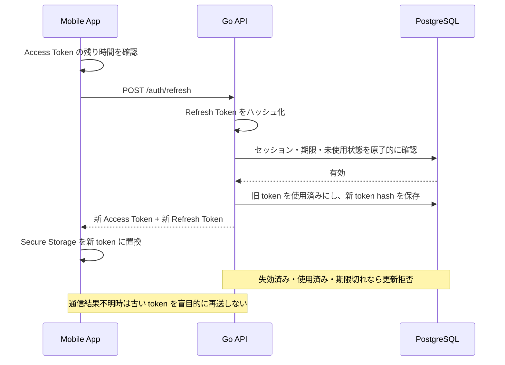

# セキュリティ最終監査（設計ドキュメント）

## 監査情報

| 項目 | 内容 |
| --- | --- |
| 対象 | `docs/` 配下の認証、セッション、API、DB、WebSocket、画像、位置情報仕様 |
| 実施日 | 2026-08-24 |
| 監査範囲 | 設計・実装差分・Go/Bun自動検査レビュー |
| ソースコード | 認証、session、OAuth、Passkey API、画像、開発クライアントを対象 |
| 判定 | 条件付き承認。P1 項目を解消するまで本番リリース不可 |

> 本書の PASS は、仕様上の対策が記載されていることを示します。実装が安全であることを示すものではありません。

今回の検査では、CIと同じ`gosec v2.28.0 -exclude-generated ./...`が`Issues: 0`、Goのtest/vet/build、PostgreSQL統合テスト、Expo/フロントのTypeScript検査、Bun監査が成功しました。Bun監査は既存の期限付き例外だけを許可しています。これは本番リリース承認ではなく、残りのP1項目は下記のとおりです。

## 1. 総合判定

自動トークン更新は採用して問題ありません。ただし、次の構成を守ることが条件です。

1. Access Token は短命な JWS 署名付き JWT とする。
2. JWT の署名検証だけで認証を完了させず、DB の `sessions` を毎回確認する。
3. Refresh Token は端末の Secure Storage に保存し、DB にはハッシュだけを保存する。
4. Refresh のたびにローテーションし、使用済み token の再利用時は token family を失効する。
5. ログアウト・端末失効・アカウント停止は DB を正本として即時反映する。
6. WebSocket は接続時・heartbeat 時にセッションを再検証する。

## 2. 監査チェックリスト

| 監査 ID | 項目 | 判定 | コメント |
| --- | --- | --- | --- |
| SEC-001 | JWS / JWT の署名検証 | PASS | `iss`、`aud`、`iat`、`exp`、署名を検証する仕様がある |
| SEC-002 | JWT の失効確認 | PASS | `sid` から `sessions` を確認する仕様がある |
| SEC-003 | Refresh Token の平文保存禁止 | PASS | DB はハッシュのみ、端末は Secure Storage と定義 |
| SEC-004 | Refresh Token ローテーション | PASS | 使用ごとに新 token を発行する仕様がある |
| SEC-005 | Refresh Token 再利用検知 | PASS | 再利用時に token family を失効する仕様がある |
| SEC-006 | 自動更新のタイミング | PASS | 残り 30 秒、アプリ復帰、401、WebSocket 再接続で更新 |
| SEC-007 | 同時 Refresh の抑制 | PASS | クライアントの single-flight を定義 |
| SEC-008 | 通信失敗時の Refresh 再送 | PASS | 同じ`session_id`・`request_id`だけ30秒以内に暗号化済み結果を再返却 |
| SEC-009 | Google 直後の権限分離 | PASS | Google handoff交換は通常sessionを発行せず、Passkey専用pre-authだけを返す |
| SEC-010 | `pre_auth_token` の一回性 | PASS* | PostgreSQLでhash、scope、user、5分期限、used_atを管理する。Web Passkeyのcredential/session作成とpre-auth hash消費は同一transaction。bootstrap消費とhandoff作成は後段の別transactionで、失敗時の再試行性は追加課題 |
| SEC-011 | JWS 署名鍵のローテーション | PARTIAL | `kid`、HS256 allow-list、複数検証鍵と旧鍵検証の単体テストは実装済み。KMS運用・移行期間・漏えい時手順は未確定 |
| SEC-012 | WebSocket の失効反映 | PARTIAL | heartbeat は定義済み。実装時の切断・再接続テストが必要 |
| SEC-013 | Key-B の信頼境界 | PARTIAL | AES-256-GCM暗号文DB保存、active session＋5分以内のPasskey再認証、退会時削除、競合テストを実装。KMS直結・鍵ローテーション・取得監査・Recovery/クライアントHKDFは未完了 |
| SEC-014 | Refresh API のレート制限 | PARTIAL | 認証系制限はあるが、token hash・IP・端末単位の値が未確定 |
| SEC-015 | 端末保存領域 | PASS | Refresh Token は Secure Storage、Access Token は短期利用 |
| SEC-016 | ログへの秘密情報混入 | PASS | token、Key-A、Key-B、Recovery Key をログ出力しない仕様 |
| SEC-017 | PostgreSQL の競合制御 | PASS | Refresh Token は行ロックとトランザクションで競合を防ぐ方針 |
| SEC-018 | 位置情報・写真の公開範囲 | PASS | 正確な位置を返さず、画像ストレージも非公開と定義 |
| SEC-019 | チャット専用 token | PASS | `aud`、`chat_id`、`sid`、scope を限定した短命 token を定義 |
| SEC-020 | QUIC 0-RTT の再送 | P1 | 1-RTT 前の状態変更禁止と実装テストが必要 |
| SEC-021 | QUIC / Expo 実装可否 | P1 | native module / WebTransport の PoC が未実施 |
| SEC-022 | Web Passkey URL秘密値境界 | PASS | URL fragmentは短命bootstrap tokenだけ。Access/Refresh/pre-authはURLへ渡さず、verifyはhandoff codeだけを返す |

## 3. P1 必須対応

### SEC-008 Refresh 通信失敗時の再送（実装済み）

Refresh はローテーションするため、サーバーが更新に成功した後、レスポンスだけが失われるケースを考慮する必要があります。古い Refresh Token をそのまま再送すると、正当な再試行でも token reuse と判定され、セッション全体が失効する可能性があります。

採用した方式は `request_id` とサーバー側の冪等性記録です。同一 `session_id`・`request_id` の再送だけ 30 秒間同じ結果を返し、レスポンスは暗号化して保存します。Refresh Token の平文は DB に保存しません。別のrequest IDで使用済みtokenが来た場合はreuseとしてsession familyを失効します。

ここで重要なのは、旧 Access Token と旧 Refresh Token を分けることです。旧 Access Token は自身の `exp` まで自然に有効ですが、旧 Refresh Token は同じ冪等リクエスト以外では即時に reuse として扱います。

### SEC-010 `pre_auth_token`（実装済み）

`pre_auth_token` は通常 API に使えないよう、次を必須にします。

- 有効期限は 5 分以内。
- `aud = passkey`、scope は Passkey 登録・認証だけ。
- 一回使用したら DB 上で失効。
- `user_id` と OAuth 認証イベントに紐付ける。
- Access Token、Refresh Token、プロフィール、チャット、Key-B を取得できない。

実装では`pre_auth_tokens`にtoken hashだけを保存し、5分期限、scope、user、`used_at`を検証します。Google交換時は通常sessionを発行せず、Passkey成功後に通常sessionを発行します。Web terminal flowではcredential/session作成とpre-auth hash消費を同一transactionにまとめ、pre-authが無効化された場合にPasskey stateだけが残らないようにしています。bootstrap消費とhandoff作成は後段の別transactionであり、handoff失敗時の再試行性・孤児sessionのreconcilerは追加課題として追跡します。Expo GoはWeb Passkey後に、直近Passkey sessionから暗号化された短命session handoffを受け取ります。

### SEC-022 Web Passkey URL秘密値境界（実装済み）

- Expo GoはAccess Tokenまたはpre-auth tokenをBearerでbootstrap発行APIへ送る。
- bootstrapはhash、scope、元session/pre-auth、ceremony binding、期限、`used_at`で管理する。
- Web URL fragmentには`bootstrap_token`だけを入れる。
- Web options/verifyは`no-store`と`no-referrer`を返す。
- verify成功時は`handoff_code`とredirect URIだけを返し、Access/Refresh/pre-auth tokenをブラウザへ返さない。

### SEC-011 JWS 鍵管理（基盤実装済み）

- JWS header の `alg` を許可リストで検証し、`none` や想定外アルゴリズムを拒否する。
- header に `kid` を付け、検証鍵をバージョン管理する。
- 署名鍵は KMS / Secret Manager に保存し、リポジトリやアプリに埋め込まない。
- 鍵ローテーション時は現行鍵と直前鍵だけを短期間検証可能にする。
- 鍵漏えい時は該当 `kid` を無効化し、全セッション失効または再認証を行う。

実装は`JWS_KEY_ID`と`JWS_VERIFY_KEYS`で現行鍵と検証鍵を分離し、未知の`kid`、`none`、想定外algを拒否する。KMS/Secret Managerへの直接統合、鍵の有効期間、漏えい時のrunbookは本番前の未完了事項である。

### SEC-013 Key-B（基盤実装済み）

- [x] Key-B の平文をログ、DB、クライアント永続領域へ保存しない。DBには`KEY_B_WRAP_KEY`を使うAES-256-GCM暗号文だけを保存する。
- [x] 発行条件を、署名検証済みAccess Token、active DB session、5分以内のPasskey再認証に限定する。
- [x] user ID、key version、wrap鍵IDをAES-GCMのAADに含め、別ユーザー・別version・異なるwrap鍵IDでの復号を拒否する。
- [x] 退会でKey-B暗号文を削除し、同時初回取得は一意制約競合後に既存暗号文を再読込する。
- [ ] Key-B の取得を秘密値なしで監査ログに残す。
- [ ] KMS/Secret Managerへの直接統合、wrap鍵ローテーション、漏えい時の失効・再発行runbookを定義する。
- [ ] Recovery・新端末復旧と、クライアントでのKey-A + Key-B HKDF統合を実装・テストする。

### 2026-08-24 Key-B差分監査

対象は`7004815..e71d585`のKey-B、直近Passkey認可、migration、統合テストである。Go test/vet/build、隔離PostgreSQL統合テスト、PR #3のGo/PostgreSQL/Expo/CodeQL/Secret/OSV/依存監査は成功した。Codex Securityプラグインの差分ランチャーはWindowsのCP932文字コード例外でscan IDを生成できなかったため、ここに手動差分監査の範囲と結果を記録する。

- [x] **P2 — Key-B応答のcache禁止。** `GET /api/v1/me/key-b`の成功応答は`Cache-Control: private, no-store`を設定する。実際の認可済みHTTP経路を通すPostgreSQL統合テストと、応答ヘルパーの単体テストで固定した。
## 4. QUIC / WebTransport 監査

- QUIC の TLS 1.3 は通信路の機密性・完全性を提供するが、Samurai Meet のユーザー・マッチ・セッション認可はアプリケーション token で別途検証する。
- Chat Token は通常の Access Token と別の `aud`、`scope`、`chat_id` を持たせる。
- Refresh Token は QUIC / WebTransport / WebSocket 上へ送信しない。
- Chat Token は通常の Access Token の Refresh とは別の短命 token とし、期限・切り替え間隔はチャット transport の負荷試験で決定する。
- `token_seq` の巻き戻しを拒否し、失効した `sid`、マッチ終了、ブロック、停止を heartbeat で切断する。
- QUIC 0-RTT のアプリケーションデータは再送され得るため、1-RTT handshake 完了前のメッセージ送信、既読更新、写真送信、通報、評価を禁止する。
- Expo の標準機能だけで QUIC / WebTransport を利用できるか、native module を含めて PoC で確認する。未対応なら WebSocket をフォールバックとする。

根拠： [RFC 9001（QUIC を TLS で保護）](https://www.rfc-editor.org/rfc/rfc9001)、[RFC 9114（HTTP/3）](https://www.rfc-editor.org/rfc/rfc9114)。RFC 9001 は 0-RTT のアプリケーションデータが再送され得るため、再送時に影響が出る操作へ使わないよう説明しています。

## 5. 自動更新の安全なシーケンス

## 6. テスト必須項目

### セッション

- 有効な JWT でも `sessions.revoked_at` 設定後は REST が `401` になる。
- ログアウト直後に WebSocket が閉じる。
- 全端末ログアウトで全セッションが利用不能になる。
- ユーザー停止時に既存 token が利用不能になる。

### Refresh

- 有効な Refresh Token で一度だけ更新できる。
- 使用済み token の再利用で token family が失効する。
- 期限切れ、別ユーザー、別セッションの token を拒否する。
- 同時 Refresh が二重発行や誤失効を起こさない。
- サーバー成功後にレスポンスが失われた場合の方針どおりに動く。
- Access Token が残り 30 秒を超えているときに不要な更新をしない。
- アプリのバックグラウンド中に定期更新しない。

### Chat Token / QUIC

- Chat Token を REST、プロフィール、Recovery、Key-B、別チャットへ利用できない。
- Chat Token の期限前に次の token へ切り替えられる。
- 古い `token_seq` への巻き戻しを拒否する。
- 1-RTT handshake 前のメッセージ送信・既読・写真・状態変更を拒否する。
- セッション失効、ブロック、マッチ終了で QUIC / WebSocket 接続を閉じる。
- QUIC が利用できない場合も、同じ認可ルールの WebSocket fallback が動く。

### 認証・鍵

- [x] Google 認証だけでは通常 API を利用できない。Google交換はpre-authだけを返し、Passkey成功後にだけ通常sessionを発行する。
- `pre_auth_token` の期限切れ・二回使用・scope 外利用を拒否する。
- `alg` 改ざん、`kid` 不正、issuer / audience 不正を拒否する。
- Key-B取得、Key-A envelope、退会には5分以内のPasskey再認証が必要である。
- Recovery Key、Key-A、Key-B、Refresh Token がログ・クラッシュレポートに出ない。

## 7. リリース判定

### 本番リリース前に必須

- [x] SEC-008 の通信失敗時ポリシーを決定・実装
- [x] SEC-010 の `pre_auth_token` 一回性を実装
- [x] SEC-022 の Web Passkey URLからAccess/pre-auth tokenを除去
- [x] SEC-011 の JWS `kid` / 複数検証鍵を実装
- [ ] SEC-011 のKMS運用・鍵移行期間・漏えい時runbookを確定
- [x] SEC-013 のKey-B暗号文DB保存・直近Passkey認可・退会削除・競合テストを実装
- [ ] SEC-013 のKMS、監査ログ、鍵ローテーション、Recovery/HKDF統合を設計レビュー
- [ ] SEC-020 の 0-RTT 禁止を実機・統合テスト
- [ ] SEC-021 の QUIC / WebTransport native PoC
- [ ] 上記テスト項目を自動テスト化
- [ ] 依存ライブラリの脆弱性スキャン
- [ ] ステージングでログアウト・端末失効・Refresh reuse の実機テスト
- [ ] 外部セキュリティレビューまたは侵入テスト

### 監査結論

自動更新の採用自体は妥当です。実装は通常時の自動更新・DB失効・token rotation・30秒の冪等再送・Google後のpre-auth/Passkey強制・Expo Goのsession handoff・Passkey HTTP儀式・暗号文画像の基本防御を満たしています。一方、JWS鍵のKMS運用、Key-BのKMS・監査・ローテーション・Recovery/HKDF統合、QUIC 0-RTT、native clientの詳細が未実装のため、現段階の結論は「条件付き承認」です。
